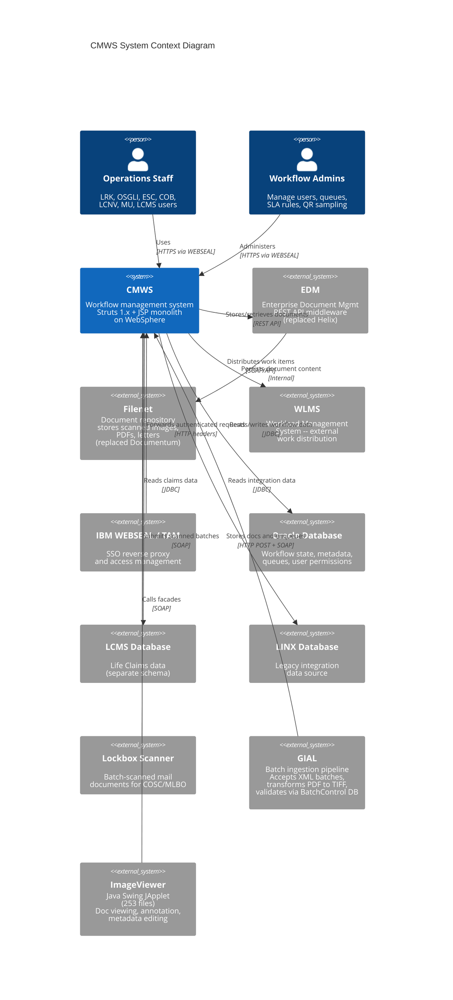
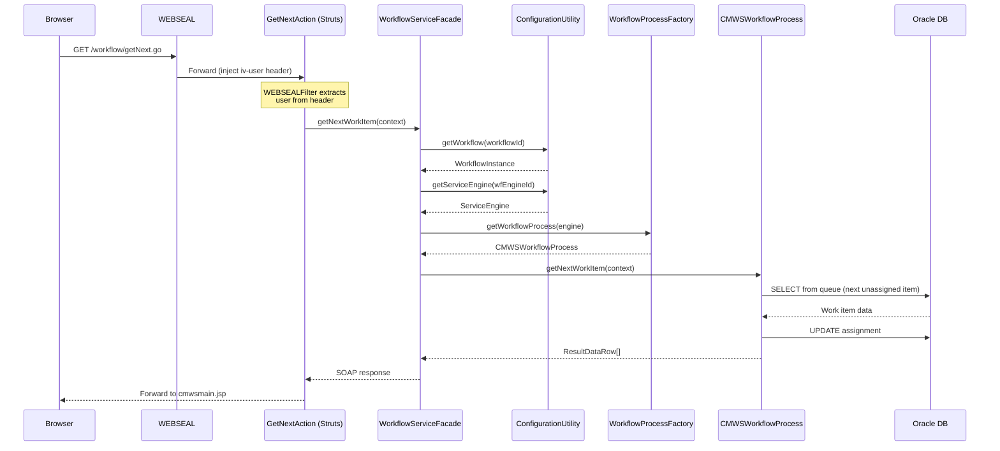

# CMWS Architecture Overview

> **Audience:** External contractors joining the workflow consolidation project.
> **Last updated:** 2026-04-06

---

## 1. Executive Summary

**CMWS (Claims Management Workflow System)** is Prudential Group Insurance's internal workflow management platform. It routes, tracks, and manages insurance work items -- claim documents, enrollment forms, conversions, underwriting packets, and more -- across multiple business domains.

**Who uses it:** Hundreds of operations staff in departments like Life Record Keeping (LRK), OSGLI Administration, Enrollment Support Center (ESC), Life Conversions (LCNV), Client On-Boarding (COB), Medical Underwriting (MU), and Life Claims Management (LCMS). Users access it through a web browser, authenticated via IBM WEBSEAL (reverse-proxy SSO).

**Why it matters:** CMWS is the single system of record for work-item routing and document storage across Group Insurance. Every scanned document, claim folder, and workflow assignment passes through it. Downtime or bugs directly impact claim processing timelines and SLA compliance.

**Why you are here:** The system was built in 2003-2004 and has grown organically for 20+ years. The consolidation project aims to modernize its workflow engine, reduce domain fragmentation, and migrate off legacy infrastructure (the former Helix/Documentum document stack -- now replaced by EDM/Filenet, Sybase-turned-Oracle, WebSphere).

---

## 2. Technology Stack

| Layer | Technology | Notes |
|---|---|---|
| **Web Framework** | Apache Struts 1.1 | Actions map `*.go` URLs to Java Action classes |
| **View Layer** | JSP 2.0 | ~110 JSPs in `/Workflow/` subdirectories |
| **Dependency Injection** | Spring XML Beans (2.0 DTD) | No annotations; all wiring in XML config files |
| **Web Services** | SOAP / JAX-WS (JAX-RPC) | 20 facade servlets exposed as `/services/*` endpoints |
| **App Server** | IBM WebSphere Application Server 7.0 | J2EE 1.4 / Servlet 2.4; 7+ JNDI datasources across Oracle, LCMS, DCMS |
| **Authentication** | IBM WEBSEAL (TAM) | Reverse proxy injects user identity via HTTP headers |
| **Database** | Oracle (migrated from Sybase ~2012) | JNDI datasources: `jdbc/wf_common_oracle_database1`, `jdbc/meta_common_oracle_database1`, etc. |
| **Document Repository** | Filenet (via EDM REST API) | Migrated from Helix/Documentum; call chain: `DocumentStorageFacade -> CMWSStorageProcess -> DocumentumRepositoryProcess -> FilennetDataAccess -> EdmTransformationService -> EdmServiceImpl -> EDM REST API -> Filenet`. All legacy class names kept as wrappers; migration complete -- no dual-path execution. GIAL has a parallel copy of EDM classes (not a shared library). |
| **GIAL** | Separate WAR (`gial.war`) | Ant/Ivy build; batch ingestion pipeline with SOAP web services (ImageLoader, DocumentRepository, ContentManagement, TiffUtility) |
| **ImageViewer** | Java Swing JApplet | 253 files; JAI imaging library; 11 domain metadata editors; runs in user's browser |
| **CMWSReports** | Crystal Reports | 347 Crystal Reports deployed to separate BI server; no Java code |
| **Build** | Ant + Ivy (`CMWSEAR/build/build.xml`) | Output: `cmws.ear` containing `CMWS.war` + `gial.war`; target: WebSphere 7.0 |
| **Source Control** | PVCS (legacy); now Git | PVCS revision headers still present in every file |
| **Java Version** | Java 8 (compiled for J2EE 1.4 compatibility) | |

---

## 3. System Context Diagram (C4 Level 1)

This shows CMWS and everything it talks to.



---

## 4. Container Diagram (C4 Level 2) -- Monolith Internals

```mermaid
C4Container
    title CMWS Internal Architecture -- cmws.ear on WebSphere 7.0

    Person(user, "Operations User")
    Person(scanner, "Scanners / Batch Systems")

    Container_Boundary(ear, "cmws.ear (Enterprise Archive)") {

        Container_Boundary(cmwswar, "CMWS.war (context: /CMWS)") {

            Component(struts, "Struts Actions", "*.go URL mappings", "Route HTTP requests<br/>to business logic")
            Component(jsps, "JSP Views", "110 JSP pages", "Render HTML UI<br/>(inbox, queue, search,<br/>case views)")
            Component(facades, "SOAP Facades", "20 JAX-WS endpoints", "WorkflowServiceFacade,<br/>MetadataServiceFacade,<br/>DocumentStorageFacade, etc.")
            Component(process, "Process Layer", "Factory + Strategy pattern", "CMWSWorkflowProcess,<br/>CMWSMetadataProcess,<br/>CMWSStorageProcess, etc.")
            Component(storage, "Document Storage Chain", "Legacy wrappers kept", "DocumentStorageFacade<br/>-> CMWSStorageProcess<br/>-> DocumentumRepositoryProcess<br/>-> FilennetDataAccess<br/>-> EdmTransformationService<br/>-> EdmServiceImpl")
            Component(domainext, "Domain Extensions", "Per-workflow queue logic", "LRK, OSGLI, COB, ESC,<br/>LCNV, EPR, MU, LCMS<br/>custom queue handlers")
            Component(config, "Configuration Utility", "Spring XML beans", "Loads workflows.xml,<br/>engines.xml,<br/>repositories.xml,<br/>loaders.xml")
            Component(servlets, "Utility Servlets", "GetDocument, PutDocument,<br/>GetReport, etc.", "Document upload/download<br/>and report generation")
            Component(ivjars, "ImageViewer JARs", "Packed inside CMWS.war", "Java Swing JApplet JARs<br/>served to browser")
        }

        Container_Boundary(gialwar, "gial.war (context: /GIAL)") {
            Component(gialbatch, "Batch Ingestion Pipeline", "XML -> validate -> transform -> store", "Accepts XML batches<br/>from scanners,<br/>PDF-to-TIFF transform,<br/>validates via BatchControl DB")
            Component(gialsoap, "GIAL SOAP Services", "ImageLoader, DocumentRepository,<br/>ContentManagement, TiffUtility", "Called by batch systems;<br/>calls CMWSWeb facades<br/>to store and enqueue docs")
            Component(gialedm, "GIAL EDM Classes", "Parallel copy (not shared)", "Own copy of EDM integration<br/>classes; no compile-time<br/>dependency on CMWSWeb")
        }
    }

    ContainerDb(oracledb, "Oracle DB", "Workflow state,<br/>queue assignments,<br/>metadata, permissions<br/>(7+ JNDI datasources)")
    ContainerDb(batchcontrol, "BatchControl DB", "Batch validation<br/>and tracking")
    Container_Ext(edm, "EDM", "Document middleware<br/>REST API")
    Container_Ext(filenet, "Filenet", "Document content store<br/>(replaced Documentum)")
    Container_Ext(biserver, "BI Server", "347 Crystal Reports<br/>(CMWSReports)")

    Rel(user, struts, "HTTP *.go")
    Rel(user, servlets, "HTTP /Workflow/*")
    Rel(struts, jsps, "Forwards to")
    Rel(facades, process, "Delegates to")
    Rel(struts, process, "Calls via")
    Rel(process, config, "Resolves engines from")
    Rel(process, domainext, "Invokes queue extensions")
    Rel(process, oracledb, "JDBC")
    Rel(process, storage, "Store/retrieve docs")
    Rel(storage, edm, "REST API")
    Rel(edm, filenet, "Stores content")
    Rel(servlets, storage, "Get/Put documents")
    Rel(scanner, gialbatch, "XML batches")
    Rel(gialbatch, batchcontrol, "Validates batches")
    Rel(gialsoap, facades, "HTTP POST + SOAP")
    Rel(gialedm, edm, "REST API")
```



---

## 5. Key Architectural Patterns

### 5.1 Domain-per-Workflow

CMWS does not have a single unified workflow engine. Instead, each business domain gets its own **WorkflowInstance** -- a configuration object defined in `workflows.xml` that maps a workflow ID to a set of named engine slots:

| Slot | Suffix | Purpose |
|---|---|---|
| Workflow Engine | `_WF` | Queue routing, assignment, approval, denial |
| Metadata Engine | `_META` | Document metadata search and storage |
| Storage Engine | `_STOR` | Physical document storage (Filenet via EDM; formerly Helix/Documentum) |
| Reporting Engine | `_RPT` | Reports for the workflow |
| Case Management Engine | `_CASE` | Folder/case hierarchy management |
| Workflow Management Engine | `_WFMGMT` | Administrative operations |
| Letter Engine | `_LTR` | Letter template management |
| Letter Storage Engine | `_LTRSTOR` | Letter document storage |
| Quality Review Engine | `_QR` | QR sampling and scoring |
| IPR Engine | `_IPR` | Individual Process Rate tracking |

Each slot resolves to a `ServiceEngine` bean in `engines.xml`, which specifies:
- An implementation class (e.g., `com.pru.gi.workflow.process.CMWSWorkflowProcess`)
- A datasource JNDI name
- Domain-specific configuration (queue extensions, metadata field mappings, lookup IDs)

**There are 21 workflow instances** defined in `workflows.xml`, each with its own set of engines. Most share the same process implementation classes but differ in configuration.

### 5.2 Facade Pattern (SOAP Services)

External systems and some internal JSP pages communicate with CMWS through **SOAP web service facades**. There are 20 facade endpoints registered in `web.xml`:

| Facade | URL Path | Purpose |
|---|---|---|
| `WorkflowServiceFacade` | `/services/WorkflowServiceFacade` | Core queue operations (get queues, assign, move, approve) |
| `MetadataServiceFacade` | `/services/MetadataServiceFacade` | Document metadata search |
| `DocumentStorageFacade` | `/services/DocumentStorageFacade` | Document upload/download |
| `WorkflowReportingFacade` | `/services/WorkflowReportingFacade` | Report generation |
| `CaseManagementFacade` | `/services/CaseManagementFacade` | Case/folder operations |
| `WorkflowManagementFacade` | `/services/WorkflowManagementFacade` | Admin workflow operations |
| `LetterServiceFacade` | `/services/LetterServiceFacade` | Letter template CRUD |
| `QualityReviewFacade` | `/services/QualityReviewFacade` | Quality review sampling |
| `QTSFacade` | `/services/QTSFacade` | Quality Tracking System |
| `LockboxFacade` | `/services/LockboxFacade` | Lockbox batch ingestion |
| `LPMFacade` | `/services/LPMFacade` | LRK-specific operations |
| `OSGLIFacade` | `/services/OSGLIFacade` | OSGLI-specific operations |
| `LCNVFacade` | `/services/LCNVFacade` | Life Conversions operations |
| `COBWorkTypeItemFacade` | `/services/COBWorkTypeItemFacade` | Client On-Boarding work types |
| `EPRWorkTypeItemFacade` | `/services/EPRWorkTypeItemFacade` | Enrollment campaign work types |
| `ESCFacade` | `/services/ESCFacade` | Enrollment Support Center |
| `GULGVULFacade` | `/services/GULGVULFacade` | GUL/GVUL operations |
| `WalmartFacade` | `/services/WalmartFacade` | Walmart-specific operations |
| `LCMSFacade` | `/services/LCMSFacade` | Life Claims operations |
| `MUFacade` | `/services/MUFacade` | Medical Underwriting operations |
| `NotificationEventFacade` | `/services/NotificationEventFacade` | Event notifications |
| `NotificationServiceFacade` | `/services/NotificationServiceFacade` | Notification delivery |

All facades extend `FacadeBase`, which implements `javax.xml.rpc.server.ServiceLifecycle`. Each facade method follows the same pattern:

1. Extract WEBSEAL user from `ThreadLocal` (set by `WEBSEALFilter`)
2. Look up the `WorkflowInstance` from `ConfigurationUtility`
3. Get the appropriate `ServiceEngine` for that workflow
4. Use a `ProcessFactory` to instantiate the process implementation
5. Delegate to the process layer
6. Return SOAP response

Each facade has a corresponding `*_mapping.xml` file in `WEB-INF/` that defines the SOAP-to-Java type mappings.

### 5.3 Queue-Based Work Routing

The core abstraction is a **work queue**. Documents enter queues, get assigned to users, and move between queues based on business rules:

```
Scan/Upload --> Intake Queue --> Auto-route (extension class) --> Work Queue --> User Inbox
                                                                      |
                                                                      v
                                                              Approve / Deny / Move / Transfer
```

**Queue Extensions** are domain-specific Java classes configured per queue ID in `engines.xml`. For example, the LRK workflow engine defines:

```
EXTENSION:20 = com.pru.gi.lrk.queue.LRKTransferMLLCM
EXTENSION:21 = com.pru.gi.lrk.queue.LRKTransferNCSC
EXTENSION:22 = com.pru.gi.lrk.queue.LRKAutoAssign
EXTENSION:29 = com.pru.gi.lrk.queue.TransferToLCNV
EXTENSION:31 = com.pru.gi.lrk.queue.LPMTransferGULGVUL
EXTENSION:32 = com.pru.gi.lrk.queue.TransferToESC
```

These extensions handle cross-workflow transfers (e.g., moving a work item from LRK to LCNV or from LRK to ESC).

### 5.4 GIAL -- Batch Ingestion Pipeline

**GIAL (General Image and Artifact Loading)** is a separate WAR (`gial.war`) packaged inside `cmws.ear` alongside `CMWS.war`. It is **not** a shared library -- it has zero compile-time dependencies on CMWSWeb and maintains its own parallel copy of EDM integration classes.

GIAL is a **batch ingestion pipeline** that:
1. **Accepts** XML batches from scanners and batch systems
2. **Validates** batches via the BatchControl database
3. **Transforms** images (PDF to TIFF conversion)
4. **Calls CMWSWeb** via HTTP POST + SOAP to store documents and enqueue them for workflow processing

GIAL exposes four SOAP web services:
- `ImageLoader` -- Loads image batches
- `DocumentRepository` -- Document storage operations
- `ContentManagement` -- Content lifecycle management
- `TiffUtility` -- TIFF image processing and conversion

**Important:** GIAL calls CMWSWeb, not the other way around. Scanners/batch systems submit to GIAL, which processes the batch and then calls CMWSWeb facades to persist documents and create work items.

Key GIAL classes:
- `Repository` -- Holds connection config for a document repository
- `ServiceEngine` -- Generic engine abstraction for process implementations
- `LoaderConfig` -- Configures batch document loaders (e.g., LCMS batch ingestion)
- `EdmAuthConfig` -- Authentication and URL config for the EDM REST API (the current integration point)
- `ConfigurationUtility` -- Loads environment-specific XML configs (loaders, repositories)
- `FilennetDataAccess` (note: double 'n' is the actual class name) -- Filenet data access, exists in both CMWSWeb and GIAL (parallel copies, not shared)

GIAL has its own Ant/Ivy build. Configuration files are environment-aware: `loaders_DEV.xml`, `loaders_QA.xml`, `loaders_PROD.xml`, etc. The `edm_*.xml` files define EDM endpoints per environment. The `repositories_*.xml` files with `hlxrtvapi` URLs are legacy Helix references still in code but being migrated away.

### 5.5 ImageViewer -- Applet-to-Service Pattern

**ImageViewer** is a Java Swing JApplet (253 files) that runs in the user's browser. It provides document viewing, annotation, and workflow metadata management through 11 domain-specific metadata editors.

ImageViewer communicates with CMWSWeb by calling its SOAP facades directly. The packed JARs are served from inside `CMWS.war` (not a separate WAR). This follows an **Applet-to-Service Pattern**: the browser-hosted applet makes SOAP calls to the server-side facades for all document and metadata operations.

### 5.6 Batch Pipeline Pattern (GIAL)

The batch ingestion flow follows a pipeline pattern:

```
Scanner/Batch System --> GIAL (gial.war)
    --> Accept XML batch
    --> Validate via BatchControl DB
    --> Transform images (PDF -> TIFF)
    --> Call CMWSWeb facades (HTTP POST + SOAP)
        --> Store document in Filenet via EDM
        --> Create work item in queue
```

### 5.7 Document Storage Architecture

The complete document storage call chain in CMWSWeb:

```
DocumentStorageFacade
  -> CMWSStorageProcess
    -> DocumentumRepositoryProcess    (legacy name kept as wrapper)
      -> FilennetDataAccess           (note: double 'n' is actual class name)
        -> EdmTransformationService
          -> EdmServiceImpl
            -> EDM REST API
              -> Filenet
```

All legacy class names (e.g., `DocumentumRepositoryProcess`) are kept as wrappers. The EDM migration is complete -- there is no dual-path execution. GIAL has its own parallel copy of the EDM classes; they are not shared as a library.

### 5.8 Process Layer (Factory + Strategy)

The process layer uses the **Factory pattern** extensively. Each concern has its own factory and interface:

| Factory | Interface | Implementation |
|---|---|---|
| `WorkflowProcessFactory` | `IProcessWorkflow` | `CMWSWorkflowProcess`, `NonCMWSWorkflowProcess`, `DefaultWorkflowProcess` |
| `MetadataProcessFactory` | `IProcessMetadata` | `CMWSMetadataProcess`, `NonCMWSMetadataProcess`, `DCMSMetadataProcess` |
| `StorageProcessFactory` | `IProcessStorage` | `CMWSStorageProcess` |
| `CaseManagementProcessFactory` | `IProcessCaseManagement` | `CMWSCaseManagementProcess` |
| `ReportingProcessFactory` | `IProcessReports` | `CMWSWorkflowReportingProcess` |
| `QualityReviewProcessFactory` | `IProcessQualityReview` | `CMWSQualityReviewProcess` |
| `LetterProcessFactory` | `IProcessLetter` | `CMWSLetterProcess` |
| `IPRProcessFactory` | `IProcessIPR` | `CMWSIPRProcess` |
| `RepositoryProcessFactory` | `IProcessRepository` | `DocumentumRepositoryProcess` (legacy name from the Helix/Documentum era; now routes through EDM to Filenet) |

The factory resolves which implementation to use based on the `ServiceEngine` configuration for the current workflow.

---

## 6. Environment Topology

CMWS runs in **8 environments**, each with dedicated configuration:

| Environment | Purpose | Config Suffix |
|---|---|---|
| **DEV** | Developer integration testing | `_DEV` |
| **DEV2** | Secondary developer environment | `_DEV2` |
| **QA** | Quality Assurance testing | `_QA` |
| **QA2** | Secondary QA environment | `_QA2` |
| **STAGE** | Pre-production staging | `_STAGE` |
| **STAGE2** | Secondary staging | `_STAGE2` |
| **INT** | Integration testing (cross-system) | `_INT` |
| **PROD** | Production | `_PROD` |

**Build and Packaging:** The master build is Ant + Ivy from `CMWSEAR/build/build.xml`. It produces `cmws.ear` containing two WARs: `CMWS.war` (context root `/CMWS`) and `gial.war` (context root `/GIAL`). ImageViewer JARs are packed inside `CMWS.war`. Target deployment is WebSphere 7.0.

Environment selection is driven by the JVM system property `com.pru.AppServerEnv`. The `ConfigurationUtility` appends this value to config file names when loading:

```
engines.xml          --> engines_PROD.xml (if com.pru.AppServerEnv=PROD)
repositories.xml     --> repositories_PROD.xml
loaders.xml          --> loaders_PROD.xml
```

Each environment has its own:
- EDM API endpoints and credentials (`edm_*.xml` -- the current document middleware)
- Oracle database JNDI datasources
- Loader batch configurations
- Legacy repository configs (`repositories_*.xml` -- contain Helix `hlxrtvapi` URLs being migrated away)

**JNDI Datasources** (defined in `web.xml`):

| JNDI Name | Purpose |
|---|---|
| `jdbc/wf_common_oracle_database1` | Primary workflow database |
| `jdbc/wf_common_oracle_database2` | Secondary workflow database |
| `jdbc/meta_common_oracle_database1` | Primary metadata database |
| `jdbc/meta_common_oracle_database2` | Secondary metadata database |
| `jdbc/conn2lcms` | LCMS (Life Claims) database |
| `jdbc/meta2dcms` | DCMS metadata database |
| `jdbc/conn2linx` | LINX integration database |

---

## 7. Project Directory Structure

```
Project_Workspace/
|
+-- CMWSWeb/                        # Main web application
|   +-- src/main/java/
|   |   +-- com/pru/gi/
|   |       +-- workflow/
|   |       |   +-- config/         # WorkflowInstance, ConfigurationUtility, ServiceEngine
|   |       |   +-- facade/         # SOAP web service facades (20 files)
|   |       |   +-- process/        # Process layer -- factories, interfaces, implementations
|   |       |   +-- common/         # ServiceContext, WorkflowException, ResultDataRow, CMWSUtil
|   |       |   +-- queues/         # Shared queue logic (CalculateCompletedDate, etc.)
|   |       |   +-- web/
|   |       |   |   +-- actions/    # Struts Action classes
|   |       |   |   +-- actionforms/# Struts ActionForm beans
|   |       |   +-- servlets/       # Utility servlets (GetDocument, PutDocument, etc.)
|   |       |   +-- utility/        # AuthorizationService, etc.
|   |       |   +-- logging/        # LoggingUtility
|   |       +-- lrk/                # LRK domain (queue extensions, custom logic)
|   |       +-- osgli/              # OSGLI domain
|   |       +-- lcnv/               # Life Conversions domain
|   |       +-- cob/                # Client On-Boarding domain
|   |       +-- esc/                # Enrollment Support Center domain
|   |       +-- epr/                # Enrollment campaign domain
|   |       +-- gulgvul/            # GUL/GVUL domain
|   |       +-- walmart/            # Walmart domain
|   |       +-- lockbox/            # Lockbox domain
|   |       +-- mu/                 # Medical Underwriting domain
|   |       +-- lcms/               # Life Claims domain
|   +-- WebContent/
|   |   +-- WEB-INF/
|   |   |   +-- web.xml             # Servlet/filter definitions
|   |   |   +-- struts-config.xml   # Struts action mappings
|   |   |   +-- *_mapping.xml       # SOAP type mapping files (20 files)
|   |   +-- config/
|   |   |   +-- workflows.xml       # Workflow instance definitions (21 workflows)
|   |   |   +-- engines.xml         # Engine imports hub
|   |   |   +-- engines/            # Per-workflow engine configs (21 files)
|   |   |   +-- businessunits.xml   # Business unit definitions
|   |   |   +-- edm_*.xml           # EDM REST API endpoints (per env) -- current document middleware
|   |   |   +-- repositories*.xml   # Legacy Helix repository configs (per env, contain hlxrtvapi URLs -- being migrated)
|   |   |   +-- loaders*.xml        # Batch loader configs (per env)
|   |   +-- Workflow/               # JSP pages organized by domain
|   |       +-- cmwsmain.jsp        # Main entry point / welcome page
|   |       +-- admin/              # User/FBU admin pages
|   |       +-- search/             # Search pages (one per domain)
|   |       +-- caselist/           # Case listing pages
|   |       +-- cob/                # COB-specific pages
|   |       +-- epr/                # EPR-specific pages
|   |       +-- ipr/                # IPR pages
|   |       +-- lockbox/            # Lockbox-specific pages
|   |       +-- lcnv/               # LCNV-specific pages
|   |       +-- osgli/              # OSGLI-specific pages
|   |       +-- qualityreview/      # QR sampling pages
|   |       +-- reports/            # Report manager pages
|   |       +-- sla/                # SLA management pages
|   |       +-- recordsadmin/       # Records management pages
|   |       +-- customerfile/       # Customer file search pages
|   |       +-- setpriority/        # Priority management pages
|
+-- GIAL/                           # Batch ingestion pipeline (separate WAR: gial.war)
|   +-- src/main/java/com/pru/gi/gial/
|   |   +-- config/                 # Repository, LoaderConfig, ServiceEngine, EdmAuthConfig
|   |   +-- process/                # Document storage process implementations
|   |   +-- edm/                    # Parallel copy of EDM classes (not shared with CMWSWeb)
|   +-- WebContent/config/          # GIAL-specific loader/repository configs
|   +-- build/                      # Ant/Ivy build (zero compile-time deps on CMWSWeb)
|
+-- CMWSReports/                    # 347 Crystal Reports (pure asset store, no Java; deployed to separate BI server)
+-- CMWSEAR/                        # Enterprise archive packaging (cmws.ear = CMWS.war + gial.war)
|   +-- build/build.xml             # Ant + Ivy master build
+-- CMWSDeploymentTest/             # Deployment verification tests
+-- ImageViewer/                    # Java Swing JApplet (253 files); JAI imaging; 11 metadata editors
|                                   # Packed JARs go inside CMWS.war (not a separate WAR)
```

---

## 8. Request Flow -- How a Typical Operation Works

Here is what happens when a user clicks "Get Next Item" from their inbox:



---

## 9. Workflow Instance Registry

All 21 workflow instances defined in `workflows.xml`:

| ID | Bean ID | Display Name | WF Prefix | Has Cases | Has QR | Has Letters | Has IPR |
|---|---|---|---|---|---|---|---|
| 1 | `lpm` | Record Keeping Services | `LRK` | Yes | Yes | No | No |
| 2 | `lockbox` | COSC/MLBO Lockbox | `NCSCMLLCM` | No | Yes | No | No |
| 3 | `osgli` | OSGLI Administration | `OSGLI` | Yes | Yes | No | No |
| 4 | `contracts` | Contracts Archive | `CONTRACTS` | No | No | No | No |
| 5 | `uw` | Underwriting Archive | `UNDERWRITING` | No | No | No | No |
| 6 | `proposals` | Proposal Unit Archive | `PROPOSALS` | No | No | No | No |
| 7 | `walmart` | Wal Mart | `WALMART` | Yes | Yes | Yes | No |
| 8 | `lcnv` | Life Conversions | `LCNV` | Yes | Yes | Yes | No |
| 9 | `gulgvul` | Gul/Gvul Management | `GUL_GVUL` | Yes | Yes | No | No |
| 10 | `esc` | Enrollment Support Center | `ESC` | Yes | Yes | Yes | No |
| 11 | `cob` | Client On-Boarding | `COB` | Yes | No | No | No |
| 12 | `smcob` | Small Market Client On-Boarding | `SMCOB` | Yes | Yes | No | No |
| 13 | `verizon` | Verizon | `VERIZON` | No | Yes | No | Yes |
| 14 | `epr` | Enrollment Campaign Management | `EPR` | Yes | Yes | No | No |
| 15 | `osgliarch` | OSGLI Archive | `OSGLIARCH` | Yes | Yes | No | No |
| 101 | `mu` | Medical Underwriting | `MU` | No | No | No | No |
| 102 | `lcms` | LCMS - GLCD | `LCMS` | No | No | No | No |
| 103 | `dcms` | DCMS Archive | `DCMS` | No | No | No | No |
| 104 | `lcmsosgli` | LCMS - OSGLI | `LCMS_OSGLI` | No | No | No | No |
| 105 | `lcmspeb` | LCMS - PEB | `LCMS_PEB` | No | No | No | No |
| 107 | `lcmsili` | LCMS - ILI | `LCMS_ILI` | No | No | No | No |

---

## 10. Glossary of Acronyms

| Acronym | Full Name | Context |
|---|---|---|
| **BFF** | Backend for Frontend | API gateway pattern (used in modernization discussions) |
| **BU** | Business Unit | Organizational division (LRK, NCSC, PREMACCT, MLLCM) |
| **CMWS** | Claims Management Workflow System | This application |
| **COB** | Client On-Boarding | Workflow for onboarding new group insurance clients |
| **COSC** | Customer Operations Service Center | Business unit handling lockbox mail |
| **CSID** | Customer Service Identifier | Unique identifier for a customer service record |
| **DCMS** | Document Content Management System | Archive workflow for legacy documents |
| **DCTM** | Documentum | Former document repository platform (replaced by Filenet) |
| **DFC** | Documentum Foundation Classes | Legacy Java API for Documentum access (replaced by EDM REST API) |
| **EAS** | Enrollment Administration System | Sub-system within EPR for enrollment admin |
| **EDM** | Enterprise Document Management | Current document middleware REST API (replaced Helix; stores in Filenet) |
| **EPR** | Enrollment/Plan Review | Workflow for enrollment campaign management |
| **ESC** | Enrollment Support Center | Workflow for enrollment support processing |
| **FBU** | Functional Business Unit | Sub-unit within a business unit for permission scoping |
| **GI** | Group Insurance | Prudential's group insurance division |
| **GIAL** | General Image and Artifact Loading | Batch ingestion pipeline; separate WAR (`gial.war`) inside `cmws.ear`; accepts XML batches from scanners, transforms PDF to TIFF, validates via BatchControl DB, then calls CMWSWeb via HTTP POST + SOAP to store docs and enqueue them |
| **GLCD** | Group Life Claims Division | Business unit for life claims |
| **GUL** | Group Universal Life | Insurance product type |
| **GULGVUL** | Group Universal Life / Group Variable Universal Life | Combined workflow for GUL and GVUL products |
| **GVUL** | Group Variable Universal Life | Insurance product type |
| **ImageViewer** | ImageViewer | Java Swing JApplet (253 files) for document viewing, annotation, and workflow metadata management; 11 domain metadata editors; calls CMWSWeb facades via SOAP; JARs packed inside CMWS.war |
| **ILI** | Individual Life Insurance | Insurance product type (LCMS sub-workflow) |
| **IPR** | Individual Process Rate | Performance tracking for individual worker throughput |
| **JNDI** | Java Naming and Directory Interface | Java API for looking up resources (datasources) |
| **LCMS** | Life Claims Management System | Workflow for processing life insurance claims |
| **LCNV** | Life Conversions | Workflow for group-to-individual policy conversions |
| **LINX** | Legacy Integration Exchange | External integration database |
| **LPM** | Life Plan Management | Legacy name for LRK workflow (bean ID `lpm`) |
| **LRK** | Life Record Keeping | Workflow for policy record management |
| **MLBO** | Mid/Large Benefits Operations | Business operations unit |
| **MLLCM** | Mid/Large Life Case Management | Business unit for mid/large case management |
| **MU** | Medical Underwriting | Workflow for medical underwriting document processing |
| **NCSC** | National Client Service Center | Business unit |
| **NCSCMLLCM** | NCSC + MLLCM combined | Repository prefix for lockbox workflow |
| **NJEA** | New Jersey Education Association | Specific client with custom case listing |
| **OSGLI** | Office of Servicemembers' Group Life Insurance | Federal employee group life insurance |
| **PEB** | Prudential Employee Benefits | Insurance product (LCMS sub-workflow) |
| **PREMACCT** | Premium Accounting | Business unit for premium processing |
| **PVCS** | Polytron Version Control System | Legacy source control (revision headers still in code) |
| **QR** | Quality Review | Sampling and scoring system for work quality |
| **QTS** | Quality Tracking System | System for tracking quality metrics |
| **RM** | Records Management | Retention and destruction management for documents |
| **SLA** | Service Level Agreement | Configurable processing time targets per queue |
| **SMCOB** | Small Market Client On-Boarding | COB variant for small market clients |
| **SSN** | Social Security Number | Used as search key in many workflows |
| **TAM** | Tivoli Access Manager | IBM SSO product (drives WEBSEAL groups) |
| **WEBSEAL** | Web Security Access Layer | IBM reverse proxy for SSO authentication |
| **WF** | Workflow | Generic abbreviation used in engine/repository naming |
| **WFMGMT** | Workflow Management | Administrative engine for workflow configuration |
| **WLMS** | Workload Management System | External system for work distribution |

---

## 11. Key Files to Read Next

If you want to go deeper, start with these files:

| File | Why |
|---|---|
| `CMWSWeb/WebContent/config/workflows.xml` | All 21 workflow definitions -- the "registry" |
| `CMWSWeb/WebContent/config/engines/engines_lpm.xml` | Example of a fully configured workflow engine set |
| `CMWSWeb/src/main/java/.../workflow/config/WorkflowInstance.java` | The WorkflowInstance POJO |
| `CMWSWeb/src/main/java/.../workflow/facade/FacadeBase.java` | Base class for all SOAP facades |
| `CMWSWeb/src/main/java/.../workflow/facade/WorkflowServiceFacade.java` | Core workflow operations |
| `CMWSWeb/src/main/java/.../workflow/process/IProcessWorkflow.java` | Workflow process interface |
| `CMWSWeb/src/main/java/.../workflow/process/CMWSWorkflowProcess.java` | Main workflow process implementation |
| `CMWSWeb/WebContent/WEB-INF/web.xml` | All servlet/filter/JNDI definitions |
| `CMWSWeb/WebContent/WEB-INF/struts-config.xml` | All Struts action mappings |
| `GIAL/src/main/java/.../gial/config/Repository.java` | Document repository abstraction |
| `GIAL/src/main/java/.../gial/config/EdmAuthConfig.java` | EDM migration config |
| `CMWSWeb/WebContent/config/repositories.xml` | Legacy Helix repository configurations (contains `hlxrtvapi` URLs being migrated to EDM) |

---

*This document is part of the CMWS Onboarding Series. See also:*
- `02-domain-workflows.md` -- Deep dive into each of the 21 workflow domains
- `03-database-schema.md` -- Oracle schema, key tables, JNDI datasource mapping
- `04-soap-api-catalog.md` -- Complete SOAP facade API reference
- `05-build-and-deploy.md` -- Build process, EAR packaging, WebSphere deployment
