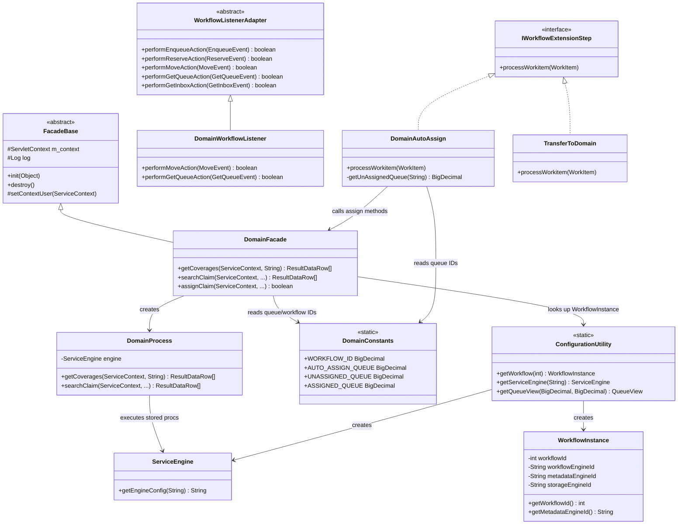

# CMWS Domain Module Reference Guide

> **Audience**: External contractors onboarding to the CMWS legacy codebase.
> **Codebase root**: `Project_Workspace/CMWSWeb/`
> **Java source**: `src/main/java/com/pru/gi/`
> **JSP views**: `WebContent/Workflow/`
> **Facade mappings**: `WebContent/WEB-INF/`
> **Tests**: `src/test/java/com/pru/gi/`

---

## Table of Contents

1. [Architecture Overview: Domain-Per-Workflow Pattern](#1-architecture-overview-domain-per-workflow-pattern)
2. [Common Domain Pattern (Class Diagram)](#2-common-domain-pattern-class-diagram)
3. [Domain Module Reference (14 Domains)](#3-domain-module-reference)
   - [3.1 LCMS - Life Claim Management](#31-lcms---life-claim-management-system)
   - [3.2 COB - Coordination of Benefits](#32-cob---coordination-of-benefits)
   - [3.3 ESC - Enrollment Support Center](#33-esc---enrollment-support-center)
   - [3.4 EPR - Client Profiles / Enrollment Campaign](#34-epr---client-profiles--enrollment-campaign-management)
   - [3.5 OSGLI - OSGLI Administration](#35-osgli---osgli-administration)
   - [3.6 LCNV - Life Conversions](#36-lcnv---life-conversions)
   - [3.7 Lockbox - COSC/MLBO Lockbox](#37-lockbox---coscmlbo-lockbox)
   - [3.8 MU - Medical Underwriting](#38-mu---medical-underwriting)
   - [3.9 GUL/GVUL - GUL/GVUL Management](#39-gulgvul---gulgvul-management)
   - [3.10 Walmart](#310-walmart)
   - [3.11 SM COB - Small Market COB](#311-smcob---small-market-cob)
   - [3.12 LRK - Life Record Keeping](#312-lrk---life-record-keeping-services)
   - [3.13 Verizon](#313-verizon)
   - [3.14 WLMS - Web Service Client](#314-wlms---web-service-client-library)
4. [Cross-Cutting Workflow Framework](#4-cross-cutting-workflow-framework-comprugiworkflow)
5. [WLMS Web Services Detail](#5-wlms-web-services-detail)
6. [Workflow ID Registry](#6-workflow-id-registry)
7. [Summary Table](#7-summary-table)

---

## 1. Architecture Overview: Domain-Per-Workflow Pattern

CMWS is a **monolithic Struts 1.x web application** that manages document-centric workflows across multiple Group Insurance business lines. Each business domain maps to one or more **workflow instances** identified by a numeric `workflowId`.

### How a domain module works

Each domain package under `com.pru.gi` follows a repeatable pattern:

| Layer | Class Convention | Responsibility |
|-------|-----------------|----------------|
| **Constants** | `{Domain}Constants.java` | Workflow IDs, queue IDs, form codes, status codes |
| **Facade** | `{Domain}Facade.java` | SOAP web service endpoint; extends `FacadeBase` (JAX-RPC `ServiceLifecycle`). Exposed via `WEB-INF/{Domain}Facade_mapping.xml`. |
| **Facade SEI** | `{Domain}Facade_SEI.java` | Service Endpoint Interface for the web service |
| **Process** | `{Domain}Process.java` | Business logic; delegates to stored procedures via `ServiceEngine` |
| **WorkflowListener** | `{Domain}WorkflowListener.java` | Extends `WorkflowListenerAdapter`; hooks into enqueue, reserve, move, getQueue, getInbox events |
| **AutoAssign** | `queue/{Domain}AutoAssign.java` | Implements `IWorkflowExtensionStep`; routes work items to queues |
| **TransferTo*** | `queue/TransferTo{Target}.java` | Cross-domain transfer handlers; implements `IWorkflowExtensionStep` |
| **ProcessStub** | `{Domain}ProcessStub.java` | Test data factory (not always present) |

### Request flow

1. **Browser** -- Struts action (e.g., `QueueViewAction`) --> **JSP view** (e.g., `queues.jsp`)
2. **JSP / Image Viewer applet** -- SOAP call --> **Facade** (e.g., `LCMSFacade`)
3. **Facade** --> `ConfigurationUtility.getWorkflow(workflowId)` --> `WorkflowInstance` --> `ServiceEngine`
4. **Facade** --> `{Domain}Process` --> stored procedures via `OracleDataAccess`
5. **Queue operations** trigger **WorkflowListener** events (pre/post enqueue, move, reserve, getQueue)
6. **AutoAssign** runs as an extension step, routing items to the correct queue

---

## 2. Common Domain Pattern (Class Diagram)

---

## 3. Domain Module Reference

> **Path convention**: All source paths below are relative to `Project_Workspace/CMWSWeb/`.
> Prefix with `src/main/java/com/pru/gi/` for Java classes.
> Prefix with `WebContent/` for JSPs and WEB-INF files.

---

### 3.1 LCMS - Life Claim Management System

**Package**: `com.pru.gi.lcms` (+ `queue/`)
**Workflow IDs**: 102 (GLCD), 104 (OSGLI), 105 (PEB), 107 (ILI)
**Purpose**: Manages life insurance claim intake, assignment, beneficiary data entry, and document routing for four sub-workflows: GLCD (Group Life Claims), PEB (Personal Employee Benefits), OSGLI (Office of Servicemembers' Group Life Insurance claims handled by LCMS), and ILI (Individual Life Insurance waiver of premium).

#### Key Classes

| Class | Path (under `com/pru/gi/lcms/`) | Responsibility |
|-------|-------------------------------|----------------|
| `LCMSConstants` | `LCMSConstants.java` | Workflow IDs (102, 104, 105, 107), queue IDs (auto-assign, unassigned, assigned per sub-workflow), form codes (death claim, accidental death, waiver, miscellaneous), utility methods (`isAssignedQueue`, `isWaiverClaimCreateForm`, `getPolicyStatusDisplay`) |
| `LCMSFacade` | `LCMSFacade.java` | SOAP facade extending `FacadeBase`; methods: `getCoverages`, `getBeneficiaries`, `getCaseInfo`, `searchClaim`, `searchClaimWaiver`, `assignClaim`, `unassignClaim`, `updateDocumentType`, `updateDocumentId`, `createClaim`, `createClaimWaiver`, `createPayee`, `createBeneficiaries`, `getFormClaimType`, `getMoveToQueue`, `getChangeFormCode`, `updateCoverage`, `updateBene`, `updateBenePayeeSeqNum`, `getUserRestrictedCases`, `getRestrictedCaseUsers`, `addUserToRestrictedCase`, `deleteUserFromRestrictedCase`, `addRestrictedCase`, `deleteRestrictedCase`, `getMediConnectRequests`, `updateMediConnectStatus`, `assignOrCreateClaim`, `validateCtrlBrCov` |
| `LCMSFacade_SEI` | `LCMSFacade_SEI.java` | Service Endpoint Interface |
| `LCMSProcess` | `LCMSProcess.java` | Business logic; stored procedure calls via `ServiceEngine` |
| `LCMSWorkflowListener` | `LCMSWorkflowListener.java` | Handles `performMoveAction` (validates claim assignment before complete, form code change on waiver/non-waiver moves, unassign on move back from complete), `performGetQueueAction` (loads coverage data, restricted case filtering, sorting) |
| `LCMSProcessStub` | `LCMSProcessStub.java` | Test data: generates `WaiverClaim`/`ILIClaim` JAXB objects |
| `PayeeGIAL` | `PayeeGIAL.java` | DTO for GIAL (Group Insurance Alliance) payee data |
| `PayeeGIAL_Ser` / `_Deser` / `_Helper` | `PayeeGIAL_Ser.java` etc. | JAX-RPC serialization support |

#### Queue Handlers (`com/pru/gi/lcms/queue/`)

| Class | Responsibility |
|-------|----------------|
| `LCMSAutoAssign` | Routes work items: checks claim attachment, assigns to GLCD/PEB/OSGLI/ILI assigned or unassigned queues based on pipeline (Waiver vs. non-Waiver). Handles web form special logic. |
| `TransferHelperLCMS` | Helper for cross-domain transfers into LCMS |
| `TransferToLCMSGLCD` | Transfer items from other domains into the LCMS GLCD workflow |
| `TransferToLCMSPEB` | Transfer items from other domains into the LCMS PEB workflow |

#### JSP Views

| JSP | Path (under `WebContent/Workflow/`) |
|-----|-------------------------------------|
| `searchAndAssignClaim.jsp` | `lcms/searchAndAssignClaim.jsp` |
| `deleteReason.jsp` | `lcms/deleteReason.jsp` |
| `LCMSSearch.jsp` | `search/LCMSSearch.jsp` |
| `LCMSCaseEdit.jsp` | `caselist/LCMSCaseEdit.jsp` |
| `LCMSCaseList.jsp` | `caselist/LCMSCaseList.jsp` |
| `LCMSILICaseList.jsp` | `caselist/LCMSILICaseList.jsp` |

#### Facade Mapping

`WebContent/WEB-INF/LCMSFacade_mapping.xml`

---

### 3.2 COB - Coordination of Benefits

**Package**: `com.pru.gi.cob` (+ `queue/`)
**Workflow ID**: 11
**Purpose**: Manages Client On-Boarding workflows including case creation, work type requests, milestones, tasks, checklists, and approval routing. Handles new cases, policy changes, bill changes, and renewals. Covers FBU (Functional Business Unit) assignment and contact management.

#### Key Classes

| Class | Path (under `com/pru/gi/cob/`) | Responsibility |
|-------|-------------------------------|----------------|
| `COBConstants` | `COBConstants.java` | Workflow ID 11, queue IDs (active, auto-assign, exception, completed, pending, renewal, deleted, approval, archive), case types (new, add, policy change, bill change), FBU IDs, market segments, group types, regions, email notification types (10+), workflow history events, date format, ERD day calculations, SM COB queues and methods |
| `COBWorkflowFacade` | `COBWorkflowFacade.java` | SOAP facade; methods: `getOpenItemsForFBU`, `setWorkTypeTaskOwner` |
| `COBWorkflowListener` | `COBWorkflowListener.java` | Workflow event handling for COB moves and queue operations |
| `COBWorkflowProcess` | `COBWorkflowProcess.java` | Business logic for workflow-level operations |
| `COBWorkTypeItemFacade` | `COBWorkTypeItemFacade.java` | SOAP facade for work type item CRUD |
| `COBWorkTypeItemFacade_SEI` | `COBWorkTypeItemFacade_SEI.java` | SEI for work type items |
| `COBWorkTypeItemProcess` | `COBWorkTypeItemProcess.java` | Work type item business logic |
| `COBWorkTypeRequestFacade` | `COBWorkTypeRequestFacade.java` | SOAP facade for work type requests |
| `COBWorkTypeRequestProcess` | `COBWorkTypeRequestProcess.java` | Work type request business logic |
| `COBManagementServicesFacade` | `COBManagementServicesFacade.java` | SOAP facade for management services |
| `COBManagementProcess` | `COBManagementProcess.java` | Management services business logic |
| `COBNotifyEventListener` | `COBNotifyEventListener.java` | Email/event notification listener |
| `FinancialDetail` | `FinancialDetail.java` | DTO for financial detail data |
| `FinanceDetailPlans` | `FinanceDetailPlans.java` | DTO for finance detail plans |
| `Contact` | `Contact.java` | DTO for contact information |
| `Coverage` | `Coverage.java` | DTO for coverage data |
| `ThirdParty` | `ThirdParty.java` | DTO for third-party data |
| `ThirdPartyCoverage` | `ThirdPartyCoverage.java` | DTO for third-party coverage |
| `PerformanceGuarantee` | `PerformanceGuarantee.java` | DTO for performance guarantee data |
| `FileUploadDetails` | `FileUploadDetails.java` | DTO for file upload metadata |
| `WorktypeRequest` | `WorktypeRequest.java` | DTO for work type requests |
| `KeyValue` | `KeyValue.java` | Generic key-value DTO |

#### Queue Handlers (`com/pru/gi/cob/queue/`)

| Class | Responsibility |
|-------|----------------|
| `COBAutoAssign` | Assigns work items based on market segment, region, FBU; processes folders, handles exception queue routing |
| `COBFindChangeTypes` | Finds applicable change types for a COB case |
| `COBFindWorkTypeCoverages` | Finds work type coverages |

#### JSP Views

| JSP | Path (under `WebContent/Workflow/`) |
|-----|-------------------------------------|
| `COBSearch.jsp` | `search/COBSearch.jsp` |
| `WorktypeRequestSearch.jsp` | `cob/WorktypeRequestSearch.jsp` |
| `WorktypeRequestResults.jsp` | `cob/WorktypeRequestResults.jsp` |
| `SMCOBWorktypeRequestDetails.jsp` | `cob/SMCOBWorktypeRequestDetails.jsp` |
| `resultsCOB.jsp` | `cob/resultsCOB.jsp` |
| `cobReturnDate.jsp` | `cob/cobReturnDate.jsp` |
| `FileUpload.jsp` | `cob/FileUpload.jsp` |
| `COBTasks.jsp` | `cob/taskchecklist/COBTasks.jsp` |
| `COBChecklists.jsp` | `cob/taskchecklist/COBChecklists.jsp` |
| `ChecklistTaskEditorMain.jsp` | `cob/taskchecklist/ChecklistTaskEditorMain.jsp` |
| `cobClientFileSearch.jsp` | `customerfile/cobClientFileSearch.jsp` |

#### Facade Mapping

`WebContent/WEB-INF/COBWorkTypeItemFacade_mapping.xml`

---

### 3.3 ESC - Enrollment Support Center

**Package**: `com.pru.gi.esc` (+ `caselist/`, `queue/`)
**Workflow ID**: 10
**Purpose**: Manages enrollment escalation cases. Acts as a routing hub -- items can be transferred to/from nearly every other domain (LCNV, GUL/GVUL, LPM, Walmart, MLBO, CRM, Verizon, COSC, NJEA). Includes case list management and SSN masking.

#### Key Classes

| Class | Path (under `com/pru/gi/esc/`) | Responsibility |
|-------|-------------------------------|----------------|
| `ESCConstants` | `ESCConstants.java` | Queue IDs, workflow constants |
| `ESCFacade` | `ESCFacade.java` | SOAP facade extending `FacadeBase`; methods: `getUserWorkHours` and other domain-specific operations |
| `ESCFacade_SEI` | `ESCFacade_SEI.java` | Service Endpoint Interface |
| `ESCProcess` | `ESCProcess.java` | Business logic |
| `ESCWorkflowListener` | `ESCWorkflowListener.java` | Workflow event handling |

#### Case List (`com/pru/gi/esc/caselist/`)

| Class | Responsibility |
|-------|----------------|
| `ESCCaseListFacade` | SOAP facade for ESC case list operations |
| `ESCCaseListProcess` | Case list business logic |

#### Queue Handlers (`com/pru/gi/esc/queue/`)

| Class | Responsibility |
|-------|----------------|
| `ESCAutoAssign` | Auto-assigns work items in the ESC workflow |
| `ESCAutoAssignHelper` | Helper methods for ESC auto-assignment |
| `ESCSSNMask` | Masks SSN for display in ESC queues |
| `TransferToESC` | Transfers items into ESC from other domains |
| `TransferToLCNV` | Transfers items from ESC to Life Conversions |
| `TransferToGULGVUL` | Transfers items from ESC to GUL/GVUL |
| `TransferToLPM` | Transfers items from ESC to LPM/LRK |
| `TransferToWalmart` | Transfers items from ESC to Walmart |
| `TransferToMLBO` | Transfers items from ESC to MLBO |
| `TransferToCRM` | Transfers items from ESC to CRM |
| `TransferToVerizon` | Transfers items from ESC to Verizon |
| `TransferToCOSC` | Transfers items from ESC to COSC |
| `TransferToNJEA` | Transfers items from ESC to NJEA |

#### JSP Views

| JSP | Path (under `WebContent/Workflow/`) |
|-----|-------------------------------------|
| `ESCSearch.jsp` | `search/ESCSearch.jsp` |
| `ESCCaseEdit.jsp` | `caselist/ESCCaseEdit.jsp` |
| `ESCCaseList.jsp` | `caselist/ESCCaseList.jsp` |

#### Facade Mapping

`WebContent/WEB-INF/ESCFacade_mapping.xml`

---

### 3.4 EPR - Client Profiles / Enrollment Campaign Management

**Package**: `com.pru.gi.epr` (+ `queue/`)
**Workflow ID**: 14
**Purpose**: Manages enrollment campaign management (ECM) including client profiles, EAS (Enrollment Administration Services) integration, work type items, notifications, and inflight dashboard. Also provides Clone and Notes functionality.

#### Key Classes

| Class | Path (under `com/pru/gi/epr/`) | Responsibility |
|-------|-------------------------------|----------------|
| `EPRConstants` | `EPRConstants.java` | Queue IDs, workflow constants |
| `EPRWorkflowFacade` | `EPRWorkflowFacade.java` | SOAP facade for workflow operations |
| `EPRWorkflowListener` | `EPRWorkflowListener.java` | Workflow event handling |
| `EPRWorkflowProcess` | `EPRWorkflowProcess.java` | Workflow business logic |
| `EPRWorkTypeItemFacade` | `EPRWorkTypeItemFacade.java` | SOAP facade for work type items |
| `EPRWorkTypeItemFacade_SEI` | `EPRWorkTypeItemFacade_SEI.java` | Service Endpoint Interface |
| `EPRWorkTypeItemProcess` | `EPRWorkTypeItemProcess.java` | Work type item business logic |
| `EPRClientProfileFacade` | `EPRClientProfileFacade.java` | SOAP facade for client profile CRUD |
| `EPRClientProfileProcess` | `EPRClientProfileProcess.java` | Client profile business logic |
| `EASFacade` | `EASFacade.java` | SOAP facade for EAS integration |
| `EASProcess` | `EASProcess.java` | EAS business logic |
| `EASRequest` | `EASRequest.java` | DTO for EAS requests |
| `ClientProfile` | `ClientProfile.java` | DTO for client profile data |
| `ClientContact` | `ClientContact.java` | DTO for client contact |
| `ClientCoverage` | `ClientCoverage.java` | DTO for client coverage |
| `ClientDependency` | `ClientDependency.java` | DTO for client dependency |
| `Contact` | `Contact.java` | DTO for contact data |
| `CoreComponent` | `CoreComponent.java` | DTO for core component data |

#### Queue Handlers (`com/pru/gi/epr/queue/`)

| Class | Responsibility |
|-------|----------------|
| `EPRAutoAssign` | Auto-assigns work items in the EPR workflow |

#### JSP Views

| JSP | Path (under `WebContent/Workflow/`) |
|-----|-------------------------------------|
| `EPRSearch.jsp` | `search/EPRSearch.jsp` |
| `ClientProfile.jsp` | `epr/ClientProfile.jsp` |
| `ClonePopup.jsp` | `epr/ClonePopup.jsp` |
| `EASDetails.jsp` | `epr/EASDetails.jsp` |
| `EASSearch.jsp` | `epr/EASSearch.jsp` |
| `InflightDashboard.jsp` | `epr/InflightDashboard.jsp` |
| `Notes.jsp` | `epr/Notes.jsp` |
| `Notification.jsp` | `epr/Notification.jsp` |
| `Status.jsp` | `epr/Status.jsp` |
| `resultsEPR.jsp` | `epr/resultsEPR.jsp` |

#### Facade Mapping

`WebContent/WEB-INF/EPRWorkTypeItemFacade_mapping.xml`

#### Action Forms (`com/pru/gi/workflow/web/actionforms/epr/`)

| Class | Responsibility |
|-------|----------------|
| `ClientProfileForm` | Struts form for client profile data |
| `EASRequestForm` | Struts form for EAS request data |

---

### 3.5 OSGLI - OSGLI Administration

**Package**: `com.pru.gi.osgli` (+ `queue/`)
**Workflow IDs**: 3 (OSGLI Administration), 15 (OSGLI Archive)
**Purpose**: Manages Office of Servicemembers' Group Life Insurance document administration. Includes records administration, QR (Quality Review) aging calculation, and get-next helper. Note: Separate from the LCMS-OSGLI sub-workflow (ID 104), which handles OSGLI life claims.

#### Key Classes

| Class | Path (under `com/pru/gi/osgli/`) | Responsibility |
|-------|-------------------------------|----------------|
| `OsgliConstants` | `OsgliConstants.java` | Queue IDs, workflow constants |
| `OSGLIFacade` | `OSGLIFacade.java` | SOAP facade |
| `OSGLIFacade_SEI` | `OSGLIFacade_SEI.java` | Service Endpoint Interface |
| `OSGLIProcess` | `OSGLIProcess.java` | Business logic |
| `OSGLIWorkflowListener` | `OSGLIWorkflowListener.java` | Workflow event handling |
| `OSGLINotifyEventListener` | `OSGLINotifyEventListener.java` | Email/event notification |
| `OSGLIRecordsAdminHelper` | `OSGLIRecordsAdminHelper.java` | Records administration helper |

#### Queue Handlers (`com/pru/gi/osgli/queue/`)

| Class | Responsibility |
|-------|----------------|
| `OSGLIAutoAssign` | Auto-assigns work items |
| `OSGLICalculateQRFailedAging` | Calculates aging for QR-failed items |
| `OSGLIGetNextHelper` | Helper for "Get Next" queue operation |
| `OSGLIQueueView` | Custom queue view rendering |
| `OSGLIWorkflowHelper` | Workflow utility methods |

#### JSP Views

| JSP | Path (under `WebContent/Workflow/`) |
|-----|-------------------------------------|
| `OSGLISearch.jsp` | `search/OSGLISearch.jsp` |
| `OSGLIArchSearch.jsp` | `search/OSGLIArchSearch.jsp` |
| `osgliCustomerFileSearch.jsp` | `customerfile/osgliCustomerFileSearch.jsp` |

#### Facade Mapping

`WebContent/WEB-INF/OSGLIFacade_mapping.xml`

---

### 3.6 LCNV - Life Conversions

**Package**: `com.pru.gi.lcnv` (+ `brochurelist/`, `caselist/`, `queue/`)
**Workflow ID**: 8
**Purpose**: Manages life insurance policy conversion workflows. Includes brochure list management and case list tracking. Supports transfers to and from nearly every other domain.

#### Key Classes

| Class | Path (under `com/pru/gi/lcnv/`) | Responsibility |
|-------|-------------------------------|----------------|
| `LcnvConstants` | `LcnvConstants.java` | Queue IDs, workflow constants, document class logic |
| `LCNVFacade` | `LCNVFacade.java` | SOAP facade |
| `LCNVFacade_SEI` | `LCNVFacade_SEI.java` | Service Endpoint Interface |
| `LCNVProcess` | `LCNVProcess.java` | Business logic |
| `LcnvWorkflowListener` | `LcnvWorkflowListener.java` | Workflow event handling |

#### Brochure List (`com/pru/gi/lcnv/brochurelist/`)

| Class | Responsibility |
|-------|----------------|
| `LCNVBrochureListFacade` | SOAP facade for brochure list CRUD |
| `LCNVBrochureListProcess` | Brochure list business logic |

#### Case List (`com/pru/gi/lcnv/caselist/`)

| Class | Responsibility |
|-------|----------------|
| `LCNVCaseListFacade` | SOAP facade for case list operations |
| `LCNVCaseListProcess` | Case list business logic |

#### Queue Handlers (`com/pru/gi/lcnv/queue/`)

| Class | Responsibility |
|-------|----------------|
| `LcnvAutoAssign` | Auto-assigns work items |
| `AutoAssignHelper` | Helper for auto-assignment logic |
| `LCNVTransferGULGVUL` | Transfer to GUL/GVUL |
| `TransferToCOSC` | Transfer to COSC |
| `TransferToCRM` | Transfer to CRM |
| `TransferToESC` | Transfer to Enrollment Support Center |
| `TransferToLPM` | Transfer to LPM/LRK |
| `TransferToMLBO` | Transfer to MLBO |
| `TransferToNJEA` | Transfer to NJEA |
| `TransferToVerizon` | Transfer to Verizon |
| `TransferToWalmart` | Transfer to Walmart |

#### JSP Views

| JSP | Path (under `WebContent/Workflow/`) |
|-----|-------------------------------------|
| `LCNVSearch.jsp` | `search/LCNVSearch.jsp` |
| `LCNVCaseEdit.jsp` | `caselist/LCNVCaseEdit.jsp` |
| `LCNVCaseList.jsp` | `caselist/LCNVCaseList.jsp` |
| `BrochureEdit.jsp` | `lcnv/BrochureEdit.jsp` |
| `BrochureList.jsp` | `lcnv/BrochureList.jsp` |

#### Facade Mapping

`WebContent/WEB-INF/LCNVFacade_mapping.xml`

---

### 3.7 Lockbox - COSC/MLBO Lockbox

**Package**: `com.pru.gi.lockbox` (+ `queue/`)
**Workflow ID**: 2
**Purpose**: Manages COSC (Central Operations Service Center) and MLBO (Mailroom/Lockbox Operations) document workflow. Has the most complex queue handler set, including auto-assign rules, billing type calculation, special handling icons, HIPAA transfers, and SSN masking.

#### Key Classes

| Class | Path (under `com/pru/gi/lockbox/`) | Responsibility |
|-------|-------------------------------|----------------|
| `LockboxConstants` | `LockboxConstants.java` | Queue IDs, fax numbers, pending reasons, auto-assignable checks |
| `LockboxFacade` | `LockboxFacade.java` | SOAP facade |
| `LockboxFacade_SEI` | `LockboxFacade_SEI.java` | Service Endpoint Interface |
| `LockboxProcess` | `LockboxProcess.java` | Business logic |

#### Queue Handlers (`com/pru/gi/lockbox/queue/`)

| Class | Responsibility |
|-------|----------------|
| `LockboxAutoAssign` | Auto-assigns work items |
| `LockboxAutoAssignHelper` | Helper methods for auto-assignment |
| `LockboxAutoAssignRule` | Rule-based auto-assignment logic |
| `COSCEligibilityAutoAssign` | COSC eligibility-specific auto-assignment |
| `CalculateSpecialHandlingIcon` | Calculates special handling icon for queue display |
| `GetBillingType` | Retrieves billing type for queue items |
| `NJEASSNMask` | SSN masking for NJEA-related items |
| `LockboxTransferGULGVUL` | Transfer to GUL/GVUL |
| `LockboxTransferLRK` | Transfer to LRK |
| `LockboxTransferMLLCM` | Transfer to MLLCM |
| `LockboxTransferNCSC` | Transfer to NCSC |
| `LockboxTransferNJEA` | Transfer to NJEA |
| `LockboxTransferWalmart` | Transfer to Walmart |
| `TransferToCRM` | Transfer to CRM |
| `TransferToESC` | Transfer to ESC |
| `TransferToHIPAA` | Transfer to HIPAA |
| `TransferToLCNV` | Transfer to LCNV |
| `TransferToVerizon` | Transfer to Verizon |

#### JSP Views

| JSP | Path (under `WebContent/Workflow/`) |
|-----|-------------------------------------|
| `LockboxSearch.jsp` | `search/LockboxSearch.jsp` |
| `LockBoxAssign.jsp` | `lockbox/LockBoxAssign.jsp` |
| `LockBoxCaseEdit.jsp` | `caselist/LockBoxCaseEdit.jsp` |
| `LockBoxCaseList.jsp` | `caselist/LockBoxCaseList.jsp` |

#### Facade Mapping

`WebContent/WEB-INF/LockboxFacade_mapping.xml`

---

### 3.8 MU - Medical Underwriting

**Package**: `com.pru.gi.mu` (+ `queue/`)
**Workflow ID**: 101
**Purpose**: Manages medical underwriting document workflow. Relatively simple domain with standard facade/process/listener/auto-assign pattern.

#### Key Classes

| Class | Path (under `com/pru/gi/mu/`) | Responsibility |
|-------|-------------------------------|----------------|
| `MUConstants` | `MUConstants.java` | Queue IDs, workflow constants |
| `MUFacade` | `MUFacade.java` | SOAP facade |
| `MUFacade_SEI` | `MUFacade_SEI.java` | Service Endpoint Interface |
| `MUProcess` | `MUProcess.java` | Business logic |
| `MUWorkflowListener` | `MUWorkflowListener.java` | Workflow event handling |

#### Queue Handlers (`com/pru/gi/mu/queue/`)

| Class | Responsibility |
|-------|----------------|
| `MUAutoAssign` | Auto-assigns work items |

#### JSP Views

| JSP | Path (under `WebContent/Workflow/`) |
|-----|-------------------------------------|
| `MUSearch.jsp` | `search/MUSearch.jsp` |
| `MUCaseEdit.jsp` | `caselist/MUCaseEdit.jsp` |
| `MUCaseList.jsp` | `caselist/MUCaseList.jsp` |

#### Facade Mapping

`WebContent/WEB-INF/MUFacade_mapping.xml`

---

### 3.9 GUL/GVUL - GUL/GVUL Management

**Package**: `com.pru.gi.gulgvul` (+ `caselist/`, `queue/`)
**Workflow ID**: 9
**Purpose**: Manages Group Universal Life (GUL) and Group Variable Universal Life (GVUL) insurance document workflows. Includes case list management, records administration, QR fix calculations, and extensive cross-domain transfer support.

#### Key Classes

| Class | Path (under `com/pru/gi/gulgvul/`) | Responsibility |
|-------|-------------------------------|----------------|
| `GulGvulConstants` | `GulGvulConstants.java` | Queue IDs, workflow constants |
| `GULGVULFacade` | `GULGVULFacade.java` | SOAP facade |
| `GULGVULFacade_SEI` | `GULGVULFacade_SEI.java` | Service Endpoint Interface |
| `GULGVULProcess` | `GULGVULProcess.java` | Business logic |
| `GulGvulWorkflowListener` | `GulGvulWorkflowListener.java` | Workflow event handling |
| `GulGvulRecordsAdminHelper` | `GulGvulRecordsAdminHelper.java` | Records administration helper |

#### Case List (`com/pru/gi/gulgvul/caselist/`)

| Class | Responsibility |
|-------|----------------|
| `GulGvulCaseListFacade` | SOAP facade for case list |
| `GulGvulCaseListProcess` | Case list business logic |

#### Queue Handlers (`com/pru/gi/gulgvul/queue/`)

| Class | Responsibility |
|-------|----------------|
| `GulGvulAutoAssign` | Auto-assigns work items |
| `GulGvulAutoAssignHelper` | Helper methods |
| `CalculateQRFix` | QR fix aging calculations |
| `TransferToCOSC` | Transfer to COSC |
| `TransferToCRM` | Transfer to CRM |
| `TransferToESC` | Transfer to ESC |
| `TransferToLCNV` | Transfer to LCNV |
| `TransferToLPM` | Transfer to LPM |
| `TransferToMLBO` | Transfer to MLBO |
| `TransferToNJEA` | Transfer to NJEA |
| `TransferToVerizon` | Transfer to Verizon |
| `TransferToWalmart` | Transfer to Walmart |

#### JSP Views

| JSP | Path (under `WebContent/Workflow/`) |
|-----|-------------------------------------|
| `GulGvulSearch.jsp` | `search/GulGvulSearch.jsp` |
| `GulGvulCaseEdit.jsp` | `caselist/GulGvulCaseEdit.jsp` |
| `GulGvulCaseList.jsp` | `caselist/GulGvulCaseList.jsp` |

#### Facade Mapping

`WebContent/WEB-INF/GULGVULFacade_mapping.xml`

---

### 3.10 Walmart

**Package**: `com.pru.gi.walmart` (+ `queue/`)
**Workflow ID**: 7
**Purpose**: Manages Walmart-specific document workflows. Follows the standard domain pattern with extensive cross-domain transfer handlers.

#### Key Classes

| Class | Path (under `com/pru/gi/walmart/`) | Responsibility |
|-------|-------------------------------|----------------|
| `WalmartConstants` | `WalmartConstants.java` | Queue IDs, workflow constants |
| `WalmartFacade` | `WalmartFacade.java` | SOAP facade |
| `WalmartFacade_SEI` | `WalmartFacade_SEI.java` | Service Endpoint Interface |
| `WalmartProcess` | `WalmartProcess.java` | Business logic |
| `WalmartWorkflowListener` | `WalmartWorkflowListener.java` | Workflow event handling |

#### Queue Handlers (`com/pru/gi/walmart/queue/`)

| Class | Responsibility |
|-------|----------------|
| `WalmartAutoAssign` | Auto-assigns work items |
| `WalmartTransferCOSC` | Transfer to COSC |
| `WalmartTransferGULGVUL` | Transfer to GUL/GVUL |
| `WalmartTransferMLBO` | Transfer to MLBO |
| `WalmartTransferNJEA` | Transfer to NJEA |
| `WalMartTransferLRK` | Transfer to LRK |
| `TransferToCRM` | Transfer to CRM |
| `TransferToESC` | Transfer to ESC |
| `TransferToLCNV` | Transfer to LCNV |
| `TransferToVerizon` | Transfer to Verizon |

#### JSP Views

| JSP | Path (under `WebContent/Workflow/`) |
|-----|-------------------------------------|
| `WalMartSearch.jsp` | `search/WalMartSearch.jsp` |

#### Facade Mapping

`WebContent/WEB-INF/WalmartFacade_mapping.xml`

---

### 3.11 SMCOB - Small Market COB

**Package**: `com.pru.gi.smcob` (+ `queue/`)
**Workflow ID**: 12
**Purpose**: Small Market variant of the Client On-Boarding workflow. Shares COB's `COBConstants` (which contains SM-specific queue IDs and helper methods). Has its own auto-assign and work type status calculation.

#### Key Classes

| Class | Path (under `com/pru/gi/smcob/`) | Responsibility |
|-------|-------------------------------|----------------|
| `SMThirdParty` | `SMThirdParty.java` | DTO for SM COB third-party data |

> **Note**: SM COB shares most facade/process/constants code with COB (see `COBConstants` SM_ prefixed constants). The `COBConstants.getWorktypeSearchView(workflowId)`, `getAutoAssignQueue(workflowId)`, etc. branch on workflow ID 11 vs. 12.

#### Queue Handlers (`com/pru/gi/smcob/queue/`)

| Class | Responsibility |
|-------|----------------|
| `SMCOBAutoAssign` | Auto-assigns SM COB work items |
| `CalculateWorktypeStatus` | Calculates work type status for queue display |

#### JSP Views

| JSP | Path (under `WebContent/Workflow/`) |
|-----|-------------------------------------|
| `SMCOBSearch.jsp` | `search/SMCOBSearch.jsp` |
| `SMCOBWorktypeRequestDetails.jsp` | `cob/SMCOBWorktypeRequestDetails.jsp` |

#### Facade Mapping

Shares COB facade mappings (see 3.2).

---

### 3.12 LRK - Life Record Keeping Services

**Package**: `com.pru.gi.lrk` (+ `caselist/`, `queue/`)
**Workflow ID**: 1
**Purpose**: Manages Record Keeping Services (RKS) document workflows. Uses `LPM` naming internally (Life Policy Management). Includes case list, pending reason tracking, aging calculations, and extensive cross-domain transfer support.

#### Key Classes

| Class | Path (under `com/pru/gi/lrk/`) | Responsibility |
|-------|-------------------------------|----------------|
| `LPMFacade` | `LPMFacade.java` | SOAP facade (named LPM for historical reasons) |
| `LPMFacade_SEI` | `LPMFacade_SEI.java` | Service Endpoint Interface |
| `LPMProcess` | `LPMProcess.java` | Business logic |

#### Case List (`com/pru/gi/lrk/caselist/`)

| Class | Responsibility |
|-------|----------------|
| `LRKCaseListFacade` | SOAP facade for case list |
| `LRKCaseListProcess` | Case list business logic |

#### Queue Handlers (`com/pru/gi/lrk/queue/`)

| Class | Responsibility |
|-------|----------------|
| `LRKAutoAssign` | Auto-assigns work items |
| `LPMCalculateAging` | Calculates aging for LPM items |
| `LPMPendingReason` | Calculates/displays pending reason |
| `LPMTransferGULGVUL` | Transfer to GUL/GVUL |
| `LRKTransferMLLCM` | Transfer to MLLCM |
| `LRKTransferNCSC` | Transfer to NCSC |
| `LRKTransferNJEA` | Transfer to NJEA |
| `LRKTransferWalMart` | Transfer to Walmart |
| `TransferToCRM` | Transfer to CRM |
| `TransferToESC` | Transfer to ESC |
| `TransferToLCNV` | Transfer to LCNV |
| `TransferToVerizon` | Transfer to Verizon |

#### JSP Views

| JSP | Path (under `WebContent/Workflow/`) |
|-----|-------------------------------------|
| `LRKSearch.jsp` | `search/LRKSearch.jsp` |
| `LRKCaseEdit.jsp` | `caselist/LRKCaseEdit.jsp` |
| `LRKCaseList.jsp` | `caselist/LRKCaseList.jsp` |

#### Facade Mapping

`WebContent/WEB-INF/LPMFacade_mapping.xml`

---

### 3.13 Verizon

**Package**: `com.pru.gi.verizon` (+ `queue/`)
**Workflow ID**: 13
**Purpose**: Manages Verizon-specific document workflows. Follows the minimal domain pattern (Constants + WorkflowListener only, no Facade/Process of its own -- uses the shared workflow framework). Has extensive transfer handlers.

#### Key Classes

| Class | Path (under `com/pru/gi/verizon/`) | Responsibility |
|-------|-------------------------------|----------------|
| `VerizonConstants` | `VerizonConstants.java` | Queue IDs, workflow constants |
| `VerizonWorkflowListener` | `VerizonWorkflowListener.java` | Workflow event handling |

> **Note**: Verizon has no dedicated Facade or Process. It relies on the shared `WorkflowServiceFacade` and `MetadataServiceFacade`.

#### Queue Handlers (`com/pru/gi/verizon/queue/`)

| Class | Responsibility |
|-------|----------------|
| `VerizonAutoAssign` | Auto-assigns work items |
| `TransferToCOSC` | Transfer to COSC |
| `TransferToCRM` | Transfer to CRM |
| `TransferToESC` | Transfer to ESC |
| `TransferToGULGVUL` | Transfer to GUL/GVUL |
| `TransferToLCNV` | Transfer to LCNV |
| `TransferToMLBO` | Transfer to MLBO |
| `TransferToNJEA` | Transfer to NJEA |
| `TransferToRKS` | Transfer to RKS/LRK |
| `TransferToWalmart` | Transfer to Walmart |

#### JSP Views

| JSP | Path (under `WebContent/Workflow/`) |
|-----|-------------------------------------|
| `VerizonSearch.jsp` | `search/VerizonSearch.jsp` |

#### Facade Mapping

No domain-specific facade mapping. Uses shared `WorkflowServiceFacade_mapping.xml`.

---

### 3.14 WLMS - Web Service Client Library

**Package**: `com.pru.gi.wlms.ws` (+ `domain/`, `framework/`, `lifeclaim/`, `mediconnect/`)
**Purpose**: JAXB-generated client library for consuming the external WLMS (Workflow Life Management System) SOAP web services. NOT a standalone domain workflow -- it is a dependency consumed by `LCMSProcess` and `LCMSProcessStub`.

> **Important**: WLMS is a library, not a service. It is used exclusively by the LCMS domain.

See [Section 5: WLMS Web Services Detail](#5-wlms-web-services-detail) for the full package breakdown.

---

## 4. Cross-Cutting Workflow Framework (`com.pru.gi.workflow`)

The `workflow` package provides the engine that all 14 domains plug into. Each subpackage is described below.

### 4.1 `common` -- Shared DTOs and Utilities

| Class | Responsibility |
|-------|----------------|
| `CMWSUtil` | General-purpose utility methods (type conversions, error message formatting) |
| `ServiceContext` | Carries `userName` and `workflowId` through the call stack |
| `ResultDataRow` | Tabular data transport object; used everywhere for query results |
| `MetadataValue` | Column name/value pair for metadata updates |
| `MetadataSearchCriterion` | Search criterion for metadata queries |
| `DocumentWrapper` | Wraps document content for storage |
| `NotificationEventConstants` | Constants for notification events |
| `WorkflowException` | Base checked exception |
| `WorkflowAuthorizationException` | Auth-specific exception |
| `WorkflowConfigurationException` | Config-specific exception |
| `WorkflowTimestampException` | Optimistic locking exception |
| `*_Ser`, `*_Deser`, `*_Helper` | JAX-RPC serialization helpers |

### 4.2 `config` -- Configuration and Engine Resolution

| Class | Responsibility |
|-------|----------------|
| `ConfigurationUtility` | Static registry; loads `workflows.xml` and `engines.xml` at startup; provides `getWorkflow(int)`, `getServiceEngine(String)`, `getQueueView(BigDecimal, BigDecimal)` |
| `WorkflowInstance` | Immutable value object holding engine IDs for a workflow (workflow, metadata, storage, reporting, case management, letter, QR, IPR engines) |
| `ServiceEngine` | Wraps engine configuration; provides `getEngineConfig(String)` |
| `Repository` | Repository configuration |
| `MailConfig` | Email server configuration |
| `EdmAuthConfig` | EDM authentication configuration |

### 4.3 `data` -- Data Access Layer

| Class | Responsibility |
|-------|----------------|
| `OracleDataAccess` | Executes stored procedures against Oracle via JDBC. Primary DAL. |
| `DB2DataAccess` | DB2 JDBC data access |
| `MSSqlServerDataAccess` | SQL Server JDBC data access |
| `FilennetDataAccess` | Filenet content management data access (note: double 'n' is the actual class name; exists in both CMWSWeb and GIAL) |
| `TivoliAccessManagerAccess` | TAM (Tivoli Access Manager) integration |
| `AuthorizationContext` | Wraps authorization data |
| `ServiceHandler` | Generic service handler |
| `CrystalReportsRASAccess` | Crystal Reports server integration |
| `ConvertPDFToTiff` | PDF-to-TIFF conversion utility |

### 4.4 `edm` -- Enterprise Document Management Integration

| Class | Responsibility |
|-------|----------------|
| `EdmService` / `EdmServiceImpl` | Interface and implementation for EDM operations -- the current document middleware integration point (GIAL -> EDM -> Filenet) |
| `EdmHelper` | Utility methods for EDM |
| `EdmTransformationService` / `EdmTransformer` | Transforms metadata between CMWS and EDM formats |
| `EdmRequest` / `EdmResponse` / `EdmStatus` | Request/response DTOs |
| `EdmPublishRequest` / `EdmPublishReqHeader` / `EdmPublishReqPayload` | Publish operation DTOs |
| `EdmReqInterface` / `EdmReqOrigination` / `EdmReqActionListItem` / `EdmReqContentItem` | Request structure DTOs |
| `EdmApplicationAttributes` / `EdmDecodedApplicationAttributes` | Application metadata DTOs |
| `EdmMetadataItem` / `EdmIdValueListItem` | Metadata DTOs |
| `EdmPresignedUrlBody` / `EdmDownloadFileResponse` | Document download DTOs |
| `MetaRecordResponse` | Metadata record response DTO |

### 4.5 `facade` -- SOAP Web Service Facades

| Class | Responsibility |
|-------|----------------|
| `FacadeBase` | Abstract base class; implements JAX-RPC `ServiceLifecycle`; provides `init()`, `destroy()`, `setContextUser()`, logging |
| `WorkflowServiceFacade` | Core facade: queue operations, auth, workflow management |
| `MetadataServiceFacade` | Metadata CRUD: search, update, get lookup tables |
| `DocumentStorageFacade` | Document storage and retrieval |
| `CaseManagementFacade` | Case management operations |
| `CaseListFacade` | Case list operations |
| `WorkflowManagementFacade` | Workflow management (admin) |
| `WorkflowReportingFacade` | Reporting operations |
| `QualityReviewFacade` | QR sampling and review |
| `QTSFacade` | QTS (Queue Tracking System) operations |
| `IPRFacade` | IPR (Individual Process Rate) operations |
| `LetterServiceFacade` | Letter generation |
| `LetterTemplateStorageFacade` | Letter template management |
| `NotificationServiceFacade` | Notification delivery |
| `NotificationEventFacade` | Notification event management |
| `RecordsAdminFacade` | Records administration |
| `SetPriorityFacade` | Priority management |
| `SLAFacade` | SLA management |
| `*_SEI` | Service Endpoint Interfaces for all facades above |

### 4.6 `logging`

| Class | Responsibility |
|-------|----------------|
| `LoggingUtility` | Centralized logging configuration |

### 4.7 `metadata` -- Metadata Definition and Search

| Class | Responsibility |
|-------|----------------|
| `MetadataDefinition` | Defines metadata schema for a workflow |
| `MetadataField` | Individual field definition |
| `MetadataHelper` | Utility methods, includes `dbDateTimeFormat` |
| `MetadataSearch` | CMWS metadata search logic |
| `NonCMWSMetadataSearch` | Non-CMWS metadata search logic |

### 4.8 `process` -- Business Process Layer

#### Core Process Interfaces and Factories

| Class | Responsibility |
|-------|----------------|
| `IProcessWorkflow` | Interface for workflow engine operations |
| `IProcessMetadata` | Interface for metadata engine operations (`getLookupTable`, `updateItemMetadata`, `searchMetadata`) |
| `IProcessStorage` | Interface for storage engine operations |
| `IProcessCaseManagement` | Interface for case management |
| `IProcessReports` | Interface for reporting |
| `IProcessQualityReview` | Interface for quality review |
| `IProcessLetter` | Interface for letter operations |
| `IProcessQTS` | Interface for QTS |
| `IProcessIPR` | Interface for IPR |
| `IProcessRepository` | Interface for document repository |
| `IProcessTemplateStorage` | Interface for template storage |
| `IProcessWorkflowManagement` | Interface for workflow management |
| `WorkflowProcessFactory` | Factory for `IProcessWorkflow` implementations |
| `MetadataProcessFactory` | Factory for `IProcessMetadata` implementations |
| `StorageProcessFactory` | Factory for `IProcessStorage` implementations |
| `CaseManagementProcessFactory` | Factory for `IProcessCaseManagement` |
| `ReportingProcessFactory` | Factory for `IProcessReports` |
| `QualityReviewProcessFactory` | Factory for `IProcessQualityReview` |
| `LetterProcessFactory` | Factory for `IProcessLetter` |
| `LetterTemplateStorageProcessFactory` | Factory for `IProcessTemplateStorage` |
| `IPRProcessFactory` | Factory for `IProcessIPR` |
| `RepositoryProcessFactory` | Factory for `IProcessRepository` |
| `WorkflowManagementProcessFactory` | Factory for `IProcessWorkflowManagement` |

#### Process Implementations

| Class | Responsibility |
|-------|----------------|
| `CMWSWorkflowProcess` | CMWS workflow engine implementation |
| `CMWSMetadataProcess` | CMWS metadata engine implementation |
| `CMWSStorageProcess` | CMWS storage engine implementation |
| `CMWSCaseManagementProcess` | Case management implementation |
| `CMWSWorkflowReportingProcess` | Reporting implementation |
| `CMWSQualityReviewProcess` | QR implementation |
| `CMWSLetterProcess` | Letter implementation |
| `CMWSLetterStorageProcess` | Letter storage implementation |
| `CMWSIPRProcess` | IPR implementation |
| `CMWSQTSProcess` | QTS implementation |
| `CMWSWorkflowManagementProcess` | Workflow management implementation |
| `DefaultWorkflowProcess` | Default/fallback workflow process |
| `NonCMWSWorkflowProcess` | External workflow engine adapter |
| `NonCMWSMetadataProcess` | External metadata engine adapter |
| `DCMSMetadataProcess` | DCMS-specific metadata process |
| `DocumentumRepositoryProcess` | Document repository adapter (legacy name from the Helix/Documentum era; now routes through EDM to Filenet) |
| `CaseFolderRepository` / `FolderTabRepository` | Folder/tab repository |
| `CaseListProcess` | Case list process |
| `NotificationProcess` / `NotificationEventProcess` | Notification handling |
| `RecordsAdminProcess` | Records administration |
| `SLAProcess` | SLA tracking |
| `SetPriorityProcess` | Priority setting |

#### `process/event` -- Workflow Events

| Class | Responsibility |
|-------|----------------|
| `IWorkflowEvent` | Interface; defines `PRE_EVENT` and `POST_EVENT` constants |
| `AbstractWorkflowEvent` | Base event class |
| `EnqueueEvent` | Fired when item enters a queue |
| `ReserveEvent` | Fired when user reserves an item |
| `MoveEvent` | Fired when item moves between queues |
| `GetQueueEvent` | Fired when queue contents are retrieved |
| `GetInboxEvent` | Fired when user inbox is retrieved |
| `GetNextEvent` | Fired for "Get Next" operations |
| `AssignEvent` | Fired for assignment operations |

#### `process/listener` -- Event Listeners

| Class | Responsibility |
|-------|----------------|
| `IWorkflowListener` | Interface for workflow event listeners |
| `WorkflowListenerAdapter` | Base adapter; domain listeners extend this |
| `INotifyEventListener` | Interface for notification listeners |
| `NotifyEventListenerAdapter` | Base adapter for notification listeners |
| `WorkflowNotifyEventListener` | Default notification listener |

### 4.9 `queues` -- Queue Management

| Class | Responsibility |
|-------|----------------|
| `QueueManager` | Central registry of `WorkflowQueue` objects |
| `WorkflowQueue` | Represents a named queue with ID, type, and properties |
| `QueueView` | Configures how queue contents display (columns, sorting, max rows) |
| `SearchView` | Configures search result display |
| `WorkItem` | Represents a single work item in a queue (document ID, metadata columns, reserved-by, timestamp) |
| `WorkItemCache` | In-memory cache of `WorkItem` objects |
| `UserInbox` | User's personal inbox |
| `UserInboxCache` | Cache for user inboxes |
| `UserInboxView` | Display configuration for inboxes |
| `InboxManager` | Manages inbox operations |
| `IWorkflowExtensionStep` | Interface for queue extension steps (AutoAssign, Transfer, Calculations) |
| `TransferBase` | Base class for cross-domain transfer operations |
| `TransferHelper` | Utility for transfer operations |
| `MoveItemHelper` | Utility for move operations |
| `ICalculateDisplayColumn` | Interface for calculated display columns |
| `DisplayColumn` | Display column definition |
| `SortColumn` | Sort column definition |
| `CalculateCycleAging` | Calculates cycle aging |
| `CalculateOnHandAging` | Calculates on-hand aging |
| `CalculateProcessAging` | Calculates process aging |
| `CalculateCompletedDate` | Calculates completed date |
| `EmailHelper` / `EmailMessage` | Email sending |
| `LetterHelper` | Letter generation helper |

### 4.10 `servlets` -- HTTP Servlets and Filters

| Class | Responsibility |
|-------|----------------|
| `WEBSEALFilter` | Extracts WEBSEAL (TAM) user from `iv-user` header; sets on `FacadeBase` ThreadLocal |
| `CharsetFilter` | Sets character encoding |
| `ValidateAccess` | Validates user access |
| `GetDocument` | Serves document content |
| `PutDocument` | Uploads document content |
| `GetMetadata` | Returns metadata as JSON/XML |
| `GetTAMGroups` | Returns TAM group membership |
| `GetTemplate` / `PutTemplate` | Template CRUD |
| `PutLetter` | Letter upload |
| `GetReport` / `GetViewReport` / `GetDashboardReport` | Report serving |
| `HealthCheck` / `HealthCheckThread` | Application health monitoring |

### 4.11 `utility` -- Shared Utilities

| Class | Responsibility |
|-------|----------------|
| `AuthenticationService` | Authentication service integration |
| `AuthorizationService` | Authorization checks |
| `PermissionCache` | Caches user permissions |
| `BusinessDateHelper` | Business day calculations |
| `ByteArrayDataSource` | In-memory data source for email attachments |
| `RandomGUID` | GUID generation |

### 4.12 `web/actions` -- Struts 1.x Actions

All actions extend `AbstractCMWSAction`, which extends Struts `Action`. `AbstractCMWSAction` handles:
- Service context initialization (WEBSEAL user extraction)
- Workflow name resolution (workflow ID to display name)
- Privilege checking (25+ permission flags)
- Parameter-to-attribute copying

| Class | Responsibility |
|-------|----------------|
| `AbstractCMWSAction` | Base action; `executeCMWSAction()` template method |
| `CMWSActionHelper` | Helper utilities for actions |
| `SelectWorkflowAction` | Workflow selection on login |
| `QueueViewAction` | Displays queue contents |
| `InboxViewAction` | Displays user inbox |
| `SearchAction` | Executes metadata search |
| `ReserveAction` | Reserves a work item |
| `MoveAction` | Moves items between queues |
| `GetNextAction` | Gets next item from queue |
| `AssignAction` | Assigns item to user |
| `ShowAssignAction` | Shows assignment dialog |
| `UnAssignAction` | Unassigns item |
| `ApproveAction` | Approves a work item |
| `DenyAction` | Denies a work item |
| `WithdrawAction` | Withdraws a work item |
| `BulkCommentsAction` | Bulk comment operations |
| `CaseTreeAction` | Case tree navigation |

### 4.13 `web/actionforms` -- Struts Action Forms

| Class | Package | Responsibility |
|-------|---------|----------------|
| `FileUploadForm` | `actionforms/cob/` | COB file upload form bean |
| `WorkTypeRequestForm` | `actionforms/cob/` | COB work type request form bean |
| `ClientProfileForm` | `actionforms/epr/` | EPR client profile form bean |
| `EASRequestForm` | `actionforms/epr/` | EPR EAS request form bean |

---

## 5. WLMS Web Services Detail

The `com.pru.gi.wlms.ws` package contains JAXB-generated classes for the WLMS SOAP web service client. All classes are under `src/main/java/com/pru/gi/wlms/ws/`.

### 5.1 `domain/` -- Business Domain Objects

| Class | Responsibility |
|-------|----------------|
| `Claim` | Life claim data |
| `LifeClaim` | Life claim details |
| `ILIClaim` | ILI (Individual Life Insurance) claim |
| `WaiverClaim` | Waiver of premium claim wrapper |
| `WaiverDocument` | Waiver document |
| `Coverage` | Coverage data |
| `Policy` | Policy data |
| `Payee` | Payee data |
| `Document` | Document metadata |
| `Address` | Address data |
| `AddressType` | Address type enum |
| `Gender` | Gender enum |
| `Suffix` | Name suffix enum |
| `ClaimOrigin` | Claim origin enum |
| `CodeApplication` | Code application |
| `EnumeratedObject` | Base enumeration |
| `ArrayOf*` | JAXB collection wrappers (`ArrayOfClaim`, `ArrayOfLifeClaim`, `ArrayOfWaiverClaim`, `ArrayOfCoverage`, `ArrayOfPayee`, `ArrayOfPolicies`, `ArrayOfAddress`, `ArrayOfBeneficiary`, `ArrayOfDocument`, `ArrayOfCodeApplication`) |
| `ObjectFactory` / `package-info` | JAXB infrastructure |

### 5.2 `framework/` -- Framework Types

| Class | Responsibility |
|-------|----------------|
| `BaseEntity` | Base entity class |
| `Property` / `ArrayOfProperty` | Key-value property |
| `DataType` | Data type enum |
| `Order` / `SortOrder` | Sort order types |
| `SearchCriteria` | Search criteria |
| `IntValue` / `StringValue` | Typed values |
| `ArrayOfIntValue` / `ArrayOfStringValue` | Value collections |

### 5.3 `framework/request/` (+ `v1x0/`) -- Request Types

| Class | Responsibility |
|-------|----------------|
| `BaseRequest` | Base request |
| `ServiceRequest` | Service request |
| `SearchRequest` | Search request |
| `AsyncRequest` | Async request |
| `RequestType` | Request type enum |

### 5.4 `framework/response/` (+ `v1x0/`) -- Response Types

| Class | Responsibility |
|-------|----------------|
| `BaseResponse` | Base response |
| `AsyncResponse` | Async response |
| `BaseStatus` / `ArrayOfBaseStatus` | Status types |
| `ResponseType` | Response type enum |

### 5.5 `lifeclaim/` (+ `v1x0/`) -- Life Claim Service Operations

| Class | Responsibility |
|-------|----------------|
| `CreateClaim` / `CreateClaimRequest` / `CreateClaimRes` / `CreateClaimResponse` | Create claim operation |
| `CreatePayee` / `CreatePayeeRequest` / `CreatePayeeRes` / `CreatePayeeResponse` | Create payee operation |
| `BeneStatus` (v1x0 only) | Beneficiary status |
| `ResponceStatus` (v1x0 only) | Response status (note: legacy typo in class name) |

### 5.6 `mediconnect/` -- MediConnect Integration

| Class | Responsibility |
|-------|----------------|
| `GetLcms2MCImages` / `GetLcms2MCImagesRequest` / `GetLcms2MCImagesRes` / `GetLcms2MCImagesResponse` | Get MediConnect images |
| `UpdateLcms2MCImages` / `UpdateLcms2MCImagesRequest` | Update MediConnect status |
| `MediConnectDoc` / `ArrayOfMediConnectDocs` | MediConnect document DTOs |

---

## 6. Workflow ID Registry

This mapping is defined in `AbstractCMWSAction.setWorkflowName()` and `COBConstants`:

| ID | Name | Package | Domain |
|----|------|---------|--------|
| 1 | Record Keeping Services | `lrk` | LRK |
| 2 | COSC/MLBO Lockbox | `lockbox` | Lockbox |
| 3 | OSGLI Administration | `osgli` | OSGLI |
| 4 | Contracts Archive | _(archive)_ | Archive |
| 5 | Underwriting Archive | _(archive)_ | Archive |
| 6 | Proposal Unit Archive | _(archive)_ | Archive |
| 7 | Wal Mart | `walmart` | Walmart |
| 8 | Life Conversions | `lcnv` | LCNV |
| 9 | GUL/GVUL Management | `gulgvul` | GUL/GVUL |
| 10 | Enrollment Support Center | `esc` | ESC |
| 11 | Client On-Boarding | `cob` | COB |
| 12 | Small Market Client On-Boarding | `smcob` | SM COB |
| 13 | Verizon | `verizon` | Verizon |
| 14 | Enrollment Campaign Management | `epr` | EPR |
| 15 | OSGLI Archive | `osgli` | OSGLI |
| 101 | Medical Underwriting | `mu` | MU |
| 102 | LCMS - GLCD | `lcms` | LCMS |
| 103 | Disability Claims Management | _(DCM)_ | DCM |
| 104 | LCMS - OSGLI | `lcms` | LCMS |
| 105 | LCMS - PEB | `lcms` | LCMS |
| 107 | LCMS - ILI | `lcms` | LCMS |

---

## 7. Summary Table

| Domain | Package | Workflow ID(s) | Key Classes | JSPs | Facade Mapping XML |
|--------|---------|---------------|-------------|------|-------------------|
| **LCMS** | `lcms` (+`queue/`) | 102, 104, 105, 107 | `LCMSFacade`, `LCMSProcess`, `LCMSConstants`, `LCMSWorkflowListener`, `LCMSAutoAssign`, `TransferHelperLCMS`, `TransferToLCMSGLCD`, `TransferToLCMSPEB`, `LCMSProcessStub`, `PayeeGIAL` | `lcms/searchAndAssignClaim.jsp`, `lcms/deleteReason.jsp`, `search/LCMSSearch.jsp`, `caselist/LCMSCaseEdit.jsp`, `caselist/LCMSCaseList.jsp`, `caselist/LCMSILICaseList.jsp` | `LCMSFacade_mapping.xml` |
| **COB** | `cob` (+`queue/`) | 11 | `COBWorkflowFacade`, `COBWorkTypeItemFacade`, `COBWorkTypeRequestFacade`, `COBManagementServicesFacade`, `COBConstants`, `COBWorkflowListener`, `COBNotifyEventListener`, `COBAutoAssign`, `COBFindChangeTypes`, `COBFindWorkTypeCoverages`, DTOs (Contact, Coverage, etc.) | `search/COBSearch.jsp`, `cob/WorktypeRequestSearch.jsp`, `cob/resultsCOB.jsp`, `cob/cobReturnDate.jsp`, `cob/FileUpload.jsp`, `cob/taskchecklist/*.jsp`, `customerfile/cobClientFileSearch.jsp` | `COBWorkTypeItemFacade_mapping.xml` |
| **ESC** | `esc` (+`caselist/`, `queue/`) | 10 | `ESCFacade`, `ESCProcess`, `ESCConstants`, `ESCWorkflowListener`, `ESCCaseListFacade`, `ESCAutoAssign`, 9 TransferTo* classes | `search/ESCSearch.jsp`, `caselist/ESCCaseEdit.jsp`, `caselist/ESCCaseList.jsp` | `ESCFacade_mapping.xml` |
| **EPR** | `epr` (+`queue/`) | 14 | `EPRWorkflowFacade`, `EPRWorkTypeItemFacade`, `EPRClientProfileFacade`, `EASFacade`, `EPRConstants`, `EPRWorkflowListener`, `EPRAutoAssign`, DTOs (ClientProfile, etc.) | `search/EPRSearch.jsp`, `epr/ClientProfile.jsp`, `epr/EASDetails.jsp`, `epr/EASSearch.jsp`, `epr/InflightDashboard.jsp`, `epr/Notes.jsp`, `epr/Notification.jsp`, `epr/Status.jsp`, `epr/resultsEPR.jsp`, `epr/ClonePopup.jsp` | `EPRWorkTypeItemFacade_mapping.xml` |
| **OSGLI** | `osgli` (+`queue/`) | 3, 15 | `OSGLIFacade`, `OSGLIProcess`, `OsgliConstants`, `OSGLIWorkflowListener`, `OSGLINotifyEventListener`, `OSGLIRecordsAdminHelper`, `OSGLIAutoAssign`, `OSGLIQueueView`, `OSGLIGetNextHelper` | `search/OSGLISearch.jsp`, `search/OSGLIArchSearch.jsp`, `customerfile/osgliCustomerFileSearch.jsp` | `OSGLIFacade_mapping.xml` |
| **LCNV** | `lcnv` (+`brochurelist/`, `caselist/`, `queue/`) | 8 | `LCNVFacade`, `LCNVProcess`, `LcnvConstants`, `LcnvWorkflowListener`, `LCNVBrochureListFacade`, `LCNVCaseListFacade`, `LcnvAutoAssign`, 8 TransferTo* classes | `search/LCNVSearch.jsp`, `caselist/LCNVCaseEdit.jsp`, `caselist/LCNVCaseList.jsp`, `lcnv/BrochureEdit.jsp`, `lcnv/BrochureList.jsp` | `LCNVFacade_mapping.xml` |
| **Lockbox** | `lockbox` (+`queue/`) | 2 | `LockboxFacade`, `LockboxProcess`, `LockboxConstants`, `LockboxAutoAssign`, `LockboxAutoAssignHelper`, `LockboxAutoAssignRule`, `COSCEligibilityAutoAssign`, 12 Transfer* classes | `search/LockboxSearch.jsp`, `lockbox/LockBoxAssign.jsp`, `caselist/LockBoxCaseEdit.jsp`, `caselist/LockBoxCaseList.jsp` | `LockboxFacade_mapping.xml` |
| **MU** | `mu` (+`queue/`) | 101 | `MUFacade`, `MUProcess`, `MUConstants`, `MUWorkflowListener`, `MUAutoAssign` | `search/MUSearch.jsp`, `caselist/MUCaseEdit.jsp`, `caselist/MUCaseList.jsp` | `MUFacade_mapping.xml` |
| **GUL/GVUL** | `gulgvul` (+`caselist/`, `queue/`) | 9 | `GULGVULFacade`, `GULGVULProcess`, `GulGvulConstants`, `GulGvulWorkflowListener`, `GulGvulRecordsAdminHelper`, `GulGvulCaseListFacade`, `GulGvulAutoAssign`, 10 TransferTo* classes | `search/GulGvulSearch.jsp`, `caselist/GulGvulCaseEdit.jsp`, `caselist/GulGvulCaseList.jsp` | `GULGVULFacade_mapping.xml` |
| **Walmart** | `walmart` (+`queue/`) | 7 | `WalmartFacade`, `WalmartProcess`, `WalmartConstants`, `WalmartWorkflowListener`, `WalmartAutoAssign`, 9 Transfer* classes | `search/WalMartSearch.jsp` | `WalmartFacade_mapping.xml` |
| **SM COB** | `smcob` (+`queue/`) | 12 | `SMThirdParty`, `SMCOBAutoAssign`, `CalculateWorktypeStatus` | `search/SMCOBSearch.jsp`, `cob/SMCOBWorktypeRequestDetails.jsp` | _(shares COB)_ |
| **LRK** | `lrk` (+`caselist/`, `queue/`) | 1 | `LPMFacade`, `LPMProcess`, `LRKCaseListFacade`, `LRKAutoAssign`, `LPMCalculateAging`, `LPMPendingReason`, 10 Transfer* classes | `search/LRKSearch.jsp`, `caselist/LRKCaseEdit.jsp`, `caselist/LRKCaseList.jsp` | `LPMFacade_mapping.xml` |
| **Verizon** | `verizon` (+`queue/`) | 13 | `VerizonConstants`, `VerizonWorkflowListener`, `VerizonAutoAssign`, 9 TransferTo* classes | `search/VerizonSearch.jsp` | _(shared)_ |
| **WLMS** | `wlms/ws/` | N/A (library) | 27 domain DTOs, 20 framework types, 14 request/response types, 10 lifeclaim ops, 6 mediconnect ops | N/A | N/A |

---

## Shared JSP Views (Cross-Domain)

These JSPs serve all workflows and are not domain-specific:

| JSP | Path (under `WebContent/Workflow/`) | Purpose |
|-----|-------------------------------------|---------|
| `cmwsmain.jsp` | `cmwsmain.jsp` | Main application frame; 25+ hidden fields for permissions |
| `queues.jsp` | `queues.jsp` | Queue viewer |
| `search/search.jsp` | `search/search.jsp` | Search dispatcher |
| `assign.jsp` | `assign.jsp` | Assignment dialog |
| `bulkComments.jsp` | `bulkComments.jsp` | Bulk comments |
| `casetree.jsp` | `casetree.jsp` | Case tree navigation |
| `documentProperties.jsp` | `documentProperties.jsp` | Document properties viewer |
| `foldertab.jsp` | `foldertab.jsp` | Folder tab viewer |
| `getnext/GetNext.jsp` | `getnext/GetNext.jsp` | Get-next dialog |
| `admin/*.jsp` | `admin/` | User admin (fbusers, userfbus, users) |
| `controladmin/*.jsp` | `controladmin/` | Control admin (cntrlAdd, cntrlusers) |
| `recordsadmin/*.jsp` | `recordsadmin/` | Records admin (holdorder, extenddate, raresults, etc.) |
| `recordview/*.jsp` | `recordview/` | Record viewer (records, recordsSearch) |
| `reports/*.jsp` | `reports/` | Reports (ReportManager, ReportCriteria, etc.) |
| `qualityreview/Sampling.jsp` | `qualityreview/` | QR sampling |
| `ipr/*.jsp` | `ipr/` | IPR views (ProcessFactor, WorkHours, ManualActivity, etc.) |
| `setpriority/*.jsp` | `setpriority/` | Priority management (SetPriority, PriorityEdit, AddPriorityPopup) |
| `sla/*.jsp` | `sla/` | SLA management |
| `customerfile/*.jsp` | `customerfile/` | Customer file search |

---

## Facade Mapping Files (Complete List)

All located in `WebContent/WEB-INF/`:

| File | Maps To |
|------|---------|
| `LCMSFacade_mapping.xml` | `com.pru.gi.lcms.LCMSFacade` |
| `COBWorkTypeItemFacade_mapping.xml` | `com.pru.gi.cob.COBWorkTypeItemFacade` |
| `ESCFacade_mapping.xml` | `com.pru.gi.esc.ESCFacade` |
| `EPRWorkTypeItemFacade_mapping.xml` | `com.pru.gi.epr.EPRWorkTypeItemFacade` |
| `OSGLIFacade_mapping.xml` | `com.pru.gi.osgli.OSGLIFacade` |
| `LCNVFacade_mapping.xml` | `com.pru.gi.lcnv.LCNVFacade` |
| `LockboxFacade_mapping.xml` | `com.pru.gi.lockbox.LockboxFacade` |
| `MUFacade_mapping.xml` | `com.pru.gi.mu.MUFacade` |
| `GULGVULFacade_mapping.xml` | `com.pru.gi.gulgvul.GULGVULFacade` |
| `WalmartFacade_mapping.xml` | `com.pru.gi.walmart.WalmartFacade` |
| `LPMFacade_mapping.xml` | `com.pru.gi.lrk.LPMFacade` |
| `WorkflowServiceFacade_mapping.xml` | `com.pru.gi.workflow.facade.WorkflowServiceFacade` |
| `MetadataServiceFacade_mapping.xml` | `com.pru.gi.workflow.facade.MetadataServiceFacade` |
| `DocumentStorageFacade_mapping.xml` | `com.pru.gi.workflow.facade.DocumentStorageFacade` |
| `CaseManagementFacade_mapping.xml` | `com.pru.gi.workflow.facade.CaseManagementFacade` |
| `WorkflowManagementFacade_mapping.xml` | `com.pru.gi.workflow.facade.WorkflowManagementFacade` |
| `WorkflowReportingFacade_mapping.xml` | `com.pru.gi.workflow.facade.WorkflowReportingFacade` |
| `QualityReviewFacade_mapping.xml` | `com.pru.gi.workflow.facade.QualityReviewFacade` |
| `QTSFacade_mapping.xml` | `com.pru.gi.workflow.facade.QTSFacade` |
| `LetterServiceFacade_mapping.xml` | `com.pru.gi.workflow.facade.LetterServiceFacade` |
