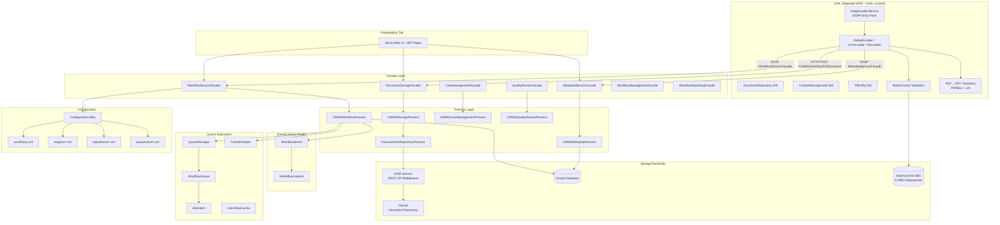
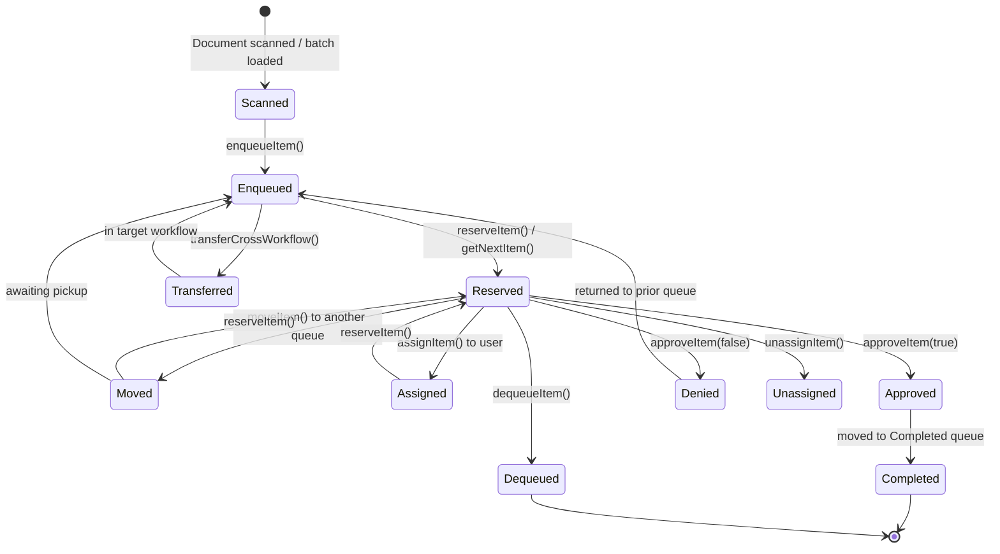
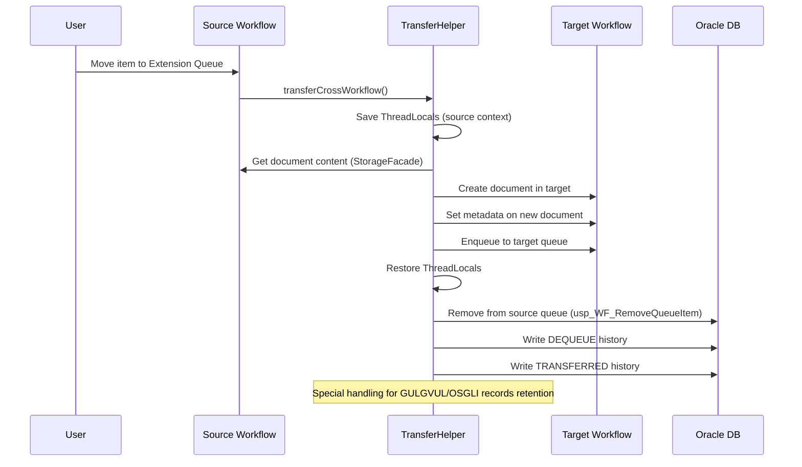
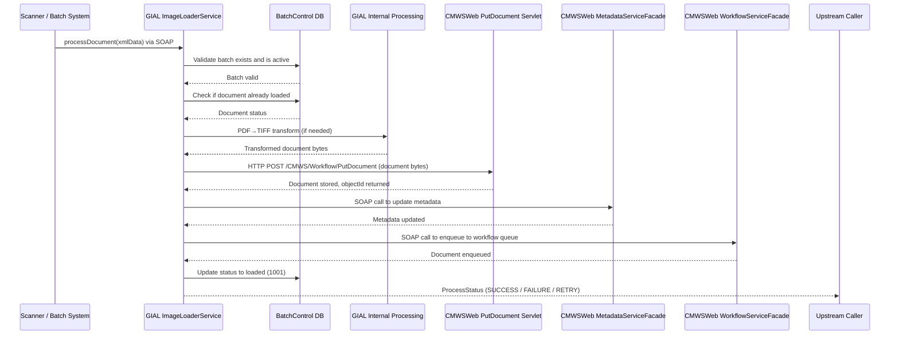
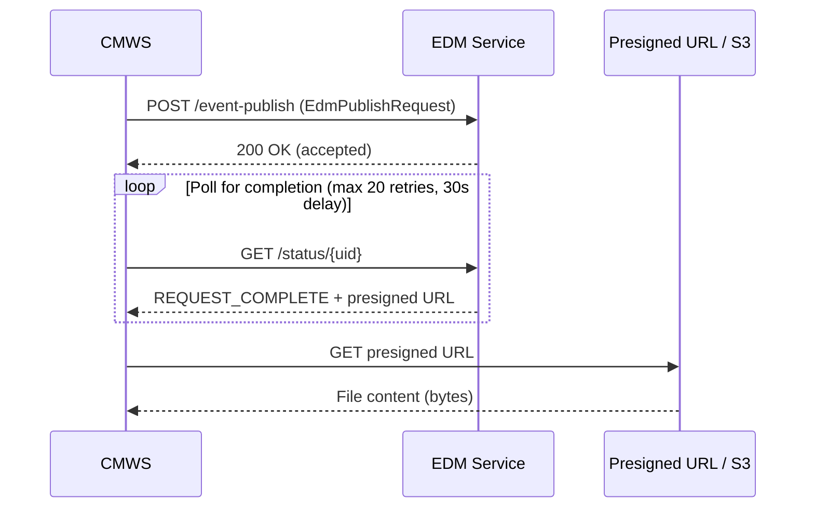
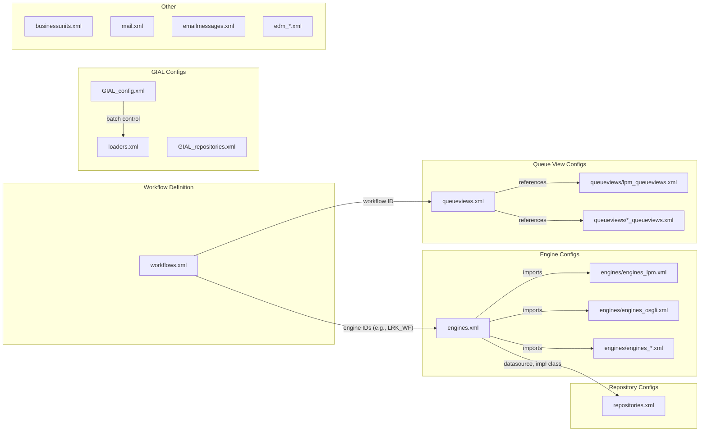
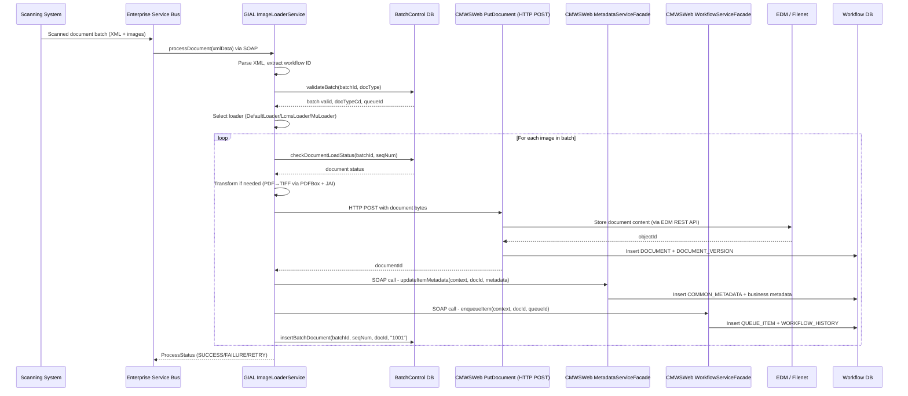
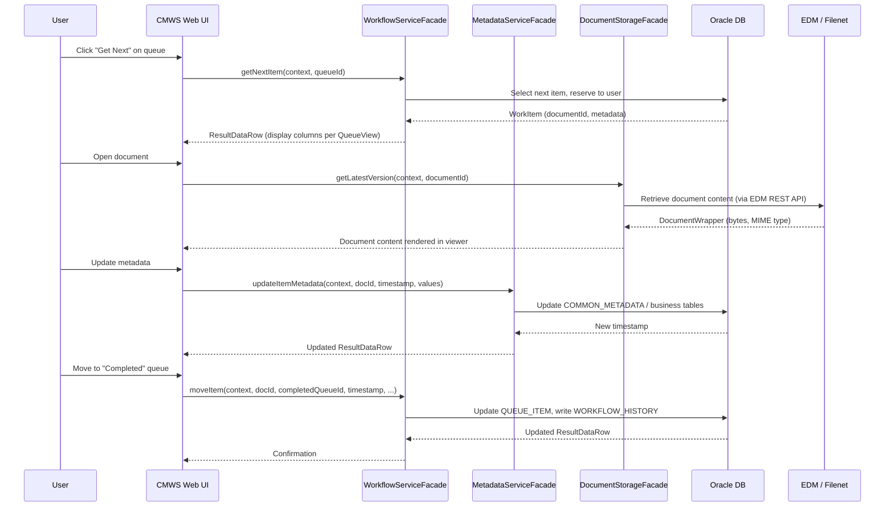
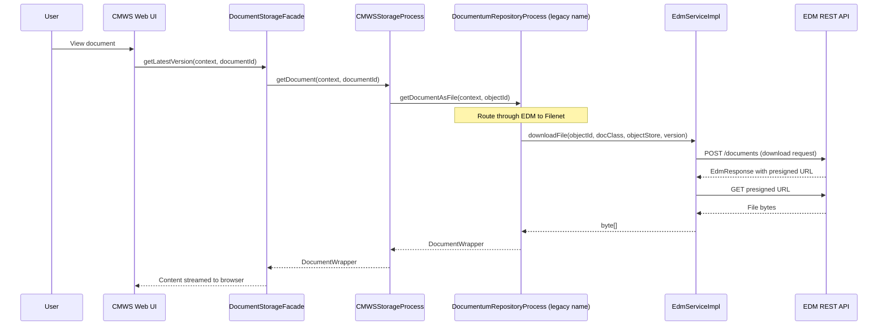

# CMWS Workflow Engine and GIAL Batch Document Ingestion Pipeline

> Onboarding documentation for external contractors.
> Last updated: 2026-04-06

---

## Table of Contents

1. [Architecture Overview](#1-architecture-overview)
2. [Workflow Engine Deep-Dive](#2-workflow-engine-deep-dive)
3. [Queue Management](#3-queue-management)
4. [GIAL Architecture](#4-gial-architecture)
5. [EDM Integration](#5-edm-integration)
6. [Configuration System](#6-configuration-system)
7. [Environment Topology](#7-environment-topology)
8. [End-to-End Claim Processing Flow](#8-end-to-end-claim-processing-flow)
9. [Configuration Reference](#9-configuration-reference)

---

## 1. Architecture Overview

CMWS (Claims Management Workflow System) is a legacy Java/J2EE application managing insurance document workflows across approximately 20 business units within Prudential Group Insurance. The system has two major subsystems:

- **Workflow Engine** (`com.pru.gi.workflow`) -- Manages the lifecycle of work items (documents/claims) as they move through queues, get assigned to users, and progress through processing stages.
- **GIAL** (General Image and Artifact Loading, `com.pru.gi.gial` and `com.pru.gial`) -- A standalone batch document ingestion pipeline deployed as a separate WAR (`gial.war`) at the `/GIAL` context path within the same EAR as CMWSWeb. GIAL accepts XML-formatted batch documents via SOAP web services, validates them against BatchControl databases, transforms images (PDF-to-TIFF conversion, multi-page TIFF assembly), and then **calls CMWSWeb** to store documents and enqueue them into workflows. GIAL is the caller, not the callee -- CMWSWeb does not call GIAL. GIAL has its own parallel copy of all 22 EDM classes and its own configuration files.

### High-Level Component Diagram



---

## 2. Workflow Engine Deep-Dive

### 2.1 Core Concepts

| Concept | Description |
|---------|-------------|
| **WorkflowInstance** | A named business workflow (e.g., LRK, OSGLI, LCMS). Each has a numeric ID and maps to a set of engine references. Defined in `workflows.xml`. |
| **ServiceEngine** | A configured processing component (workflow, metadata, storage, reporting, case management, etc.). Defined in `engines*.xml`. Each engine has an implementation class, a JNDI datasource, and key-value config. |
| **Repository** | A document storage backend (Filenet via EDM; formerly Helix/Documentum). FolderTab repos handle case management. Defined in `repositories*.xml` (legacy) and `edm_*.xml` (current). |
| **WorkItem** | A single document/claim in the workflow. Identified by `document_id`. Lives in exactly one `WorkflowQueue` at a time. |
| **WorkflowQueue** | A named queue within a workflow instance. Has a `queue_type_cd` that determines behavior (WIP, Approval, Completed, Deleted, Pending, etc.). |
| **ServiceContext** | Carries the `workflowId` and `userName` through every service call. The fundamental request context. |

### 2.2 Layered Architecture

Requests flow through three strict layers:

1. **Facade Layer** (`com.pru.gi.workflow.facade`) -- Entry point. Resolves the `WorkflowInstance` from `ServiceContext.workflowId`, looks up the appropriate `ServiceEngine` from configuration, then instantiates the correct process-layer class via a factory. Every facade method follows the same pattern:

   ```
   WorkflowInstance workflow = ConfigurationUtility.getWorkflow(context.getWorkflowId());
   IProcessWorkflow process = WorkflowProcessFactory.getInstance()
       .getWorkflowProcess(ConfigurationUtility.getServiceEngine(workflow.getWorkflowEngineId()));
   IProcessMetadata metaProcess = MetadataProcessFactory.newMetadataProcess(
       ConfigurationUtility.getServiceEngine(workflow.getMetadataEngineId()));
   ```

2. **Process Layer** (`com.pru.gi.workflow.process`) -- Contains the business logic. Implements interfaces like `IProcessWorkflow`, `IProcessMetadata`, `IProcessStorage`. The primary implementations are:
   - `CMWSWorkflowProcess` -- Standard CMWS workflow operations
   - `CMWSMetadataProcess` -- Metadata CRUD via Oracle stored procedures
   - `CMWSStorageProcess` -- Document storage via EDM/Filenet (formerly Helix/Documentum)
   - `NonCMWSWorkflowProcess` / `NonCMWSMetadataProcess` -- For external systems (LCMS, MU, DCMS)

3. **Data Access Layer** (`com.pru.gi.workflow.data`) -- `OracleDataAccess` executes SQL and stored procedures against Oracle. Uses JNDI datasources configured per-engine.

### 2.3 Process Factories

Each engine type has a corresponding factory that uses the `ServiceEngine.getEngineImplementation()` (a `Class<?>` loaded at config time) to reflectively instantiate the correct process class:

| Factory | Interface | Default Implementation |
|---------|-----------|----------------------|
| `WorkflowProcessFactory` | `IProcessWorkflow` | `CMWSWorkflowProcess` |
| `MetadataProcessFactory` | `IProcessMetadata` | `CMWSMetadataProcess` |
| `StorageProcessFactory` | `IProcessStorage` | `CMWSStorageProcess` |
| `RepositoryProcessFactory` | `IProcessRepository` | `DocumentumRepositoryProcess` (legacy name; now routes via EDM to Filenet) |
| `CaseManagementProcessFactory` | `IProcessCaseManagement` | `CMWSCaseManagementProcess` |
| `QualityReviewProcessFactory` | `IProcessQualityReview` | `CMWSQualityReviewProcess` |
| `WorkflowManagementProcessFactory` | `IProcessWorkflowManagement` | `CMWSWorkflowManagementProcess` |
| `ReportingProcessFactory` | `IProcessReports` | `CMWSWorkflowReportingProcess` |
| `LetterProcessFactory` | `IProcessLetter` | `CMWSLetterProcess` |
| `IPRProcessFactory` | `IProcessIPR` | `CMWSIPRProcess` |

### 2.4 Workflow Lifecycle -- State Diagram



**Key Lifecycle Rules:**
- Every state change writes a row to the `WORKFLOW_HISTORY` table.
- Timestamp-based optimistic concurrency: if the front-end passes a stale timestamp, the operation is rejected with `WorkflowTimestampException`.
- Items can only be moved by the user who reserved them (except via `moveItemForUser` for admin operations).
- Queue permissions (`Move From`, `Move To`, `Assign`, `Approve`, `List All`) are enforced at the process layer.

### 2.5 Event/Listener Model

The workflow engine fires events at key lifecycle points. Events extend `AbstractWorkflowEvent` (which implements `IWorkflowEvent`):

| Event Class | Trigger |
|------------|---------|
| `EnqueueEvent` | Item placed onto a queue |
| `MoveEvent` | Item moved between queues |
| `ReserveEvent` | Item reserved by a user |
| `AssignEvent` | Item assigned to a user |
| `GetNextEvent` | "Get Next" operation on a queue |
| `GetQueueEvent` | Queue listing retrieved |
| `GetInboxEvent` | Inbox listing retrieved |

Each event has `PRE_EVENT`, `ON_EVENT`, and `POST_EVENT` action commands, allowing listeners to execute logic before, during, or after an operation.

**Listeners** implement `IWorkflowListener`:

```java
public interface IWorkflowListener {
    boolean performMoveAction(MoveEvent event);
    boolean performAssignAction(AssignEvent event);
    boolean performReserveAction(ReserveEvent event);
    boolean performGetQueueAction(GetQueueEvent event);
    boolean performGetInboxAction(GetInboxEvent event);
    boolean performEnqueueAction(EnqueueEvent event);
    boolean performGetNextAction(GetNextEvent event);
}
```

The `WorkflowListenerAdapter` provides no-op defaults. `WorkflowNotifyEventListener` extends the adapter to handle notification-specific events. Listeners are configured per-engine in `engines*.xml`:

```xml
<entry key="notification-service-listener"
       value="com.pru.gi.workflow.process.listener.WorkflowNotifyEventListener"/>
```

---

## 3. Queue Management

### 3.1 Queue Types

The `QueueManager` defines the following queue type codes, each controlling different behavior:

| Code | Constant | Purpose |
|------|----------|---------|
| 1 | `QUEUE_TYPE_CODE_APPROVAL` | Requires approve/deny action |
| 2 | `QUEUE_TYPE_CODE_COMPLETED` | Terminal state -- work is done |
| 3 | `QUEUE_TYPE_CODE_DELETED` | Soft-deleted items |
| 4 | `QUEUE_TYPE_CODE_PENDING` | Awaiting external action |
| 5 | `QUEUE_TYPE_CODE_QR` | Quality Review queue |
| 6 | `QUEUE_TYPE_CODE_MANUAL_TRAN` | Manual transfer queue |
| 7 | `QUEUE_TYPE_CODE_WIP` | Work In Progress (default active queue) |
| 8 | `QUEUE_TYPE_CODE_ARCHIVED` | Long-term archive |
| 9 | `QUEUE_TYPE_CODE_APPEALS` | Appeals processing |
| 10 | `QUEUE_TYPE_CODE_CLOSED` | Closed/finalized |
| 11 | `QUEUE_TYPE_CODE_RECORDS_MGMT` | Records management |
| 99 | `QUEUE_TYPE_CODE_EXTENSION` | Custom extension queues |
| 100 | `QUEUE_TYPE_CODE_VIRTUAL` | Virtual (computed) queues |

### 3.2 QueueManager and Caching

`QueueManager` is a static singleton that caches `WorkflowQueue` objects in a `HashMap` keyed by `(workflowId, queueId)`. It uses `WorkflowHelper` thread-local variables to determine the current workflow context:

```
QueueManager
  +-- HashMap<workflowId, HashMap<queueId, WorkflowQueue>>
        +-- WorkflowQueue
              +-- List<WorkItem>
              +-- QueueView (attached)
              +-- queueName, queueTypeCd, isGetNext, etc.
```

Queue data is loaded lazily and cached with a configurable timeout (`queue-timeout` in engine config). The `WorkflowHelper` class manages thread-local state (DAL connection, service engine, workflow ID, metadata process, service context) that persists for the duration of a request.

### 3.3 Queue Views

Queue views define how items are displayed in each queue. They are configured in per-workflow XML files referenced from `queueviews.xml`:

```xml
<queue-view workflow-id="1" queue-id="*">
    <view-name>LRK Default Queue View</view-name>
    <sort-columns>
        <sort-column name="target_date" direction="ASC"/>
    </sort-columns>
    <display-columns>
        <display-column name="document_type_cd" caption="Document Type" decode="true"/>
        <display-column name="ssn" caption="SSN"/>
        <display-column name="aging_days_accum" caption="Aging Days"
            calculated="true" calculateon="queue_type_cd,aging_date,aging_days_accum"
            calculateid="1"/>
        <!-- ... -->
    </display-columns>
</queue-view>
```

Key queue view features:
- **`queue-id="*"`** -- Default view for all queues in the workflow
- **`queue-id="INBOX"`** -- Special inbox view
- **`queue-id="SEARCH"`** -- Search results view with `row-count` limit
- **`queue-id="ACTIVE"` / `"ARCHIVED"`** -- Records management views
- **`decode="true"`** -- Values are decoded via lookup tables (e.g., queue names, user display names)
- **`calculated="true"`** -- Column value computed by a Java class (e.g., aging calculation)
- **`calculateid`** -- References a `CALCULATEID:N` entry in the engine config that maps to a class implementing `ICalculateDisplayColumn`

### 3.4 Extension Queues and Auto-Transfer

Extension queues (type 99) trigger custom Java classes when items are enqueued. The engine config maps queue IDs to extension classes:

```xml
<entry key="EXTENSION:20" value="com.pru.gi.lrk.queue.LRKTransferMLLCM"/>
<entry key="EXTENSION:21" value="com.pru.gi.lrk.queue.LRKTransferNCSC"/>
<entry key="EXTENSION:22" value="com.pru.gi.lrk.queue.LRKAutoAssign"/>
<entry key="EXTENSION:24" value="com.pru.gi.lrk.queue.LRKTransferWalMart"/>
```

These implement `IWorkflowExtensionStep` and handle:
- **Cross-workflow transfers** (via `TransferHelper`)
- **Auto-assignment** logic
- **Business-specific routing** (e.g., CRM integration)

### 3.5 Cross-Workflow Transfer

The `TransferHelper` class handles moving work items between different workflow instances. The process:



The transfer copies a standard set of metadata fields (`scan_uid`, `batch_number`, `control_number`, `ssn`, `box_number`, etc.) plus any workflow-specific fields defined in a metadata map.

### 3.6 Get Next and Auto-Assign

"Get Next" is the primary way processors receive work. When a user clicks "Get Next" on a queue:

1. The system queries for the next unprocessed item based on the queue's sort configuration
2. The item is automatically reserved to the requesting user
3. A `WORKFLOW_HISTORY` entry is written
4. The `ResultDataRow` for the item is returned to the UI

The `maxGetNextCount` attribute on queue views allows configuring how many items are returned per Get Next operation (default is 1).

### 3.7 Inbox Management

The `UserInbox` and `UserInboxCache` classes manage per-user inbox views. An item appears in a user's inbox if:
- The user is the `reserved_by` user, OR
- The user is the `assigned_to` user AND the item is not reserved by someone else

---

## 4. GIAL Architecture

### 4.1 Overview

GIAL (General Image and Artifact Loading) is a standalone batch document ingestion pipeline. It is deployed as a separate WAR (`gial.war`) at the `/GIAL` context path within the same EAR as CMWSWeb. GIAL is built by Ant/Ivy and has its own `web.xml`, `webservices.xml`, and `ibm-web-bnd.xml`.

**What GIAL does:** Accepts XML-formatted batch documents via SOAP, validates them against BatchControl databases, transforms images (PDF-to-TIFF via PDFBox + JAI, format conversion, multi-page TIFF assembly), and then calls CMWSWeb to store and enqueue documents.

**What GIAL does NOT do:**
- It does NOT get called by CMWSWeb (GIAL is the caller, not the callee)
- It does NOT act as an abstraction layer between CMWSWeb and Filenet/EDM
- It does NOT share code with CMWSWeb (it has its own parallel copy of all 22 EDM classes)

### 4.2 The Actual Data Flow



### 4.3 Web Services Exposed by GIAL

| Web Service | Interface | Purpose |
|-------------|-----------|---------|
| `ImageLoaderService` | `GIALImageLoader` | Main entry point: `processDocument(String xmlData)` |
| `DocumentRepository` | -- | `createDocument`, `getDocument`, `updateDocument` |
| `ContentManagement` | -- | Batch document operations |
| `TiffUtility` | -- | `convertToTiff`, `mergeTiffs` |

### 4.4 Package Structure

GIAL has two major package hierarchies:

**`com.pru.gi.gial`** -- GIAL services and infrastructure:
- `config/` -- `ServiceEngine`, `Repository`, `LoaderConfig`, `ConfigurationUtility`, `EdmAuthConfig`
- `process/` -- Process implementations (`CMWSContentManagementProcess`, `LCMSContentManagementProcess`, `DocumentumRepositoryProcess` -- legacy name)
- `svcs/` -- Web service endpoints (`ContentManagement`, `DocumentRepository`, `TiffUtility`)
- `svcs/common/` -- Shared DTOs (`DocumentWrapper`, `ServiceContext`, `MetadataValue`, `GIALException`)
- `data/` -- Database access (`DBInterface`, `LoaderHelper`, `FilennetDataAccess` -- note double 'n', actual class name, `XMLHelper`)

**`com.pru.gial`** -- Batch loader (the core ingestion logic):
- `ImageLoader/` -- Batch document loading (`ImageLoader`, `DefaultLoader`, `LcmsLoader`, `MuLoader`, `OSGLILoader`)
- `config/` -- Batch control config (`BatchControlConfig`, `CMWSConfig`, `ConfigurationUtility`)
- `data/` -- Database interface for batch operations
- `metadata/` -- Claim metadata objects (`ClaimIdInfo`, `CoverageInfo`, `PayeeGIAL`)

**`com.pru.gi.cmws.method`** -- Web service method implementations:
- `CreateDocumentMethod`, `GetDocumentMethod`, `EnqueueDocumentMethod`
- `MetadataLookupMethod`, `SearchMetadataMethod`, `UpdateMetadataMethod`

**`com.pru.gi.workflow.edm`** -- GIAL's own parallel copy of EDM integration classes (NOT shared with CMWSWeb):
- `EdmService` / `EdmServiceImpl` -- EDM client
- `EdmTransformer` -- Builds EDM request/response objects
- `EdmHelper` -- Utility methods
- Various DTOs for EDM API communication

### 4.5 Loader Types (Strategy Pattern)

The `ImageLoader` selects a loader class based on workflow ID. Each loader delegates to a different content management process:

| Loader | Workflows | Delegate |
|--------|-----------|----------|
| `DefaultLoader` | OSGLI (3/15), GUL/GVUL (9), COB (11), SMCOB (12) | `CMWSContentManagementProcess` |
| `LcmsLoader` | GLCD/LCMS (102), LCMS PEB (105), OSGLI Claims (104), ILI (107) | `LCMSContentManagementProcess` |
| `MuLoader` | MU (101) | MU-specific processing |

### 4.6 Supported Workflows

| Workflow | ID | Batch DB JNDI |
|----------|----|---------------|
| OSGLI | 3, 15 | `jdbc/osgli2Batch`, `jdbc/osglia2Batch` |
| GUL/GVUL | 9 | `jdbc/gul2Batch` |
| COB | 11 | `jdbc/cob2Batch` |
| SMCOB | 12 | `jdbc/smcob2Batch` |
| MU | 101 | `jdbc/mu2Batch` |
| GLCD/LCMS | 102 | `jdbc/lcms2Batch` |
| LCMS OSGLI Claims | 104 | (via lcms2Batch) |
| LCMS PEB | 105 | (via lcms2Batch) |
| LCMS ILI | 107 | (via lcms2Batch) |
| Waiver | 999 -> 102 | `jdbc/waiver2Batch` |

### 4.7 BatchControl Database

The BatchControl database validates and tracks document ingestion:
- Validates that the batch exists and is active
- Checks if a document has already been loaded (prevents duplicates)
- Updates batch/document status: `1000` = created, `1001` = loaded
- Uses 8 separate JNDI datasources for different workflow batch databases (`lcms2Batch`, `gul2Batch`, `osglia2Batch`, `osgli2Batch`, `waiver2Batch`, `mu2Batch`, `cob2Batch`, `smcob2Batch`)

### 4.8 GIAL's Own EDM Integration

GIAL maintains its own independent copy of all 22 EDM classes in `com.pru.gi.workflow.edm`. These are parallel copies of the classes in CMWSWeb, not shared libraries. Additionally, GIAL has its own:

- `FilennetDataAccess` in `com.pru.gi.gial.data` (note: double 'n' is the actual class name)
- `DocumentumRepositoryProcess` in `com.pru.gi.gial.process`
- `ConfigurationUtility` in `com.pru.gi.gial.config`

GIAL loads its own configuration files:
- `GIAL_repositories_*.xml` -- Repository endpoint configuration
- `edm_*.xml` -- EDM endpoint configuration
- `loaders_*.xml` -- Loader class mappings per workflow
- `GIAL_config_*.xml` -- Batch control database configuration

### 4.9 GIAL Configuration Files

GIAL has its own set of environment-specific configuration files, independent of CMWSWeb:

| File Pattern | Purpose |
|-------------|---------|
| `GIAL_config_<ENV>.xml` | Batch control database connections |
| `GIAL_repositories_<ENV>.xml` | Document repository endpoints |
| `loaders_<ENV>.xml` | Loader class mappings per workflow |
| `edm_<ENV>.xml` | EDM REST API endpoints and auth |

> **Note:** The `repositories_*.xml` config files still contain legacy Helix URLs (`hlxrtvapi` endpoints). The `edm_*.xml` config files contain the current EDM endpoints. The migration from Helix to EDM is being completed on this branch (`GI_Sprint_Rel_06.12.25_DEV_Helix_to_EDM`).

---

## 5. EDM Integration

### 5.1 Overview

EDM (Enterprise Document Management) is the current document middleware, replacing the former Helix middleware (which connected to Documentum). CMWSWeb integrates with EDM via REST APIs, with the `EdmServiceImpl` class in `com.pru.gi.workflow.edm` handling all communication. EDM stores documents in **Filenet** (which replaced Documentum as the document repository). GIAL also has its own parallel copy of the EDM integration classes (see Section 4.8).

### 5.2 EDM Operations

The `EdmService` interface defines:

| Operation | Method | Description |
|-----------|--------|-------------|
| Upload | `uploadFile` / `uploadFileWithBytestream` | Store new document |
| Download | `downloadFile` | Retrieve document content |
| Download Info | `downloadFileInfo` | Get document metadata without content |
| Update | `updateFile` / `updateFileWithBytestream` | Replace document content |
| Validate | `isValidObjectId` | Check if an object ID exists |

### 5.3 EDM Request Transformation

The `EdmTransformer` class builds properly structured EDM API requests. Key fields:

- **Application ID**: `APM0001423`
- **Product Type**: `GI`
- **Intermediary ID**: `CMWS`
- **Repository**: `FileNet`
- **Subdomain**: `repository`

For downloads, the system identifies documents by `r_object_id` (legacy Documentum identifier, still used for backward compatibility) or `PrimaryDocumentGUID` (EDM/Filenet native).

### 5.4 Large File Handling

Files exceeding 200 MB use an event-publish flow:



### 5.5 EDM Configuration

EDM auth and endpoints are configured per-environment in `edm_*.xml` files, loaded by `ConfigurationUtility.getEdmAuthConfig()`:

- `basicAuth` -- HTTP Basic auth header
- `edmEnv` -- Environment identifier (sent as `X-PruEnvID` header)
- `documentsUrl` -- Upload/download endpoint
- `presignedUrl` -- Presigned URL endpoint for large files
- `eventPublishUrl` -- Event publish endpoint
- `statusUrl` -- Status polling endpoint

---

## 6. Configuration System

### 6.1 Configuration Loading

All configuration is managed by `ConfigurationUtility`, a static utility class that lazy-loads and caches XML configuration with automatic hot-reload (checks file modification time every 3 seconds).

### 6.2 Configuration File Relationships



### 6.3 Environment-Specific File Resolution

Configuration files use the `com.pru.AppServerEnv` system property to select environment-specific variants:

```java
// In ConfigurationUtility static initializer:
String envSuffix = System.getProperty("com.pru.AppServerEnv"); // e.g., "DEV", "QA", "PROD"
ENGINE_CONFIG_FILE = "engines_" + envSuffix + ".xml";         // e.g., engines_DEV.xml
REPOSITORY_CONFIG_FILE = "repositories_" + envSuffix + ".xml";
EDM_CONFIG_FILE = "edm_" + envSuffix + ".xml";
```

If the system property is not set, the base filename is used (e.g., `engines.xml`).

### 6.4 workflows.xml Structure

Each workflow instance is a Spring bean with 13 constructor arguments:

| Index | Field | Description | Example |
|-------|-------|-------------|---------|
| 0 | workflowId | Numeric ID (must match DB `WORKFLOW_INSTANCE` table) | `1` |
| 1 | workflowName | Display name | `Record Keeping Services` |
| 2 | workflowEngineId | Key into engines map | `LRK_WF` |
| 3 | metadataEngineId | Key into engines map | `LRK_META` |
| 4 | storageEngineId | Key into engines map | `LRK_STOR` |
| 5 | tamKey | TAM authorization path (legacy name references Documentum era) | `/Prudential/InsDiv/GI/CMWS/Workflows/LRK` |
| 6 | reportingEngineId | Key into engines map (nullable) | `LRK_RPT` |
| 7 | caseManagementEngineId | Key into engines map (nullable) | `LRK_CASE` |
| 8 | workflowManagementEngineId | Key into engines map | `LRK_WFMGMT` |
| 9 | letterEngineId | Key into engines map (nullable) | `WALMART_LTR` |
| 10 | letterStorageEngineId | Key into engines map (nullable) | `WALMART_LTRSTOR` |
| 11 | qualityReviewEngineId | Key into engines map (nullable) | `LRK_QR` |
| 12 | iprEngineId | Key into engines map (nullable) | `VERIZON_IPR` |

### 6.5 Engine Configuration Details

Each engine bean has four constructor args plus a config map:

```xml
<bean id="lpmWorkflowEngine" parent="cmwsWorkflow"
      class="com.pru.gi.workflow.config.ServiceEngine">
    <constructor-arg index="0" value="LRK_WF"/>           <!-- engine ID -->
    <constructor-arg index="1" value="LRK Workflow Engine"/>  <!-- display name -->
    <constructor-arg index="2" value="workflow"/>           <!-- engine type -->
    <constructor-arg index="3" value="com.pru.gi.workflow.process.CMWSWorkflowProcess"/>
    <property name="engineConfig">
        <map merge="true">
            <entry key="datasource" value="jdbc/wf_common_oracle_database1"/>
            <entry key="queue-timeout" value="120000"/>
            <entry key="use-cache" value="true"/>
            <entry key="EXTENSION:20" value="com.pru.gi.lrk.queue.LRKTransferMLLCM"/>
            <entry key="CALCULATEID:1" value="com.pru.gi.lrk.queue.LPMCalculateAging"/>
            <entry key="notification-service-listener"
                   value="com.pru.gi.workflow.process.listener.WorkflowNotifyEventListener"/>
        </map>
    </property>
</bean>
```

Engine config key conventions:
- `datasource` -- JNDI name for the Oracle database
- `queue-timeout` -- Cache timeout for queue data (ms)
- `use-cache` -- Enable/disable queue caching
- `EXTENSION:<queueId>` -- Extension class for a queue
- `CALCULATEID:<id>` -- Calculated display column class
- `notification-service-listener` -- Listener class for workflow events
- `METADATA:<fieldName>` -- Metadata field-to-column mapping (metadata engines)
- `LOOKUP:<lookupName>` -- Lookup table ID mapping (metadata engines)
- `DOCTYPE:` -- Document object type, legacy Documentum naming convention (metadata engines)
- `default-repository-id` -- Default storage repository (storage engines)
- `folder-repository` -- Case folder repository ID

---

## 7. Environment Topology

### 7.1 Environments

| Environment | System Property | Config Suffix | Purpose |
|-------------|----------------|---------------|---------|
| DEV | `com.pru.AppServerEnv=DEV` | `_DEV` | Development |
| DEV2 | `com.pru.AppServerEnv=DEV2` | `_DEV2` | Secondary dev |
| QA | `com.pru.AppServerEnv=QA` | `_QA` | QA testing |
| QA2 | `com.pru.AppServerEnv=QA2` | `_QA2` | Secondary QA |
| STAGE | `com.pru.AppServerEnv=STAGE` | `_STAGE` | Pre-production |
| STAGE2 | `com.pru.AppServerEnv=STAGE2` | `_STAGE2` | Secondary staging |
| PROD | `com.pru.AppServerEnv=PROD` | `_PROD` | Production |
| INT | (GIAL only) | `_INT` | Integration testing |

### 7.2 Per-Environment Config Files

Each environment has its own set of:
- `engines_<ENV>.xml` -- Different JNDI datasources
- `edm_<ENV>.xml` -- Different EDM REST API endpoints and auth (the current document middleware)
- `repositories_<ENV>.xml` -- Legacy Helix repository configs (contain `hlxrtvapi` URLs being migrated away)
- `GIAL_config_<ENV>.xml` -- Different batch control databases
- `GIAL_repositories_<ENV>.xml` -- Different GIAL repository endpoints
- `loaders_<ENV>.xml` -- Different loader configurations
- `dmcl.ini.<env>` -- Legacy Documentum client config per environment (being phased out)

### 7.3 Database Architecture

All workflows share a common Oracle database per environment, accessed via JNDI datasources:
- `jdbc/wf_common_oracle_database1` -- Workflow and metadata operations
- `jdbc/meta_common_oracle_database1` -- Metadata-specific queries
- Various batch control datasources for GIAL (e.g., `jdbc/osglia2Batch`, `jdbc/lcms2Batch`)

### 7.4 Key Database Tables

| Table | Purpose |
|-------|---------|
| `WORKFLOW_INSTANCE` | Workflow definitions (mirrors `workflows.xml`) |
| `WORKFLOW_QUEUE` | Queue definitions per workflow |
| `QUEUE_ITEM` | Work items currently in queues |
| `WORKFLOW_HISTORY` | Audit trail of all workflow actions |
| `DOCUMENT` | Document master records |
| `DOCUMENT_VERSION` | Document version tracking with object IDs |
| `DOCUMENT_TYPE` | Document type definitions |
| `COMMON_METADATA` | Shared metadata fields (SSN, batch number, etc.) |
| `QUEUE_TYPE` | Queue type definitions |
| `LOOKUP` | Decode lookup tables |
| `USER_PERMISSION` | Queue-level permissions per user |

---

## 8. End-to-End Claim Processing Flow

### 8.1 Document Ingestion (Batch Load)



### 8.2 User Processing a Work Item



### 8.3 Document Retrieval Flow (EDM Path)



---

## 9. Configuration Reference

### 9.1 Workflow Instance Registry

| ID | Bean ID | Name | WF Engine | Has Case Mgmt | Has Letters | Has QR | Has IPR |
|----|---------|------|-----------|--------------|-------------|--------|---------|
| 1 | lpm | Record Keeping Services | LRK_WF | Yes | No | Yes | No |
| 2 | lockbox | COSC/MLBO Lockbox | NCSCMLLCM_WF | No | No | Yes | No |
| 3 | osgli | OSGLI Administration | OSGLI_WF | Yes | No | Yes | No |
| 4 | contracts | Contracts Archive | CONTRACTS_WF | No | No | No | No |
| 5 | uw | Underwriting Archive | UNDERWRITING_WF | No | No | No | No |
| 6 | proposals | Proposal Unit Archive | PROPOSALS_WF | No | No | No | No |
| 7 | walmart | Wal Mart | WALMART_WF | Yes | Yes | Yes | No |
| 8 | lcnv | Life Conversions | LCNV_WF | Yes | Yes | Yes | No |
| 9 | gulgvul | GUL/GVUL Management | GUL_GVUL_WF | Yes | No | Yes | No |
| 10 | esc | Enrollment Support Center | ESC_WF | Yes | Yes | Yes | No |
| 11 | cob | Client On-Boarding | COB_WF | Yes | No | No | No |
| 12 | smcob | Small Market Client On-Boarding | SMCOB_WF | Yes | No | Yes | No |
| 13 | verizon | Verizon | VERIZON_WF | No | No | Yes | Yes |
| 14 | epr | Enrollment Campaign Management | EPR_WF | Yes | No | Yes | No |
| 15 | osgliarch | OSGLI Archive | OSGLIARCH_WF | Yes | No | Yes | No |
| 101 | mu | Medical Underwriting | MU_WF | No | No | No | No |
| 102 | lcms | LCMS - GLCD | LCMS_WF | No | No | No | No |
| 103 | dcms | DCMS Archive | DCMS_WF | No | No | No | No |
| 104 | lcmsosgli | LCMS - OSGLI | LCMS_OSGLI_WF | No | No | No | No |
| 105 | lcmspeb | LCMS - PEB | LCMS_PEB_WF | No | No | No | No |
| 107 | lcmsili | LCMS - ILI | LCMS_ILI_WF | No | No | No | No |

### 9.2 Business Units

| ID | Name |
|----|------|
| LRK | Life Record Keeping |
| NCSC | National Client Service Center |
| PREMACCT | Premium Accounting |
| MLLCM | Mid/Large Life Case Management |

### 9.3 Engine Type Reference

| Engine Type | Impl Class | Purpose |
|-------------|-----------|---------|
| `workflow` | `CMWSWorkflowProcess` | Queue operations, permissions, workflow history |
| `metadata` | `CMWSMetadataProcess` | Metadata CRUD, search, lookups |
| `storage` | `CMWSStorageProcess` | Document create/read/update via repositories |
| `reporting` | `CMWSWorkflowReportingProcess` | Workflow reports |
| `case` | `CMWSCaseManagementProcess` | Case folder management |
| `wfmanagement` | `CMWSWorkflowManagementProcess` | Admin operations |
| `qualityreview` | `CMWSQualityReviewProcess` | QR sampling and review |
| `letter` | `CMWSLetterProcess` | Letter generation |
| `letterstorage` | `CMWSLetterStorageProcess` | Letter template storage |
| `ipr` | `CMWSIPRProcess` | In-Process Review |

### 9.4 Repository Type Reference

| Object Type | Workflows | Description |
|-------------|-----------|-------------|
| `pru_cmws_document` | LRK (default) | Standard CMWS document |
| `pru_cmws_osgli_document` | OSGLI | OSGLI-specific document |
| `pru_cmws_osgli_archive` | OSGLI Archive | OSGLI archive document |
| `pru_cmws_contract_document` | Contracts | Contract document (full-text) |
| `pru_underwriting_contract_d` | Underwriting | Underwriting document (full-text) |
| `pru_cmws_proposal_document` | Proposals | Proposal document |
| `pru_cmws_cob_document` | COB | Client On-Boarding document |
| `pru_cmws_smcob_document` | SMCOB | Small Market COB document |
| `pru_cmws_epr_document` | EPR | Enrollment Process Re-Design document |
| `pru_mu_document` | MU | Medical Underwriting document |
| `pru_lcms_document` | LCMS | LCMS/GLCD document |
| `pru_dcms_document` | DCMS | DCMS archive document |

### 9.5 Key Source File Reference

| Component | Path |
|-----------|------|
| Configuration loader | `CMWSWeb/src/main/java/com/pru/gi/workflow/config/ConfigurationUtility.java` |
| Workflow instance model | `CMWSWeb/src/main/java/com/pru/gi/workflow/config/WorkflowInstance.java` |
| Service engine model | `CMWSWeb/src/main/java/com/pru/gi/workflow/config/ServiceEngine.java` |
| Repository model | `CMWSWeb/src/main/java/com/pru/gi/workflow/config/Repository.java` |
| Workflow facade | `CMWSWeb/src/main/java/com/pru/gi/workflow/facade/WorkflowServiceFacade.java` |
| Workflow process interface | `CMWSWeb/src/main/java/com/pru/gi/workflow/process/IProcessWorkflow.java` |
| Queue manager | `CMWSWeb/src/main/java/com/pru/gi/workflow/queues/QueueManager.java` |
| Work item model | `CMWSWeb/src/main/java/com/pru/gi/workflow/queues/WorkItem.java` |
| Transfer helper | `CMWSWeb/src/main/java/com/pru/gi/workflow/queues/TransferHelper.java` |
| Event base | `CMWSWeb/src/main/java/com/pru/gi/workflow/process/event/AbstractWorkflowEvent.java` |
| Listener interface | `CMWSWeb/src/main/java/com/pru/gi/workflow/process/listener/IWorkflowListener.java` |
| EDM service | `CMWSWeb/src/main/java/com/pru/gi/workflow/edm/EdmServiceImpl.java` |
| EDM transformer | `CMWSWeb/src/main/java/com/pru/gi/workflow/edm/EdmTransformer.java` |
| GIAL content management | `GIAL/src/main/java/com/pru/gi/gial/svcs/ContentManagement.java` |
| GIAL document repository | `GIAL/src/main/java/com/pru/gi/gial/svcs/DocumentRepository.java` |
| Batch image loader | `GIAL/src/main/java/com/pru/gial/ImageLoader/ImageLoader.java` |
| workflows.xml | `CMWSWeb/WebContent/config/workflows.xml` |
| engines.xml | `CMWSWeb/WebContent/config/engines.xml` |
| repositories.xml | `CMWSWeb/WebContent/config/repositories.xml` |
| queueviews.xml | `CMWSWeb/WebContent/config/queueviews.xml` |
| businessunits.xml | `CMWSWeb/WebContent/config/businessunits.xml` |
| GIAL config | `CMWSWeb/WebContent/config/GIAL_config.xml` |
| loaders config | `CMWSWeb/WebContent/config/loaders.xml` |
