# CMWS System Diagrams

Mermaid diagram collection for the CMWS legacy codebase. Each diagram is self-contained and renderable in any Mermaid-compatible viewer (GitHub, VS Code plugin, Mermaid Live Editor).

---

## a. C4 System Context Diagram

Shows CMWS and all external systems, actors, and integration points at the highest level.

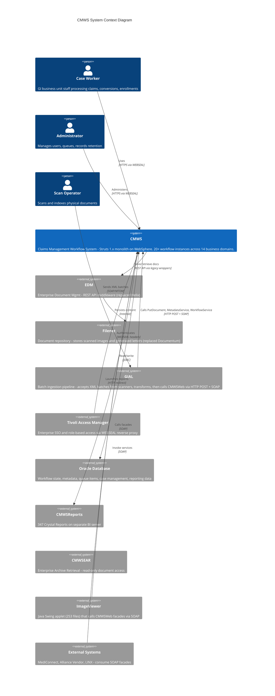

---

## b. C4 Container Diagram

Internal components of the CMWS monolith showing the layered architecture within the EAR deployment containing two WARs.

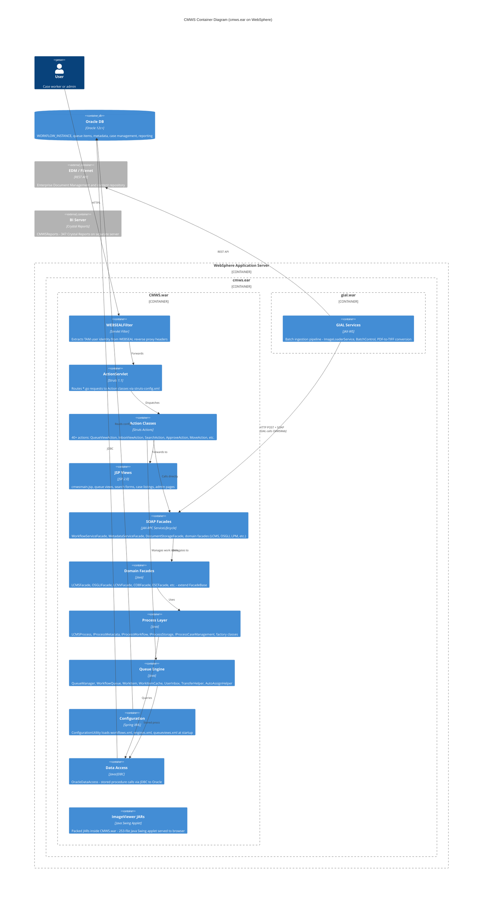

---

## c. Component Diagram - Domain Module Relationships

Shows how the 14+ business domains relate to the shared workflow framework and to each other.

```mermaid
graph TB
    subgraph "Shared Workflow Framework"
        FacadeBase["FacadeBase<br/><i>ServiceLifecycle</i>"]
        WFS["WorkflowServiceFacade"]
        MSF["MetadataServiceFacade"]
        DSF["DocumentStorageFacade"]
        CMF["CaseManagementFacade"]
        LTR["LetterServiceFacade"]
        QRF["QualityReviewFacade"]
        QTFS["QTSFacade"]
        WMF["WorkflowManagementFacade"]
        RPT["WorkflowReportingFacade"]
        NOT["NotificationEventFacade"]
    end

    subgraph "Domain Modules"
        LRK["lrk<br/>Record Keeping<br/>WF ID: 1"]
        LOCK["lockbox<br/>COSC/MLBO Lockbox<br/>WF ID: 2"]
        OSGLI["osgli<br/>OSGLI Admin<br/>WF ID: 3"]
        CON["contracts<br/>Contracts Archive<br/>WF ID: 4"]
        UW["uw<br/>Underwriting Archive<br/>WF ID: 5"]
        PROP["proposals<br/>Proposal Unit<br/>WF ID: 6"]
        WAL["walmart<br/>Wal Mart<br/>WF ID: 7"]
        LCNV["lcnv<br/>Life Conversions<br/>WF ID: 8"]
        GUL["gulgvul<br/>GUL/GVUL Mgmt<br/>WF ID: 9"]
        ESC["esc<br/>Enrollment Support<br/>WF ID: 10"]
        COB["cob<br/>Client On-Boarding<br/>WF ID: 11"]
        SMCOB["smcob<br/>SM Client On-Boarding<br/>WF ID: 12"]
        VER["verizon<br/>Verizon<br/>WF ID: 13"]
        EPR["epr<br/>Enrollment Campaign<br/>WF ID: 14"]
        MU["mu<br/>Medical Underwriting<br/>WF ID: 101"]
        LCMS["lcms<br/>LCMS-GLCD<br/>WF ID: 102"]
    end

    subgraph "Queue System"
        QM["QueueManager"]
        WQ["WorkflowQueue"]
        WI["WorkItem"]
        WIC["WorkItemCache"]
        UIB["UserInbox"]
        TH["TransferHelper"]
        AAH["AutoAssignHelper"]
    end

    subgraph "Process Interfaces"
        IPW["IProcessWorkflow"]
        IPM["IProcessMetadata"]
        IPS["IProcessStorage"]
        IPC["IProcessCaseManagement"]
        IPL["IProcessLetter"]
        IPR["IProcessReports"]
        IPQR["IProcessQualityReview"]
    end

    LRK --> FacadeBase
    LOCK --> FacadeBase
    OSGLI --> FacadeBase
    LCNV --> FacadeBase
    LCMS --> FacadeBase
    WAL --> FacadeBase
    ESC --> FacadeBase
    COB --> FacadeBase
    EPR --> FacadeBase
    MU --> FacadeBase

    FacadeBase --> WFS
    FacadeBase --> MSF
    FacadeBase --> DSF

    WFS --> IPW
    MSF --> IPM
    DSF --> IPS
    CMF --> IPC

    QM --> WQ
    WQ --> WI
    WIC --> WI
    TH --> WFS
    TH --> MSF
    TH --> DSF
    AAH --> WIC

    OSGLI -.->|"cross-WF transfer"| GUL
    LCNV -.->|"cross-WF transfer"| LRK

    style FacadeBase fill:#4a90d9,color:#fff
    style QM fill:#e67e22,color:#fff
    style TH fill:#e74c3c,color:#fff
```

---

## d. Sequence: Claim Creation (LCMS Domain)

Traces how a new claim is created in the LCMS domain, from user action through the process layer to Oracle.

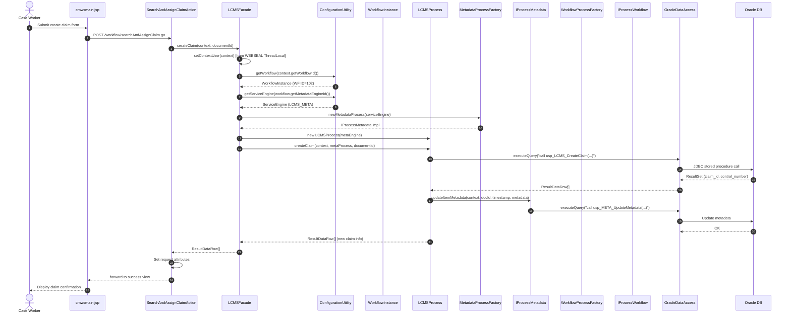

---

## d2. Sequence: GIAL Batch Ingestion

How scanned documents flow from scanners through the GIAL batch ingestion pipeline into CMWSWeb. GIAL is the caller -- it accepts XML batches from scanners, transforms content, then calls CMWSWeb services.

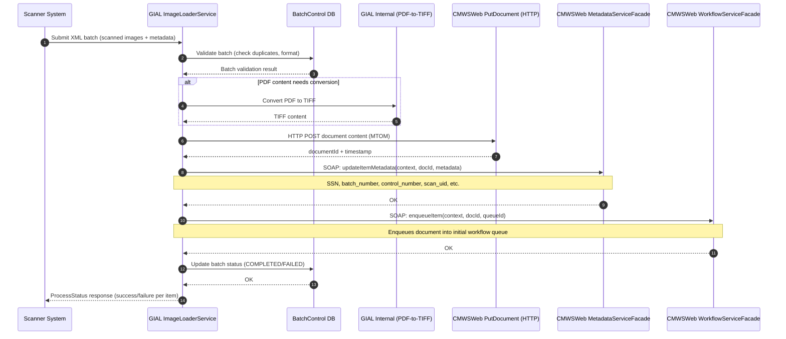

---

## d3. Sequence: ImageViewer Communication

How the ImageViewer Java Swing applet (253 files, packed as JARs inside CMWS.war) communicates with CMWSWeb facades via SOAP and bridges back to the browser via JavaScript.

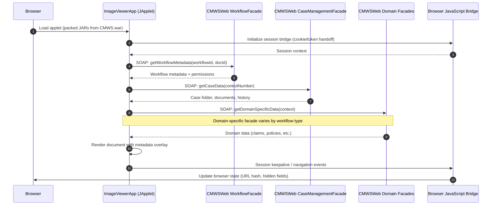

---

## e. Sequence: Document Retrieval

How a document image is fetched from Filenet (via EDM) through the legacy wrapper chain and streamed to the browser. Note: legacy class names (DocumentumRepositoryProcess, FilennetDataAccess) are kept as wrappers even though the underlying storage migrated from Documentum to EDM/Filenet.

```mermaid
sequenceDiagram
    autonumber
    actor User as Case Worker
    participant Browser as Browser/ImageViewer
    participant Servlet as GetDocument Servlet
    participant DSF as DocumentStorageFacade
    participant CSP as CMWSStorageProcess
    participant DRP as DocumentumRepositoryProcess
    participant FDA as FilennetDataAccess
    participant ETS as EdmTransformationService
    participant ESI as EdmServiceImpl
    participant EDMApi as EDM REST API

    User->>Browser: Click document link
    Browser->>Servlet: GET /Workflow/GetDocument?docId=12345&wfId=102
    Servlet->>DSF: getLatestVersion(context, documentId)
    DSF->>CSP: getLatestVersion(context, documentId)
    CSP->>DRP: getDocumentAsFile(context, objectId)
    Note over DRP: Legacy class name kept as wrapper
    DRP->>FDA: retrieveDocument(objectId)
    Note over FDA: Legacy class name (note double-n); now routes to EDM
    FDA->>ETS: transformAndRetrieve(objectId)
    ETS->>ESI: getDocument(objectId)
    ESI->>EDMApi: GET /documents/{objectId}/content
    EDMApi-->>ESI: File content + MIME type
    ESI-->>ETS: DocumentContent
    ETS-->>FDA: TransformedDocument
    FDA-->>DRP: DocumentWrapper (content, mimeType, version)
    DRP-->>CSP: DocumentWrapper
    CSP-->>DSF: DocumentWrapper
    DSF-->>Servlet: DocumentWrapper
    Servlet->>Servlet: Set Content-Type, Content-Disposition headers
    Servlet-->>Browser: Stream binary content (TIFF/PDF)
    Browser-->>User: Render document image
```

---

## f. Sequence: Queue Transfer (Cross-Workflow)

How a work item is transferred between queues across different workflow instances.

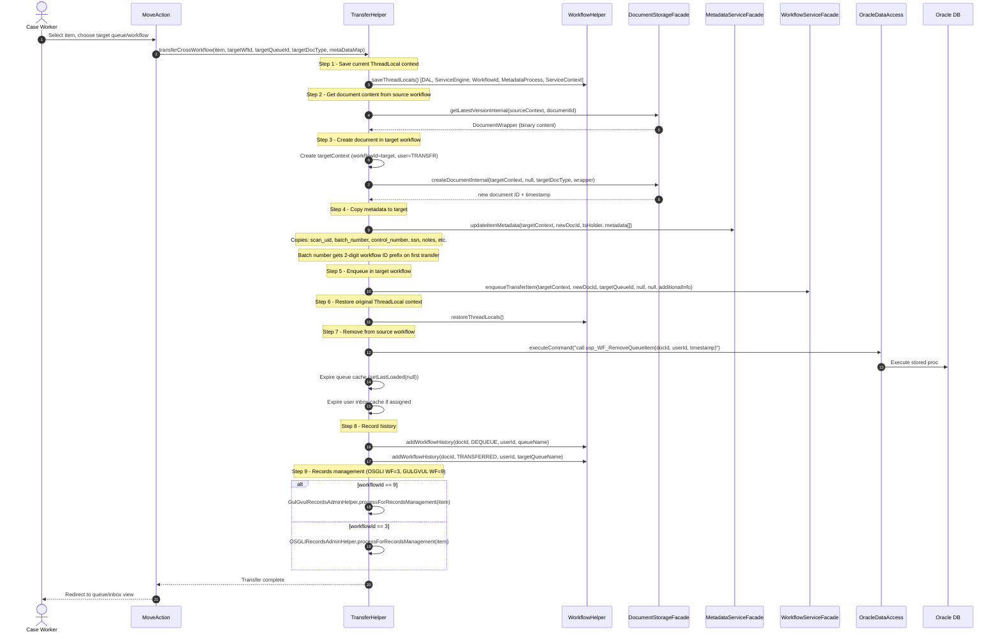

---

## g. Sequence: SOAP Web Service Call

How an external system invokes a CMWS facade via SOAP.

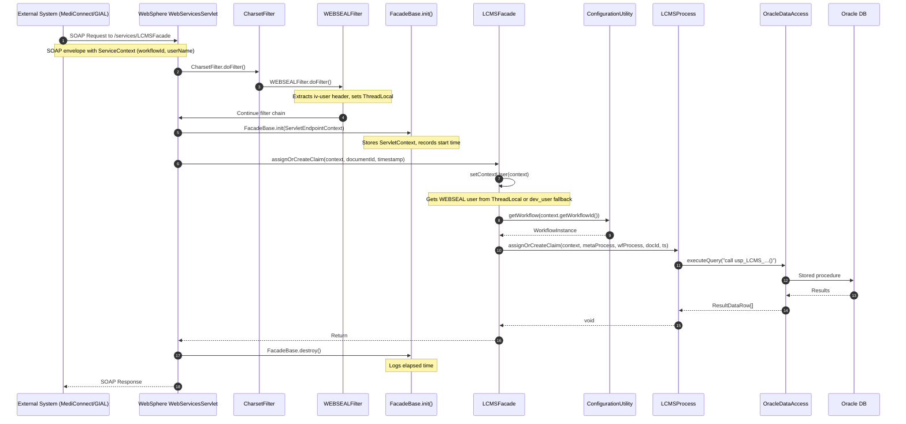

---

## h. State Diagram: Workflow Lifecycle

States a claim/document goes through from initial scan to final completion or archival.

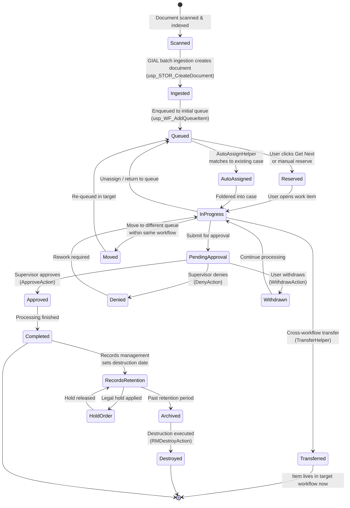

---

## i. State Diagram: Queue Item

Lifecycle states of a WorkItem within the queue system.

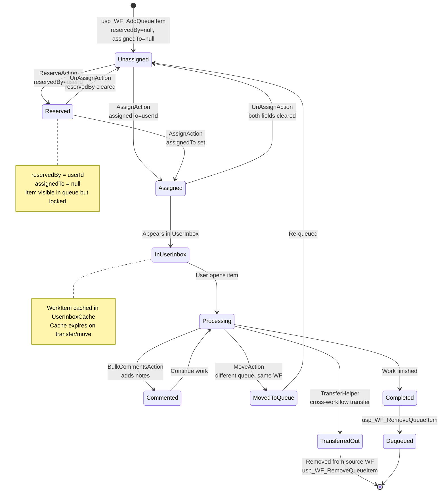

---

## j. ER Diagram: Domain Model

Key entities and relationships in the CMWS Oracle database schema.

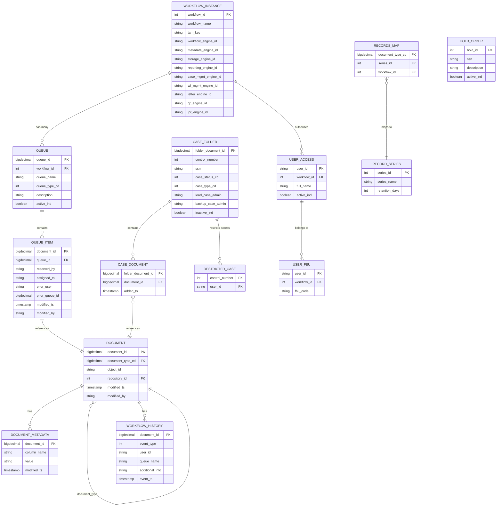

---

## k. Flowchart: Request Processing (Struts)

How an HTTP request flows through the Struts framework from browser to rendered JSP.

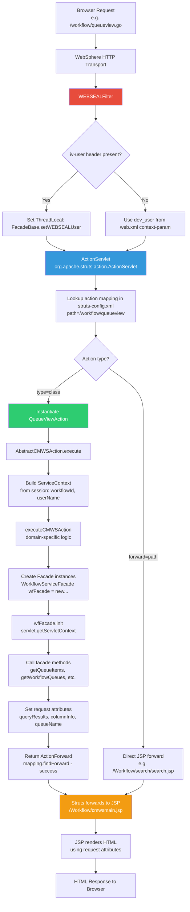

---

## l. Flowchart: Auto-Assign Logic

How the AutoAssignHelper determines where to route incoming documents to cases and queues.

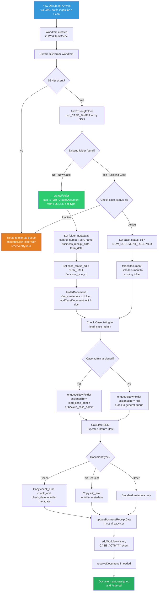

---

## m. Deployment: Environment Topology

DEV/QA/STAGE/PROD environment chain with all deployed components. cmws.ear contains CMWS.war + gial.war. ImageViewer JARs are packed inside CMWS.war (served as applet). CMWSReports runs on a separate BI server. CMWSEAR orchestrates the Ant build.

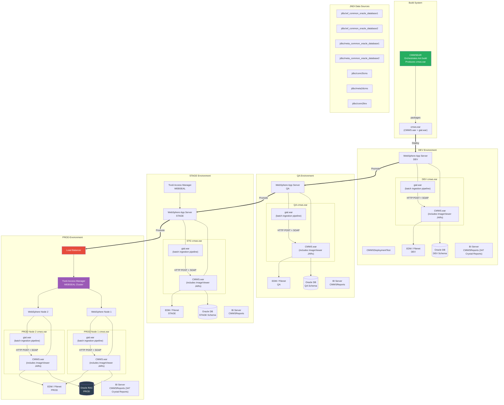

---

## n. Package Diagram - Java Package Hierarchy

Shows the package structure and dependencies within CMWSWeb and GIAL.

```mermaid
graph TB
    subgraph "CMWSWeb - com.pru.gi"
        subgraph "workflow (shared framework)"
            wf_config["workflow.config<br/><i>ConfigurationUtility</i><br/><i>WorkflowInstance</i><br/><i>ServiceEngine</i>"]
            wf_common["workflow.common<br/><i>ServiceContext</i><br/><i>ResultDataRow</i><br/><i>MetadataValue</i><br/><i>WorkflowException</i><br/><i>CMWSUtil</i><br/><i>DocumentWrapper</i>"]
            wf_facade["workflow.facade<br/><i>FacadeBase</i><br/><i>WorkflowServiceFacade</i><br/><i>MetadataServiceFacade</i><br/><i>DocumentStorageFacade</i><br/><i>CaseManagementFacade</i><br/><i>LetterServiceFacade</i><br/><i>QualityReviewFacade</i><br/><i>QTSFacade</i><br/><i>NotificationFacades</i>"]
            wf_process["workflow.process<br/><i>IProcessWorkflow</i><br/><i>IProcessMetadata</i><br/><i>IProcessStorage</i><br/><i>IProcessCaseManagement</i><br/><i>IProcessLetter</i><br/><i>IProcessReports</i><br/><i>Factory classes</i>"]
            wf_queues["workflow.queues<br/><i>QueueManager</i><br/><i>WorkflowQueue</i><br/><i>WorkItem/Cache</i><br/><i>UserInbox/Cache</i><br/><i>TransferHelper</i><br/><i>WorkflowHelper</i>"]
            wf_data["workflow.data<br/><i>OracleDataAccess</i>"]
            wf_metadata["workflow.metadata<br/><i>MetadataHelper</i>"]
            wf_logging["workflow.logging<br/><i>LoggingUtility</i>"]
            wf_servlets["workflow.servlets<br/><i>GetDocument</i><br/><i>PutDocument</i><br/><i>GetTemplate</i><br/><i>PutTemplate</i><br/><i>PutLetter</i><br/><i>WEBSEALFilter</i><br/><i>ValidateAccess</i><br/><i>GetReport</i>"]
            wf_utility["workflow.utility<br/><i>RandomGUID</i>"]
        end

        subgraph "workflow.web (Struts layer)"
            wf_actions["workflow.web.actions<br/><i>AbstractCMWSAction</i><br/><i>QueueViewAction</i><br/><i>InboxViewAction</i><br/><i>SearchAction</i><br/><i>ApproveAction</i><br/><i>DenyAction</i><br/><i>MoveAction</i><br/><i>AssignAction</i><br/><i>ReserveAction</i><br/><i>GetNextAction</i>"]
            wf_actionforms["workflow.web.actionforms<br/><i>WorkTypeRequestForm</i><br/><i>FileUploadForm</i><br/><i>EASRequestForm</i>"]
            wf_sub_actions["workflow.web.actions.*<br/><i>.admin</i><br/><i>.caselisting</i><br/><i>.reports</i><br/><i>.recordsadmin</i><br/><i>.recordview</i><br/><i>.customerfile</i><br/><i>.ipr</i><br/><i>.qrsampling</i><br/><i>.controladmin</i><br/><i>.lcms</i><br/><i>.osgli</i><br/><i>.epr</i>"]
        end

        subgraph "Domain Packages"
            pkg_lcms["lcms<br/><i>LCMSFacade</i><br/><i>LCMSProcess</i><br/><i>PayeeGIAL</i>"]
            pkg_osgli["osgli<br/><i>OSGLIFacade</i><br/><i>OSGLIRecordsAdminHelper</i>"]
            pkg_lrk["lrk<br/><i>LPMFacade</i>"]
            pkg_lockbox["lockbox<br/><i>LockboxFacade</i>"]
            pkg_lcnv["lcnv<br/><i>LCNVFacade</i><br/><i>lcnv.queue.AutoAssignHelper</i>"]
            pkg_walmart["walmart<br/><i>WalmartFacade</i>"]
            pkg_gulgvul["gulgvul<br/><i>GULGVULFacade</i><br/><i>GulGvulRecordsAdminHelper</i>"]
            pkg_esc["esc<br/><i>ESCFacade</i>"]
            pkg_cob["cob<br/><i>COBWorkTypeItemFacade</i>"]
            pkg_epr["epr<br/><i>EPRWorkTypeItemFacade</i>"]
            pkg_mu["mu<br/><i>MUFacade</i>"]
            pkg_smcob["smcob<br/>(uses cob structures)"]
            pkg_verizon["verizon<br/>(uses shared framework)"]
        end
    end

    subgraph "GIAL - com.pru.gi.gial (batch ingestion pipeline)"
        gial_svcs["gial.svcs<br/><i>ImageLoaderService</i><br/><i>DocumentRepository</i><br/><i>ContentManagement</i><br/><i>TiffUtility</i><br/><i>BatchControl</i>"]
        gial_process["gial.process<br/><i>DocumentumRepositoryProcess</i><br/><i>(legacy name; routes via EDM to Filenet)</i><br/><i>CMWSContentManagementProcess</i><br/><i>LCMSContentManagementProcess</i><br/><i>Factory classes</i>"]
        gial_config["gial.config<br/><i>ConfigurationUtility</i><br/><i>Repository</i><br/><i>LoaderConfig</i><br/><i>EdmAuthConfig</i>"]
        gial_data["gial.data<br/><i>FilennetDataAccess</i><br/><i>(Filenet access; note double n)</i>"]
        gial_common["gial.svcs.common<br/><i>ServiceContext</i><br/><i>DocumentWrapper</i><br/><i>GIALException</i>"]
    end

    wf_actions --> wf_facade
    wf_actions --> wf_queues
    wf_facade --> wf_process
    wf_facade --> wf_config
    wf_facade --> wf_common
    wf_process --> wf_data
    wf_queues --> wf_data
    wf_queues --> wf_common
    wf_config --> wf_common

    pkg_lcms --> wf_facade
    pkg_lcms --> wf_process
    pkg_lcms --> wf_config
    pkg_osgli --> wf_facade
    pkg_lcnv --> wf_queues
    pkg_lcnv --> wf_facade

    gial_svcs --> gial_process
    gial_svcs --> gial_config
    gial_process --> gial_data
    gial_process --> gial_common

    gial_svcs -.->|"HTTP POST + SOAP"| wf_facade

    style wf_config fill:#3498db,color:#fff
    style wf_facade fill:#2ecc71,color:#fff
    style wf_queues fill:#e67e22,color:#fff
    style gial_svcs fill:#9b59b6,color:#fff
```

---

## o. Gantt-style: Domain Complexity

Relative size and complexity of each business domain based on number of engines configured, facade methods, and feature richness. Longer bars indicate more complex domains with more sub-systems (letters, QR, case management, IPR).

```mermaid
gantt
    title Domain Complexity (relative feature count / engine coverage)
    dateFormat X
    axisFormat %s

    section Active Workflows
    LRK (WF 1) - WF+META+STOR+RPT+CASE+WFMGMT+QR          :0, 7
    Lockbox (WF 2) - WF+META+STOR+RPT+WFMGMT+QR            :0, 6
    OSGLI (WF 3) - WF+META+STOR+RPT+CASE+WFMGMT+QR         :0, 7
    Contracts (WF 4) - WF+META+STOR+WFMGMT                  :0, 4
    Underwriting (WF 5) - WF+META+STOR+WFMGMT               :0, 4
    Proposals (WF 6) - WF+META+STOR+WFMGMT                  :0, 4
    Walmart (WF 7) - WF+META+STOR+RPT+CASE+WFMGMT+LTR+QR   :0, 8
    LCNV (WF 8) - WF+META+STOR+RPT+CASE+WFMGMT+LTR+QR      :0, 8
    GUL/GVUL (WF 9) - WF+META+STOR+RPT+CASE+WFMGMT+QR      :0, 7
    ESC (WF 10) - WF+META+STOR+RPT+CASE+WFMGMT+LTR+QR      :0, 8
    COB (WF 11) - WF+META+STOR+RPT+CASE+WFMGMT              :0, 6
    SMCOB (WF 12) - WF+META+STOR+RPT+CASE+WFMGMT+QR        :0, 7
    Verizon (WF 13) - WF+META+STOR+RPT+WFMGMT+QR+IPR       :0, 7
    EPR (WF 14) - WF+META+STOR+RPT+CASE+WFMGMT+QR          :0, 7

    section LCMS Sub-Workflows
    MU (WF 101) - WF+META+STOR+RPT+WFMGMT                   :0, 5
    LCMS-GLCD (WF 102) - WF+META+STOR+RPT+WFMGMT            :0, 5
    DCMS (WF 103) - WF+META+STOR+WFMGMT                     :0, 4
    LCMS-OSGLI (WF 104) - WF+META+STOR+RPT+WFMGMT           :0, 5
    LCMS-PEB (WF 105) - WF+META+STOR+RPT+WFMGMT             :0, 5
    LCMS-ILI (WF 107) - WF+META+STOR+RPT+WFMGMT             :0, 5
    OSGLI Archive (WF 15) - WF+META+STOR+RPT+CASE+WFMGMT+QR :0, 7

    section Most Complex (Letters + QR + Case)
    Walmart - full suite                                      :crit, 0, 8
    LCNV - full suite + auto-assign                          :crit, 0, 8
    ESC - full suite                                         :crit, 0, 8
```
