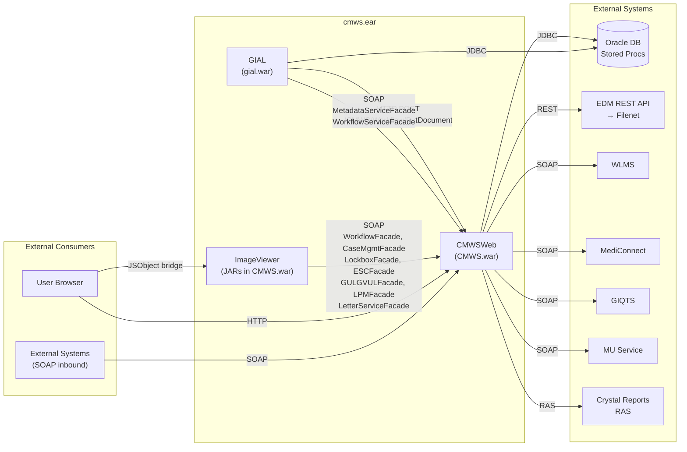
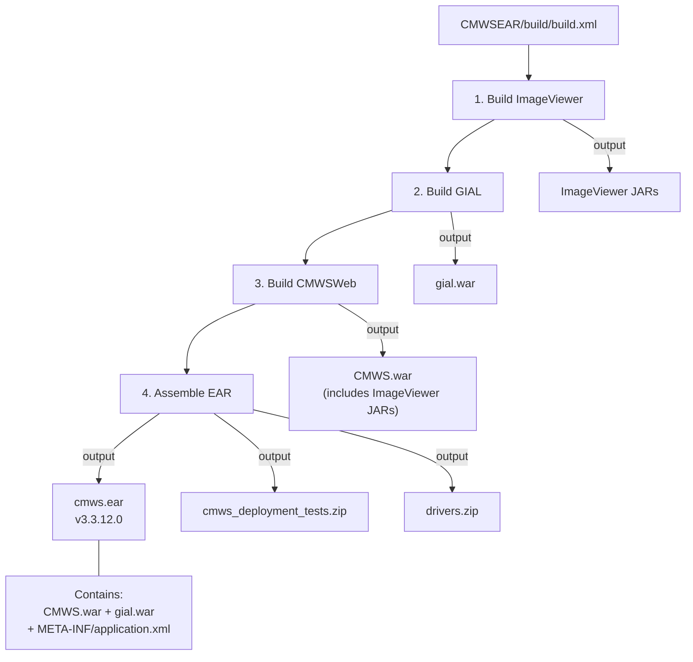

# 07 — Project Anatomy

CMWS is composed of **6 projects** packaged into `cmws.ear` via Ant/Ivy. There are zero compile-time dependencies between projects — all integration happens at runtime through HTTP and SOAP calls. The build is orchestrated from `CMWSEAR/build/build.xml`.

This document breaks down each project: what it is, how it deploys, its internal structure, what it talks to, and how it relates to the others.

---

## Project 1: CMWSWeb (CMWS.war)

### What It Is

CMWSWeb is the multi-tenant workflow orchestration platform and the central hub of the entire system. It hosts the Struts-based web UI, 20 SOAP facades for external and internal consumers, workflow process factories for each domain, and all Oracle stored procedure integration. With 1,320 Java files, 110 JSPs, and 176 XML configuration files, it is by far the largest project in the codebase.

### Deployment

Deployed as `CMWS.war` at the `/CMWS` context root inside `cmws.ear`. It is one of the two WAR modules declared in `META-INF/application.xml`.

### Architecture Layers

```
Struts UI (JSPs + Actions)
    │
    ▼
SOAP Facades (20 facade classes extending FacadeBase)
    │
    ▼
Process Factories (per-domain workflow logic)
    │
    ▼
Oracle Stored Procedures + EDM REST API → Filenet
```

### Package Structure

| Package | Purpose |
|---------|---------|
| `com.pru.gi.workflow.*` | Core framework — config, facade, process, queues, data, edm, servlets, utility, web/actions |
| `com.pru.gi.{lcms,cob,esc,epr,osgli,lcnv,gulgvul,lockbox,mu,walmart,smcob,lrk,verizon}` | 14 domain-specific packages, each with its own workflow logic |
| `com.pru.gi.wlms.ws.*` | WLMS web service client/server — domain, framework, lifeclaim, mediconnect, payee, port, workflowclaim |
| `com.prudential.gi.services.*` | 200+ JAX-WS generated JAXB classes for external service integration |

### Key Classes

| Class | Role |
|-------|------|
| `FacadeBase` | Base class for all 20 SOAP facades |
| `ConfigurationUtility` | Centralized configuration management |
| `WorkflowInstance` | Core workflow state representation |
| `ServiceEngine` | Service dispatch and orchestration |
| `DefaultWorkflowProcess` | Base process implementation |
| `OracleDataAccess` | Stored procedure invocation layer |
| `EdmServiceImpl` | EDM REST API client for Filenet document operations |
| `QueueManager` | Workflow queue management |
| `WEBSEALFilter` | WebSEAL authentication filter |

### External Systems

- **Oracle DB** — stored procedures for all workflow state, case data, and queue management
- **EDM REST API** — document storage/retrieval via Filenet
- **WLMS** — Work/Life Management System integration
- **MediConnect** — healthcare-related claim processing
- **GIQTS** — GI Quote Tracking System
- **MU Service** — Mass Update service
- **Crystal Reports (RAS)** — report generation via SAP BusinessObjects

### Relationship to Other Projects

- **Consumed by GIAL**: GIAL calls CMWSWeb via HTTP POST (`/CMWS/Workflow/PutDocument`) and SOAP (`MetadataServiceFacade`, `WorkflowServiceFacade`) to store documents and enqueue work items
- **Consumed by ImageViewer**: ImageViewer makes SOAP calls to CMWSWeb facades for document operations, case management, and metadata editing
- **Consumed by external systems**: Exposes SOAP endpoints for inbound document and workflow operations

---

## Project 2: GIAL (gial.war)

### What It Is

GIAL — "General Image and Artifact Loading" — is a batch document ingestion pipeline. It accepts XML batch payloads, validates and transforms documents (including PDF-to-TIFF conversion), and calls CMWSWeb to store documents in Filenet and enqueue them for workflow processing. It is a separate WAR with its own servlet context and database connections.

### Deployment

Deployed as `gial.war` at the `/GIAL` context root inside `cmws.ear`. It is the second WAR module declared in `META-INF/application.xml`.

### Package Structure

| Package | Purpose |
|---------|---------|
| `com.pru.gial.ImageLoader` | Main web service entry point — `ImageLoader.java`, `GIALImageLoader` interface, `DefaultLoader`, `LcmsLoader`, `MuLoader` |
| `com.pru.gi.gial.*` | Core pipeline — config, data (`FilennetDataAccess`, `DBInterface`, `LoaderHelper`, `TiffConversionHelper`), process (`DocumentumRepositoryProcess`, `ContentManagementProcessFactory`), svcs (`DocumentRepository`, `ContentManagement`, `TiffUtility`) |
| `com.pru.gi.cmws.method.*` | HTTP/SOAP clients calling CMWSWeb — `CreateDocumentMethod`, `UpdateMetadataMethod`, `EnqueueDocumentMethod`, `GetDocumentMethod` |
| `com.pru.gi.workflow.edm.*` | Parallel copy of 22 EDM classes (duplicated from CMWSWeb — see [Duplicated Code](#duplicated-code) below) |

### External Systems

- **CMWSWeb** — HTTP POST to `/CMWS/Workflow/PutDocument` and SOAP calls to `MetadataServiceFacade` and `WorkflowServiceFacade`
- **Oracle DB** — 8 BatchControl JNDI datasources (`lcms2Batch`, `gul2Batch`, etc.) for batch tracking and status
- **Filenet (via EDM)** — document storage through the duplicated EDM client classes

### Relationship to Other Projects

- **Calls CMWSWeb** to store documents and enqueue work items
- **Does NOT get called by CMWSWeb** — the data flow is one-directional
- **Does NOT interact with ImageViewer** — there is no direct communication between them
- **Shares duplicated EDM code with CMWSWeb** — 22 classes are copy-pasted (see below)

---

## Project 3: ImageViewer (packed JARs in CMWS.war)

### What It Is

ImageViewer is a Java Swing JApplet with 253 files that runs in the user's browser. Despite the name, it is **not a simple viewer** — it is a full document management and workflow client. It provides document viewing (TIFF, PDF, Office formats), annotation tools (freehand drawing, text, stamps, highlights, sticky notes), 11 domain-specific metadata editors, case management (diary, activities, notes), QR processing, split-view, thumbnails, and zoom/rotate capabilities.

### Deployment

Packaged as JAR files bundled inside `CMWS.war`. The applet is launched from the CMWSWeb UI and runs in the user's JVM plugin. It communicates back to CMWSWeb via SOAP over HTTP.

### Package Structure

| Package | Purpose |
|---------|---------|
| `com.pru.gi.imaging.*` | Core framework — actions, controls, data, documents, models, renderers, tiff, treetable, extension/metadata |
| `com.pru.gi.casemgmt.*` | Case management — actions, extension/metadata |
| `com.pru.gi.{lcms,mu,cob,epr,esc,gulgvul,lcnv,lockbox,lpm,osgli,verizon,walmart}` | Domain-specific UI extensions — custom metadata panels and actions per business line |

### Key Classes

| Class | Role |
|-------|------|
| `ImageViewerApp` | JApplet entry point — bootstraps the Swing UI |
| `MetadataManagerWebService` | SOAP client singleton — all server communication flows through here |
| `ImageViewerFrame` | Main document viewing window |
| `CaseViewerFrame` | Case management window |

### External Systems

- **CMWSWeb SOAP facades** — calls `WorkflowFacade`, `CaseManagementFacade`, `LockboxFacade`, `ESCFacade`, `GULGVULFacade`, `LPMFacade`, `LetterServiceFacade`
- **Browser JavaScript** — uses `netscape.javascript.JSObject` for browser session management (cookie passing, window lifecycle)

### Relationship to Other Projects

- **Calls CMWSWeb** exclusively via SOAP for all data operations
- **Does NOT call GIAL directly** — no interaction with the batch pipeline
- **Deployed inside CMWSWeb's WAR** but has no compile-time dependency on it — communication is purely SOAP at runtime

---

## Project 4: CMWSReports

### What It Is

CMWSReports contains 347 Crystal Reports (`.rpt` files) with zero Java code. These are the business intelligence reports consumed by various domain teams through the SAP BusinessObjects/Crystal Reports BI server.

### Deployment

Deployed separately to the SAP BusinessObjects/Crystal Reports BI server. **Not packaged in the EAR.** Historical deployment artifacts (`.lcmbiar` files from 2017-2020) exist in the project for reference.

### Organization

Reports are organized by domain:

| Domain | Description |
|--------|-------------|
| COB | Coordination of Benefits |
| EPR | Electronic Payment Records |
| ESC | Escalation |
| GLC | Group Life Claims |
| GULGVUL | Group Universal Life / Group Variable Universal Life |
| LCMS | Life Claims Management System |
| LockBox | Lockbox Processing |
| LPM | Life Premium Management |
| MU | Mass Update |
| OSGLI | Office of Servicemembers' Group Life Insurance |
| SMCOB | SM Coordination of Benefits |
| Verizon | Verizon-specific reports |
| Walmart | Walmart-specific reports |

### Relationship to Other Projects

- **CMWSWeb** invokes these reports at runtime via Crystal Reports RAS (Report Application Server) integration
- No other projects interact with CMWSReports directly

---

## Project 5: CMWSEAR

### What It Is

CMWSEAR is the EAR packaging orchestrator. It contains no application code — its sole purpose is to build and assemble the other projects into the deployable `cmws.ear` artifact.

### Build Orchestration

`build/build.xml` drives the entire build in order:

1. Build ImageViewer (JARs)
2. Build GIAL (gial.war)
3. Build CMWSWeb (CMWS.war, incorporating ImageViewer JARs)
4. Assemble the EAR

### Key Files

| File | Purpose |
|------|---------|
| `build/build.xml` | Ant build script orchestrating all sub-builds |
| `META-INF/application.xml` | JEE application descriptor defining two WAR modules (`CMWS.war`, `gial.war`) |
| `build/ivy.xml` | Ivy dependency resolution for database drivers (`ojdbc6`, `sqljdbc4`, `db2jcc`) |

### Build Outputs

| Artifact | Description |
|----------|-------------|
| `cmws.ear` | The deployable enterprise archive (version 3.3.12.0) |
| `cmws_deployment_tests.zip` | Packaged deployment smoke tests |
| `drivers.zip` | Database driver bundle |

### Relationship to Other Projects

- Orchestrates builds of ImageViewer, GIAL, and CMWSWeb
- Produces the final deployable artifact that contains all runtime components

---

## Project 6: CMWSDeploymentTest

### What It Is

CMWSDeploymentTest is a Selenium-based smoke test suite that validates ECM (Enrollment Campaign Management) workflow functionality after deployment. It uses Internet Explorer via IEDriverServer, TestNG 6.8.5 as the test framework, and Selenium 2.45.0 for browser automation.

### Deployment

Not deployed to a server. Packaged as a standalone zip (`cmws_deployment_tests.zip`) and executed manually or from CI against `cmws-dev.prudential.com`.

### Key Details

- **Target**: `cmws-dev.prudential.com` with WebSEAL authentication
- **Browser**: Internet Explorer (via `IEDriverServer.exe`)
- **Framework**: TestNG 6.8.5 + Selenium 2.45.0
- **Special handling**: Uses `java.awt.Robot` for Windows security dialog automation
- **Scope**: ECM workflow smoke tests only

### Relationship to Other Projects

- Tests the deployed CMWSWeb application
- No runtime relationship to any other project

---

## Integration Map

The following diagram shows all runtime communications between projects and external systems.



---

## Build Pipeline

The Ant build order and outputs, orchestrated by `CMWSEAR/build/build.xml`:



---

## Duplicated Code

### The 22 EDM Classes

Both CMWSWeb and GIAL contain a parallel copy of **22 classes** in the `com.pru.gi.workflow.edm.*` package. In addition to those, `FilennetDataAccess` and `DocumentumRepositoryProcess` are also duplicated between the two projects.

### Why the Duplication Exists

The root cause is the JEE classloader isolation model:

1. **Separate WARs = separate classloaders.** `CMWS.war` and `gial.war` are two distinct web applications inside the same EAR. Each WAR has its own classloader, and classes in one WAR are invisible to the other.

2. **No shared library exists.** The clean solution would be to extract the common EDM classes into a shared JAR placed in the EAR's `lib/` directory (visible to both WARs). This was never done — the code was simply copied.

3. **Both projects need EDM access.** CMWSWeb uses the EDM classes for its core document management workflows. GIAL uses the same EDM classes to store ingested documents in Filenet. Since both need the same Filenet client logic and no shared library was created, the classes were duplicated.

### Affected Classes

The duplicated code includes:
- All 22 EDM client/model/utility classes in `com.pru.gi.workflow.edm.*`
- `FilennetDataAccess` — Filenet database access layer
- `DocumentumRepositoryProcess` — Documentum repository operations

### Migration Note

This duplication is one of the architectural issues that the migration to microservices will resolve. In the new architecture, EDM integration will live in a single shared service or library, eliminating the copy-paste pattern entirely.
