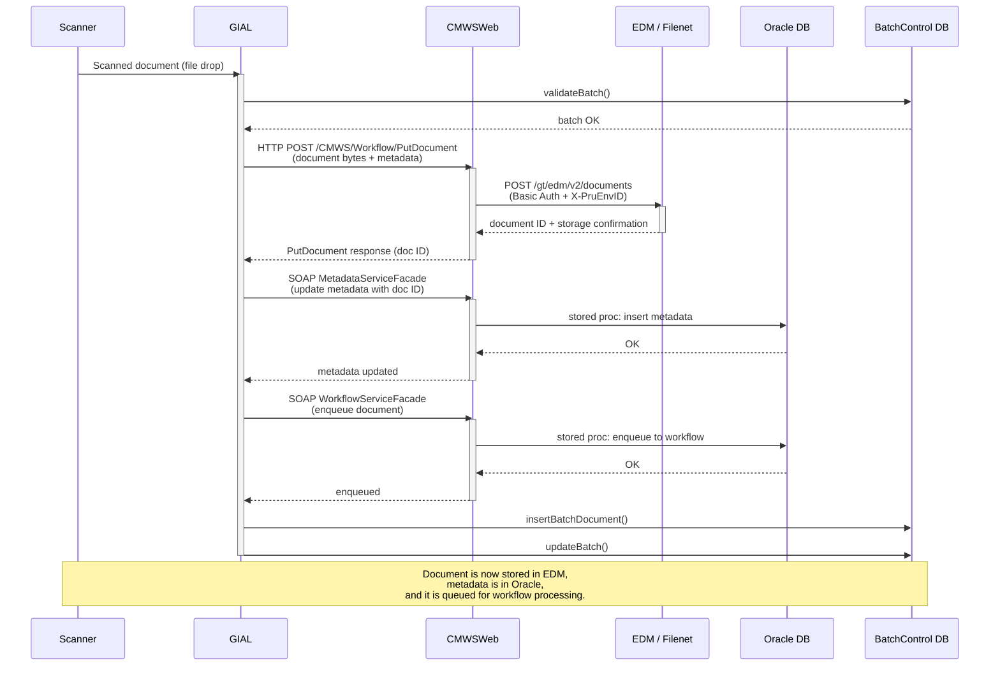
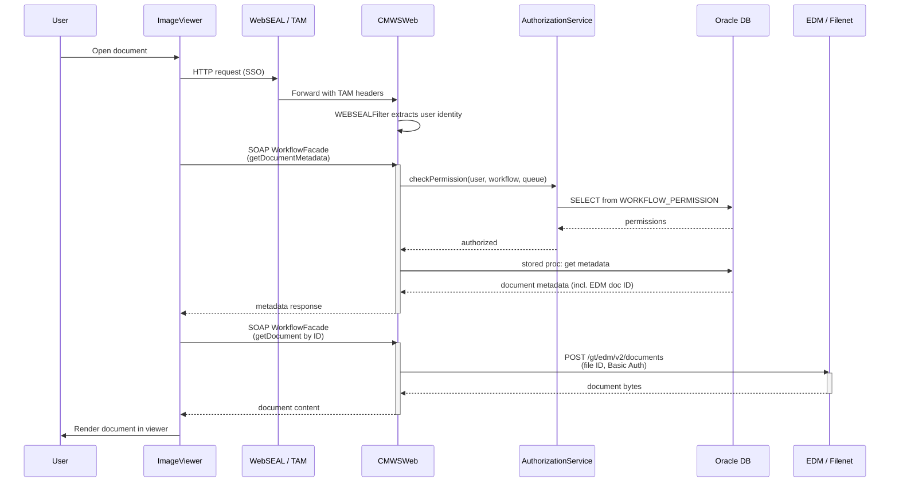

# 08 - CMWS Integration Map

> All system-to-system communications in the CMWS ecosystem, including
> protocols, classes, and configuration references.

---

## Table of Contents

1. [Internal Communications (within cmws.ear)](#1-internal-communications-within-cmwsear)
2. [External Communications (CMWSWeb to External Systems)](#2-external-communications-cmwsweb--external-systems)
3. [Authentication and Security](#3-authentication--security)
4. [Integration Diagrams](#4-integration-diagrams)

---

## 1. Internal Communications (within cmws.ear)

### 1.1 GIAL to CMWSWeb

GIAL (GI Automated Loader) communicates with the CMWSWeb application through
a mix of HTTP and SOAP calls for document ingestion and metadata management.

| # | Protocol | Endpoint / Facade | Purpose | Class |
|---|----------|-------------------|---------|-------|
| 1 | HTTP POST | `/CMWS/Workflow/PutDocument` | Upload document bytes + metadata | `com.pru.gi.cmws.method.CreateDocumentMethod` |
| 2 | SOAP | `MetadataServiceFacade` | Update document metadata | `com.pru.gi.cmws.method.UpdateMetadataMethod` |
| 3 | SOAP | `WorkflowServiceFacade` | Enqueue document to workflow queue | `com.pru.gi.cmws.method.EnqueueDocumentMethod` |
| 4 | HTTP GET | `/CMWS/Workflow/GetDocument` | Retrieve a stored document | `com.pru.gi.cmws.method.GetDocumentMethod` |
| 5 | SOAP | `MetadataServiceFacade` | Search / lookup metadata | `SearchMetadataMethod`, `MetadataLookupMethod` |

**Configuration:** GIAL's `LoaderConfig` contains `cmws-url`, `cmws-username`,
and `cmws-password` properties that point to the CMWSWeb instance.

---

### 1.2 ImageViewer to CMWSWeb

The ImageViewer (Applet / thick-client) communicates exclusively over SOAP
using the `MetadataManagerWebService` singleton. Each facade is resolved via
the URL pattern `../services/{FacadeName}`.

| # | SOAP Facade | Responsibility |
|---|-------------|----------------|
| 1 | `WorkflowFacade` | Metadata retrieval, permissions, queue operations |
| 2 | `CaseManagementFacade` | Case data, diary entries |
| 3 | `LockboxFacade` | Lockbox eligibility checks |
| 4 | `ESCFacade` | ESC workflow operations |
| 5 | `GULGVULFacade` | GUL/GVUL QR status |
| 6 | `LPMFacade` | LPM QR status |
| 7 | `LetterServiceFacade` | Letter generation |

**Dispatcher:** `MetadataManagerWebService` singleton resolves the correct
facade at runtime using the relative URL `../services/{FacadeName}`.

---

## 2. External Communications (CMWSWeb to External Systems)

### 2.1 CMWSWeb to EDM / Filenet

The primary document repository. After the EDM migration, all Documentum
calls were replaced with REST calls to the EDM API.

| Operation | Method | URL Pattern |
|-----------|--------|-------------|
| Upload document | POST | `https://api-{env}.prudential.com/gt/edm/v2/documents` |
| Download document | POST | Same endpoint, with file ID in body |
| Large file upload (>200 MB) | POST | `/gt/edm/v2/eventpublish` (event publish) then poll `/gt/edm/v2/documents/getstatus` |
| Presigned URL | GET | `/gt/edm/v2/getpresignedurl` |

**Authentication:** Basic Auth + `X-PruEnvID` header (configured in `EdmAuthConfig`).

**Client class:** `EdmServiceImpl` (uses native `java.net.HttpURLConnection`).

**Call chain:**

```
DocumentStorageFacade
  -> CMWSStorageProcess
    -> DocumentumRepositoryProcess
      -> FilennetDataAccess
        -> EdmTransformationService
          -> EdmServiceImpl
```

**Config files:** `edm_*.xml`

---

### 2.2 GIAL to EDM / Filenet (Parallel Path)

GIAL maintains its own copy of the EDM client code and calls the same EDM
REST API independently of CMWSWeb.

**Call chain:**

```
DocumentumRepositoryProcess
  -> FilennetDataAccess
    -> EdmTransformationService
      -> EdmServiceImpl
```

**Config files:** GIAL's own `edm_*.xml`

---

### 2.3 CMWSWeb to Oracle Database

All database access goes through stored procedures via `OracleDataAccess`.

**JNDI Datasources (7):**

| # | JNDI Name | Purpose |
|---|-----------|---------|
| 1 | `jdbc/connlcms` | Primary LCMS connection |
| 2 | `jdbc/meta2dcms` | Metadata DCMS connection |
| 3 | `jdbc/conn2linx` | LINX connection |
| 4 | `jdbc/wf_common_oracle_database1` | Workflow common DB 1 |
| 5 | `jdbc/wf_common_oracle_database2` | Workflow common DB 2 |
| 6 | `jdbc/meta_common_oracle_database1` | Metadata common DB 1 |
| 7 | `jdbc/meta_common_oracle_database2` | Metadata common DB 2 |

**Database user:** `gicmwsv`

**Operations:** Queue management, metadata CRUD, workflow state transitions,
user permission lookups.

---

### 2.4 GIAL to BatchControl Databases

GIAL connects to eight separate BatchControl databases for batch tracking
and document load status.

**JNDI Datasources (8):**

| # | JNDI Name | Batch Domain |
|---|-----------|--------------|
| 1 | `jdbc/lcms2Batch` | LCMS |
| 2 | `jdbc/gul2Batch` | GUL |
| 3 | `jdbc/osglia2Batch` | OSGLI-A |
| 4 | `jdbc/osgli2Batch` | OSGLI |
| 5 | `jdbc/waiver2Batch` | Waiver |
| 6 | `jdbc/mu2Batch` | MU |
| 7 | `jdbc/cob2Batch` | COB |
| 8 | `jdbc/smcob2Batch` | SMCOB |

**Operations:** `validateBatch`, `checkDocumentLoadStatus`,
`insertBatchDocument`, `updateBatch`.

---

### 2.5 CMWSWeb to WLMS (Life Claims)

Outbound SOAP calls to the WLMS (Workflow Life Management System) for
life-claims processing.

| Environment | URL |
|-------------|-----|
| DEV | `wlms-dev.prudential.com` |
| PROD | `wlmsinternalws.prudential.com` |

**Client classes:** `WlmsLifeClaimProxy`, `WorkflowClaimProxy`

**Operations:** `createClaim`, `createPayee`, `searchClaim`, `assignClaim`,
`getClaimInfo`

---

### 2.6 CMWSWeb to MediConnect

Outbound SOAP calls for medical document image exchange.

**Client class:** `WlmsMediConnectProxy`

**Operations:** `getLcms2MCImages`, `updateLcms2MCImages`

---

### 2.7 CMWSWeb to MU Application Coverage

Outbound SOAP calls for MU (Mutual Underwriting) application coverage data.

| Environment | URL |
|-------------|-----|
| DEV | `gimuwuatapp.prudential.com` |
| PROD | `GIMUWAPP.prudential.com` |

**Client class:** `MUApplicationCoverageProxy`

**Operations:** `list`, `getMissingInfo`, `getApplicationRequirements`,
`getUnderWriterNotes`

---

### 2.8 CMWSWeb to GIQTS Feed Handler

Outbound SOAP call to push case/transaction XML into the QTS (Queue
Tracking System).

**Client class:** `GIQTSFeedHandlerServiceSoapProxy`

**Operation:** `GIQTSProcessFeed` (sends case/transaction XML payload)

---

### 2.9 CMWSWeb to GIQTS Response Feed Handler

Inbound poll over SOAP to retrieve QTS processing responses.

**Client class:** `GIQTSResponseFeedHandlerSoapProxy`

**Operations:** `GIQTSGetResponse`, `GIQTSTodaysResponse`

---

### 2.10 CMWSWeb to Crystal Reports RAS

Outbound connection to Crystal Reports Analytics Service for report
generation.

**Client class:** `CrystalReportsRASAccess`

| Environment | Server |
|-------------|--------|
| DEV | `P1ERSCBA0068:6400` |
| PROD | `giboprodbo:6400` |

---

### 2.11 CMWSWeb to Email (SMTP)

Outbound email via `JavaMailSender`.

**SMTP Host:** `internalrelay-mail.prudential.com`

**Config:** `mail.xml`

**Consuming workflows:** COB, SMCOB, Lockbox, EPR (templates defined in
`emailmessages.xml`).

---

## 3. Authentication and Security

| Mechanism | Description |
|-----------|-------------|
| **WebSEAL / TAM SSO** | `WEBSEALFilter` extracts the authenticated user identity from HTTP headers injected by the reverse proxy. |
| **GetTAMGroups servlet** | Looks up the user's TAM (Tivoli Access Manager) security groups at login time. |
| **AuthorizationService** | Checks the `WORKFLOW_PERMISSION` table per `(user, workflow, queue)` tuple to determine action eligibility. |
| **PermissionCache** | In-memory cache of resolved permissions to avoid repeated DB round-trips. |
| **EdmAuthConfig** | Stores Basic Auth credentials and the `X-PruEnvID` value used for EDM REST API calls. |

---

## 4. Integration Diagrams

### 4.1 Full Integration Map

```mermaid
graph TB
    subgraph "cmws.ear"
        GIAL["GIAL<br/>(Automated Loader)"]
        CMWSWeb["CMWSWeb<br/>(Core Application)"]
        IV["ImageViewer<br/>(Applet)"]
    end

    subgraph "External Systems"
        EDM["EDM / Filenet<br/>(Document Store)"]
        ORA["Oracle Database<br/>(7 JNDI sources)"]
        BATCH["BatchControl DBs<br/>(8 databases)"]
        WLMS["WLMS<br/>(Life Claims)"]
        MEDI["MediConnect<br/>(Medical Images)"]
        MU["MU App Coverage<br/>(Underwriting)"]
        QTS_OUT["GIQTS Feed Handler<br/>(Outbound)"]
        QTS_IN["GIQTS Response Handler<br/>(Inbound Poll)"]
        CRYSTAL["Crystal Reports RAS"]
        SMTP["SMTP<br/>(Email Relay)"]
    end

    subgraph "Security Layer"
        WEBSEAL["WebSEAL / TAM SSO"]
        AUTH["AuthorizationService"]
    end

    %% GIAL -> CMWSWeb
    GIAL -- "HTTP POST /PutDocument" --> CMWSWeb
    GIAL -- "HTTP GET /GetDocument" --> CMWSWeb
    GIAL -- "SOAP MetadataServiceFacade" --> CMWSWeb
    GIAL -- "SOAP WorkflowServiceFacade" --> CMWSWeb

    %% ImageViewer -> CMWSWeb
    IV -- "SOAP WorkflowFacade" --> CMWSWeb
    IV -- "SOAP CaseManagementFacade" --> CMWSWeb
    IV -- "SOAP LockboxFacade" --> CMWSWeb
    IV -- "SOAP ESCFacade" --> CMWSWeb
    IV -- "SOAP GULGVULFacade" --> CMWSWeb
    IV -- "SOAP LPMFacade" --> CMWSWeb
    IV -- "SOAP LetterServiceFacade" --> CMWSWeb

    %% CMWSWeb -> External
    CMWSWeb -- "REST (EDM API)" --> EDM
    CMWSWeb -- "JDBC (stored procs)" --> ORA
    CMWSWeb -- "SOAP" --> WLMS
    CMWSWeb -- "SOAP" --> MEDI
    CMWSWeb -- "SOAP" --> MU
    CMWSWeb -- "SOAP (push)" --> QTS_OUT
    CMWSWeb -- "SOAP (poll)" --> QTS_IN
    CMWSWeb -- "RAS protocol" --> CRYSTAL
    CMWSWeb -- "SMTP" --> SMTP

    %% GIAL -> External
    GIAL -- "REST (EDM API)" --> EDM
    GIAL -- "JDBC" --> BATCH

    %% Security
    WEBSEAL -- "HTTP headers" --> CMWSWeb
    CMWSWeb -- "permission check" --> AUTH
    AUTH -- "WORKFLOW_PERMISSION" --> ORA
```



---

### 4.2 Document Ingestion Flow (Scanner to EDM)

This sequence diagram shows the complete path a scanned document takes from
the physical scanner through GIAL, into CMWSWeb, and finally into the EDM
document repository.



---

### 4.3 User Document Access Flow (ImageViewer to EDM)

This sequence diagram shows what happens when a user opens a document
through the ImageViewer.



---

## Quick Reference: Protocol Summary

| Source | Target | Protocol | Auth Mechanism |
|--------|--------|----------|----------------|
| GIAL | CMWSWeb | HTTP (POST/GET) | `LoaderConfig` credentials |
| GIAL | CMWSWeb | SOAP | `LoaderConfig` credentials |
| GIAL | EDM | REST | Basic Auth + X-PruEnvID |
| GIAL | BatchControl DBs | JDBC | JNDI datasource |
| ImageViewer | CMWSWeb | SOAP | WebSEAL / TAM SSO |
| CMWSWeb | EDM | REST | Basic Auth + X-PruEnvID |
| CMWSWeb | Oracle DB | JDBC | JNDI datasource (gicmwsv) |
| CMWSWeb | WLMS | SOAP | Service credentials |
| CMWSWeb | MediConnect | SOAP | Service credentials |
| CMWSWeb | MU App Coverage | SOAP | Service credentials |
| CMWSWeb | GIQTS (outbound) | SOAP | Service credentials |
| CMWSWeb | GIQTS (inbound) | SOAP | Service credentials |
| CMWSWeb | Crystal Reports | RAS | Server connection |
| CMWSWeb | Email | SMTP | Relay (no auth) |
