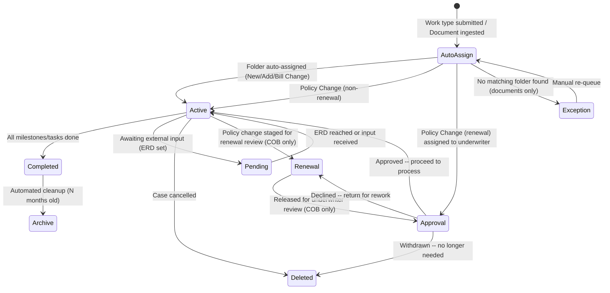
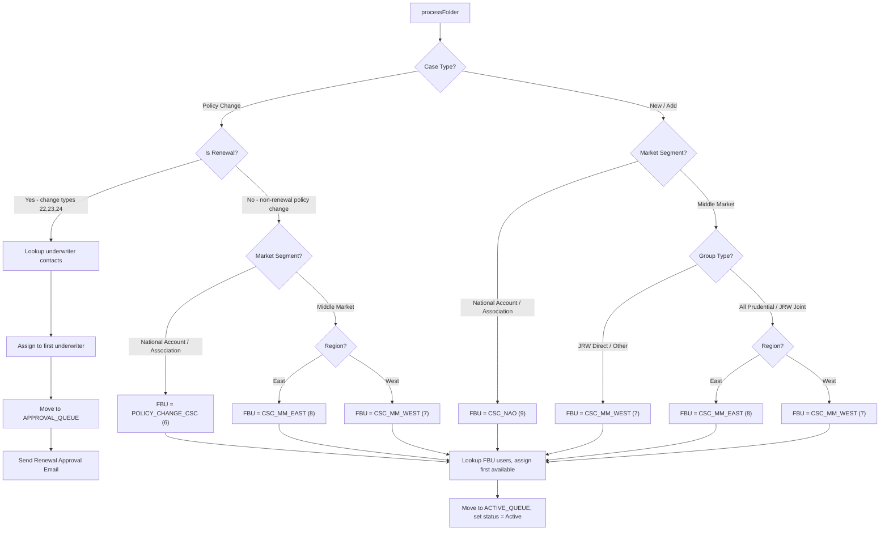
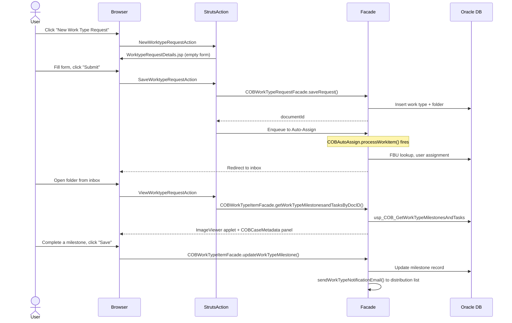
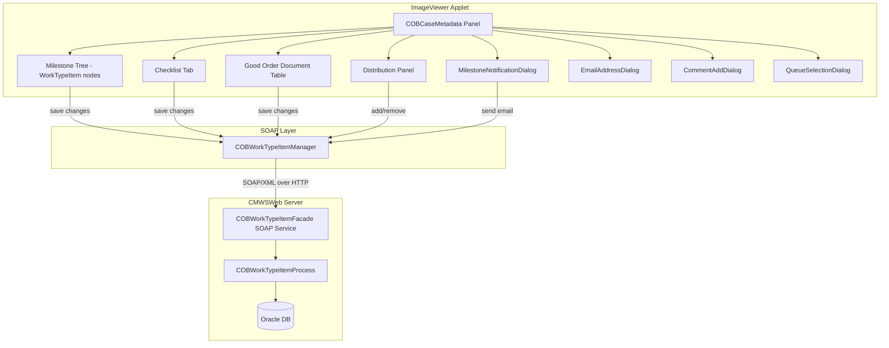
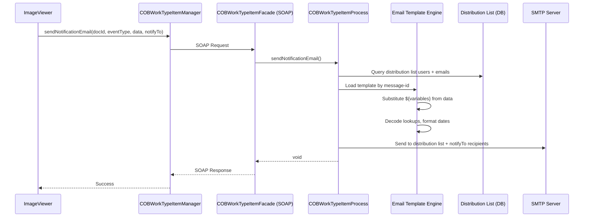

# 09 - COB Workflow Deep Dive

## 1. Overview

**COB** stands for **Client On-Boarding**. It is one of the most feature-rich workflows in the CMWS system, encompassing task/checklist management, milestone tracking, Good Order Document tracking, approval workflows, and email notifications.

| Property | Value |
|----------|-------|
| COB Workflow ID | **11** |
| SM COB Workflow ID | **12** |
| Repository ID | 6 |
| Folder Document Type Code | 54 (`COB_WORK_TYPE_FOLDER`) |
| Created | June 2009 |
| Last major revision | February 2015 (April 2015 release) |

### Git Activity — Last Commits Per Area

| Area | Last Commit | Date | Description |
|------|-------------|------|-------------|
| **CMWSWeb COB Java** (`com.pru.gi.cob`) | `abbb19c8` | 2023-05-04 | Webseal to Ping migration |
| **CMWSWeb SM COB Java** (`com.pru.gi.smcob`) | `dd8d96a7` | 2020-02-05 | Letters Migration - Existing Letters |
| **COB JSP Views** (`WebContent/Workflow/cob`) | `b3489953` | 2025-01-07 | PRJ-4115 changes |
| **COB Struts Actions** (`workflow/web/actions/cob`) | `4e700f8f` | 2020-08-05 | COB Renaming |
| **ImageViewer COB** (`com.pru.gi.cob` in IV) | `dd8d96a7` | 2020-02-05 | Letters Migration - Existing Letters |
| **ImageViewer COBCaseMetadata** | `0b1d6c11` | 2020-05-26 | MU PDF Doc Creation - Unreserved Changes |

**Key takeaway:** The COB backend Java code was last touched in **May 2023** (WebSEAL-to-Ping auth migration), the JSP views in **January 2025** (PRJ-4115), but most COB-specific business logic hasn't changed since **2020**. The ImageViewer COB components haven't been modified since **mid-2020**. This is mature, stable code — the recent commits are infrastructure changes (auth migration, renaming) rather than business logic changes.

**Who uses it:** GI operations staff (Case Install CSC teams, Policy Change CSC, Workflow Managers, Supervisors) who onboard new employer group clients and manage ongoing policy and billing changes.

**Two variants:**

- **COB (workflow ID 11)** -- National Accounts + Middle Market. Full feature set including Renewal Staging, Approval Queue, and underwriter-based assignment for renewal policy changes.
- **SM COB (workflow ID 12)** -- Small Market. Simplified variant with round-robin assignment, a Policy Change queue instead of Renewal/Approval, and third-party vendor integration.

Both variants share the `COBConstants` class, which branches on `workflowId == 11` vs `workflowId == 12` throughout the codebase.

---

## 2. Business Purpose

### 2.1 Case Types

Defined in `COBConstants`:

| Case Type Code | Constant | Description |
|----------------|----------|-------------|
| 1 | `NEW_CASE_TYPE` | **New Business** -- Brand new employer group client. Requires full underwriting, plan design grids, enrollment materials, and all good order documents. |
| 2 | `ADD_CASE_TYPE` | **Add Issue** -- Adding new coverage lines to an existing client. Similar to new business but leverages existing client data. |
| 3 | `POLICY_CHANGE_CASE_TYPE` | **Policy Change** -- Modification to an existing policy. Includes renewals, rate changes, plan design amendments. This is the most complex type because it may be routed through the Renewal and Approval queues. |
| 4 | `BILL_CHANGE_CASE_TYPE` | **Billing Change** -- Changes to billing arrangements (payment type, eligibility format, billing approval). SM COB only routes these like New/Add cases. |

### 2.2 What Each Case Type Involves

**New Business:**
- Underwriting Decision documents
- Prior Carrier Booklets
- RFGI (Request for Group Information)
- Plan Design Grids (finalized by Case Install)
- Enrollment materials
- Financial details (financial devices, performance guarantees)
- Full contact setup (Account Manager, Underwriters, Account Exec)
- Coverage selection across multiple categories (Prudential, JRW, Travel Assist, Services, Absence Services, Voluntary)

**Policy Change:**
- Change type selection (single or multiple change types)
- Three special renewal-related change types (IDs 22, 23, 24):
  - `RENEWAL_ONLY_CHANGE_TYPE` (22)
  - `RENEWAL_WPCWWORC_CHANGE_TYPE` (23) -- With Policy Change / Without Rate Change
  - `RENEWAL_RATECHANGE_CHANGE_TYPE` (24)
- Change description narrative
- May require underwriter approval via the Approval Queue

**Billing Change:**
- Payment type modification
- Billing approval indicator
- CIM (Client Information Memorandum) sent date
- Eligibility format change

### 2.3 The Lifecycle

```
Work Type Request (Draft) --> Submit --> Auto-Assign Queue --> [Assignment Logic] -->
  Active Queue --> [Processing: milestones, tasks, checklists] -->
    Option A: Completed Queue (done)
    Option B: Pending Queue (waiting, with ERD and pending reason)
    Option C: Renewal Queue --> Approval Queue --> Active Queue (renewals only)
    Option D: Deleted Queue (cancelled/withdrawn)
    Option E: Archive Queue (automated cleanup after N months)
```

Key statuses tracked on the work item metadata:

| Status Code | Constant | Meaning |
|-------------|----------|---------|
| 1 | `ACTIVE_CASE_STATUS` | Case is being actively worked |
| 2 | `COMPLETE_CASE_STATUS` | Case processing is complete |
| 3 | `PENDING_CASE_STATUS` | Waiting on external input |
| 4 | `DELETE_CASE_STATUS` | Case cancelled or withdrawn |

---

## 3. Queue Structure

### 3.1 COB Queues (Workflow ID 11)

| Queue ID | Constant | Purpose |
|----------|----------|---------|
| 1 | `ACTIVE_QUEUE` | Primary working queue. Cases actively being processed. |
| 2 | `COMPLETED_QUEUE` | Successfully completed cases. |
| 3 | `AUTO_ASSIGN_QUEUE` | Landing queue for newly submitted work types and incoming documents. Processed by `COBAutoAssign`. |
| 32 | `EXCEPTION_QUEUE` | Documents that could not be auto-assigned (no matching folder found). Requires manual intervention. |
| 33 | `RENEWAL_QUEUE` | Staging area for renewal policy changes awaiting underwriter review. |
| 34 | `PENDING_QUEUE` | Cases paused awaiting external input. Requires a pending reason and Expected Resolution Date (ERD). |
| 35 | `DELETED_QUEUE` | Cancelled or withdrawn cases. |
| 36 | `APPROVAL_QUEUE` | Renewal policy changes awaiting Approve/Decline/Withdraw action from the underwriter or account manager. |
| 37 | `ARCHIVE_QUEUE` | Long-term storage. Populated by `COBNotifyEventListener.performArchiveAction()` which moves completed items older than N months. |

### 3.2 SM COB Queues (Workflow ID 12)

| Queue ID | Constant | Purpose |
|----------|----------|---------|
| 1 | `SM_ACTIVE_QUEUE` | Primary working queue |
| 4 | `SM_COMPLETED_QUEUE` | Completed cases |
| 8 | `SM_AUTO_ASSIGN_QUEUE` | Auto-assign landing queue |
| 3 | `SM_EXCEPTION_QUEUE` | Unmatched documents |
| 6 | `SM_PENDING_QUEUE` | Paused cases |
| 5 | `SM_DELETED_QUEUE` | Cancelled cases |
| 7 | `SM_POLICY_CHANGE_QUEUE` | Dedicated queue for policy change case types (no renewal/approval flow) |

Note: SM COB does **not** have Renewal, Approval, or Archive queues.

### 3.3 Queue Transition State Diagram



---

## 4. Auto-Assign Logic

The auto-assign process is implemented by `COBAutoAssign` (for workflow 11) and `SMCOBAutoAssign` (for workflow 12). Both implement `IWorkflowExtensionStep` and are invoked when items land in the Auto-Assign queue.

### 4.1 COB Auto-Assign (`COBAutoAssign.java`)

The entry point is `processWorkitem(WorkItem item)`. It branches on document type:

- **Folder (document type 54)** --> `processFolder(item)` -- assign to an FBU (Functional Business Unit) and user
- **Document (anything else)** --> `processDocument(item)` -- find the matching folder and attach the document as a case document

#### 4.1.1 Folder Assignment Decision Tree



#### 4.1.2 FBU Assignment Constants

| FBU ID | Constant | Description |
|--------|----------|-------------|
| 6 | `POLICY_CHANGE_CSC_FBU` | Policy Change Customer Service Center |
| 7 | `CASE_INSTALL_CSC_MM_WEST_FBU` | Case Install CSC -- Middle Market West |
| 8 | `CASE_INSTALL_CSC_MM_EAST_FBU` | Case Install CSC -- Middle Market East |
| 9 | `CASE_INSTALL_CSC_NAO_FBU` | Case Install CSC -- National Account Office |

#### 4.1.3 Market Segments

| ID | Constant | Description |
|----|----------|-------------|
| 1 | `MIDDLE_MARKET_SEGMENT` | Middle Market employers |
| 2 | `NATIONAL_ACCOUNT_SEGMENT` | National Account (large employers) |
| 3 | `ASSOCIATION_SEGMENT` | Association groups (routed same as National Account) |

#### 4.1.4 Group Types

| ID | Constant | Description |
|----|----------|-------------|
| 1 | `ALL_PRUDENTIAL_GROUP` | All Prudential coverage |
| 2 | `JRW_DIRECT_GROUP` | JRW Direct case |
| 3 | `JRW_JOINT_GROUP` | JRW Joint case (routed same as All Prudential) |

#### 4.1.5 Document Processing

When a document (not a folder) arrives, `processDocument()`:

1. Looks up the folder by `uniqueID`, `controlNumber`, and `caseType` using `usp_COB_FindFolder`
2. If found, attaches the document to the folder via `CaseManagementFacade.addCaseDocument()`
3. If not found (or exception), moves the document to the Exception Queue

### 4.2 SM COB Auto-Assign (`SMCOBAutoAssign.java`)

Simpler logic:

- **New / Add / Billing Change** --> calls `usp_COB_GetNextAssignToUser` (round-robin), moves to `SM_ACTIVE_QUEUE`
- **Policy Change** --> no user assignment, moves to `SM_POLICY_CHANGE_QUEUE`
- After assignment, automatically adds the assigned user to the distribution list

No market segment, region, or group type routing.

---

## 5. Workflow Listener Behavior

`COBWorkflowListener` extends `WorkflowListenerAdapter` and responds to lifecycle events on work items.

### 5.1 Move Action (`performMoveAction`)

#### PRE_EVENT Validation
- **Same queue check:** Throws `WorkflowException` if source queue equals destination queue
- **Folder moves:** Validates destination via `COBConstants.isValidMoveToQueue()`:
  - COB (11): Active, Completed, Renewal, Pending, Auto-Assign, Deleted, Approval, Archive
  - SM COB (12): Active, Completed, Policy Change, Pending, Deleted, Auto-Assign
- **Document moves:** Can only move to Auto-Assign or Deleted queue

#### ON_EVENT Processing
- **Pending queue reservation:** Items must be reserved before moving to pending-type queues (`WorkflowAuthorizationException` otherwise)
- **SM COB Pending-to-Active:** When moving from Pending queue in workflow 12, sends `RETURNED_TO_ACTIVE_FROM_PENDING_NOTF` email to the prior user
- **COB Renewal-to-Approval:** When moving from Renewal to Approval queue in workflow 11:
  - Looks up work type contacts via `usp_COB_GetWorkTypeContactsDoc`
  - Identifies Account Manager (contact type 3) and Underwriters (types 7, 8, 9, 12 for CI)
  - Sends `RETURNED_TO_APPROVAL_FROM_RENEWAL_NOTF` email to all identified contacts

#### POST_EVENT Status Updates
After the move completes, updates the work item metadata status:

| Destination Queue | Status Set | History Event |
|-------------------|-----------|---------------|
| Completed Queue | `COMPLETE_CASE_STATUS` (2) | "Completed" |
| Active / Policy Change / Approval Queue | `ACTIVE_CASE_STATUS` (1) | "Active" |
| Pending / Renewal Queue | `PENDING_CASE_STATUS` (3) | "Pending" + pending reason + ERD date |
| Deleted Queue | `DELETE_CASE_STATUS` (4) | "Deleted" |

For pending moves, additionally records:
- **Pending reason** -- looked up from `pending_reasons` table, logged as `PENDING_REASON_EVENT` (1108)
- **Expected Resolution Date (ERD)** -- logged as `ERD_EVENT` (1109), formatted as MM/dd/yyyy
- Default ERD is 45 days (`ERD_DAYS`), declined renewals get 33 days (`DECLINED_ERD_DAYS`)

### 5.2 Get Inbox Action (`performGetInboxAction`)

POST_EVENT processing:
- Calls `getOpenInboxItems()` to fetch additional inbox items (tasks/checklists assigned to the user) via `usp_COB_GetOpenInboxItems`
- Merges with standard inbox results
- Sorts by `followup_ind` (follow-up indicator) descending
- Supports work type drafts (items with null `document_id` that are still in Draft status)

### 5.3 Get Queue Action (`performGetQueueAction`)

For **virtual queues** (FBU-specific queues):
- Executes `usp_COB_GetOpenQueueItems` to get task/checklist items
- Populates queue view rows with document type icons, task descriptions, target dates, owner info
- Respects max row count (hardcoded at 2000 for COB) per `TT# 13304`
- Special handling for SM COB QR queue (queue ID 11) which includes `qr_selected_date`

### 5.4 Archive Action (`COBNotifyEventListener`)

- Extends `NotifyEventListenerAdapter`
- `performArchiveAction()` calls `USP_WF_GETITEMSTOARCHIVE` with a configurable time period (default 20 months/days)
- Spawns a background `MoveItemHelper` thread to move items to `ARCHIVE_QUEUE` (37) asynchronously

---

## 6. SOAP Facades

COB exposes four SOAP facade classes, all extending `FacadeBase`. They follow the same pattern: authenticate via WebSEAL, lookup workflow/engine configuration, delegate to a process class.

### 6.1 COBManagementServicesFacade

**Package:** `com.pru.gi.cob`  
**Delegates to:** `COBManagementProcess`  
**Purpose:** FBU/user access control and task/checklist/milestone administration

| Method | Parameters | Description |
|--------|-----------|-------------|
| `getUsersByFunctionalArea` | context, functionalUnitId | Returns users assigned to an FBU |
| `getChecklistItemsByFBU` | context, functionalUnitId | Returns checklist item templates for an FBU |
| `createChecklistItem` | context, checklistId, sequenceNumber, checklistItemName | Creates a new checklist item template |
| `updateChecklistItem` | context, checklistId, sequenceNumber, checklistItemName | Updates an existing checklist item template |
| `getTasksByFBU` | context, functionalUnitId, caseTypeCD | Returns task templates for an FBU and case type |
| `createTask` | context, milestoneId, sequenceNumber, taskDescription, functionalUnitId, changeInd | Creates a new task template under a milestone |
| `updateTask` | context, taskId, milestoneId, sequenceNumber, taskDescription, functionalUnitId, changeInd | Updates an existing task template |
| `getMilestones` | context, caseTypeCD | Returns all milestone definitions for a case type |
| `getUserFunctionalAreas` | context, originCode | Returns FBUs the current user has access to |

### 6.2 COBWorkflowFacade

**Package:** `com.pru.gi.cob`  
**Delegates to:** `COBWorkflowProcess`  
**Purpose:** Folder/workflow management, task/checklist ownership, completion, approval

| Method | Parameters | Description |
|--------|-----------|-------------|
| `getOpenItemsForFBU` | context, functionalUnitId | Returns queue view items for FBU virtual queues |
| `setWorkTypeTaskOwner` | context, documentId, taskId, ionsId | Assigns a task to a specific user |
| `setWorkTypeCheckListItemOwner` | context, documentId, checklistItemId, ionsId | Assigns a checklist item to a user |
| `setWorkTypeTaskNA` | context, documentId, taskId, queueId | Marks a task as Not Applicable |
| `setWorkTypeChecklistItemNA` | context, documentId, checklistItemId, queueId | Marks a checklist item as Not Applicable |
| `setWorkTypeTaskCompleted` | context, documentId, taskId | Marks a task as completed (sets completed_date) |
| `setWorkTypeChecklistItemCompleted` | context, documentId, checklistItemId | Marks a checklist item as completed |
| `approveItem` | context, documentId, timestamp, approvalCd | Approve/Decline/Withdraw a renewal item |

### 6.3 COBWorkTypeItemFacade

**Package:** `com.pru.gi.cob`  
**Delegates to:** `COBWorkTypeItemProcess`  
**Purpose:** Work type task/checklist/NIGO document CRUD, distribution lists, email notifications  
**Exposed as SOAP Web Service** via `COBWorkTypeItemFacade_mapping.xml`

| Method | Description |
|--------|-------------|
| `getWorkTypeMilestonesandTasksByDocID` | Get milestone/task tree for a document |
| `getWorkTypeChecklistsByDocID` | Get checklists for a document |
| `getWorkTypeNIGODocumentsByDocID` | Get Good Order (NIGO) documents for a document |
| `updateWorkTypeMilestone` | Update milestone dates, completion, owner, status, comment |
| `updateWorkTypeTask` | Update task dates, completion, owner, status, comment, transaction type |
| `updateWorkTypeChecklistItem` | Update checklist item dates, completion, owner |
| `updateWorkTypeNIGODocument` | Update NIGO document required/completed/N-A flags, dates, comment |
| `getWorkTypeDistributionListEmails` | Get email addresses on the distribution list |
| `getWorkTypeDistributionListUsers` | Get CMWS users on the distribution list |
| `getWorkTypeContactsByDocID` | Get contacts (Account Manager, Underwriters) for a document |
| `addEmailToWorkTypeDistributionList` | Add an external email address to distribution |
| `addCMWSUserToDistributionList` | Add a CMWS user to distribution |
| `deleteEntryFromDistributionList` | Remove an entry from the distribution list |
| `sendUpcomingDueItemsNotification` | Batch send 2-day-alert emails for upcoming due items |
| `sendWorkTypeNotificationEmail` | Send notification email to distribution list |
| `sendNotificationEmail` | Send notification email to specific recipients |
| `getDocumentVersions` | Get version history for a document |

#### WSDL Mapping

The SOAP service is mapped via `COBWorkTypeItemFacade_mapping.xml`:
- **Service:** `COBWorkTypeItemFacadeService`
- **Port:** `COBWorkTypeItemFacade`
- **Binding:** `COBWorkTypeItemFacadeSoapBinding`
- **Namespace:** `http://cob.gi.pru.com`
- **Common types namespace:** `http://common.workflow.gi.pru.com`
- Key mapped types: `ServiceContext` (userName, workflowId, authorizationToken), `ResultDataRow` (column array)

### 6.4 COBWorkTypeRequestFacade

**Package:** `com.pru.gi.cob`  
**Delegates to:** `COBWorkTypeRequestProcess`  
**Purpose:** Work type request (intake form) CRUD operations

---

## 7. Struts Actions and JSP Views

### 7.1 Action Classes

All in `com.pru.gi.workflow.web.actions.cob`:

| Action Class | URL Pattern | Description |
|-------------|-------------|-------------|
| `NewWorktypeRequestAction` | New work type | Initializes a new work type request form |
| `SaveWorktypeRequestAction` | Save work type | Saves (create or update) a work type request. Supports "Save as Draft" |
| `ViewWorktypeRequestAction` | View work type | Loads an existing work type request for viewing/editing |
| `SearchWorktypeRequestsAction` | Search | Searches work type requests by criteria |
| `GetRequestByControlNumberAction` | Lookup | Finds a work type request by control number |
| `FileUploadAction` | Upload | Handles file upload to a work type folder |
| `ShowFileUploadAction` | Show upload form | Displays the file upload dialog |
| `NAAction` | N/A action | National Account specific action |
| `WorktypeRequestActionHelper` | (helper) | Shared utility methods for COB actions |

**Task/Checklist sub-actions** in `com.pru.gi.workflow.web.actions.cob.taskchecklist`:

| Action Class | Description |
|-------------|-------------|
| `AddTaskAction` | Add a new task to a milestone |
| `AddChecklistAction` | Add a new checklist item to an FBU |
| `GetTasksAction` | Retrieve tasks for a work type |
| `GetChecklistsAction` | Retrieve checklists for a work type |
| `SaveTasksAction` | Save modified tasks |
| `SaveChecklistsAction` | Save modified checklists |

### 7.2 Form Beans

| Form Bean | Description |
|-----------|-------------|
| `WorkTypeRequestForm` | Main form bean for the work type request. Maps all fields from the `WorktypeRequest` data model: general info, coverages, billing, financial, contacts, producer info, SM-specific fields, COB-specific fields |
| `FileUploadForm` | Form bean for file upload: document type, file data, description |

### 7.3 JSP Views

Located in `WebContent/Workflow/cob/`:

| JSP File | Description |
|----------|-------------|
| `WorktypeRequestSearch.jsp` | Search form for work type requests |
| `WorktypeRequestResults.jsp` | Search results grid |
| `WorktypeRequestDetails.jsp` | **Main detail view** for COB work type request (New/Edit/View) |
| `WorktypeRequestDetailsReport.jsp` | Printable report version of work type details |
| `SMCOBWorktypeRequestDetails.jsp` | SM COB variant of the detail view |
| `FileUpload.jsp` | File upload dialog |
| `cobReturnDate.jsp` | ERD (Expected Resolution Date) entry dialog |
| `resultsCOB.jsp` | COB-specific search results rendering |
| `taskchecklist/COBTasks.jsp` | Task management panel (AJAX-loaded) |
| `taskchecklist/COBChecklists.jsp` | Checklist management panel (AJAX-loaded) |
| `taskchecklist/ChecklistTaskEditorMain.jsp` | Combined task/checklist editor main page |

### 7.4 Typical User Interaction



---

## 8. ImageViewer Integration (COB-Specific)

COB is one of the most heavily customized workflows in the ImageViewer Java applet. The case metadata panel and supporting dialogs provide rich interactive functionality.

### 8.1 COBCaseMetadata

**File:** `ImageViewer/src/main/java/com/pru/gi/casemgmt/extension/metadata/COBCaseMetadata.java`  
**Revision count:** ~50 revisions (one of the most-edited files in the codebase)

This is the main case metadata panel displayed when a COB work type folder is opened in the ImageViewer. It provides:

- **Good Order Document tracking table** -- Editable grid showing NIGO documents with Required/Completed/N-A flags, receipt dates, comments. Changes are tracked via dirty flags and saved via `COBWorkTypeItemManager`
- **Milestone tabs** -- Lazy-loaded (loaded on first tab click, not on folder open, per performance optimization in Rev 1.27). Shows milestone tree with tasks nested under milestones
- **Checklist tabs** -- Lazy-loaded checklist items organized by FBU
- **Distribution panel** -- Email notification distribution list management. Add/remove CMWS users and external email addresses
- **Project Health indicator** -- Visual indicator of overall case health, changes logged as `PROJECT_HEALTH_CHANGE_EVENT` (1102)
- **Supervisor FBU permissions** -- Users in the Supervisor FBU (ID 10 for COB, ID 16 for SM COB) get additional editing capabilities:
  - Can edit completed dates (back-dating allowed per Tracker 4380)
  - Can reassign tasks/checklists between users
  - Access to all checklist items via `VIEW_ALL_CHECKLISTS_PRIVILEGE` ("ALLCHKLST")
- **Case Administrator field** -- Displays the CSC (Case Service Coordinator) name. Fixed in Tracker 4570 to not be overwritten by underwriter name
- **Reserve integration** -- `enableReserve()` method added for Pega-CMWS integration (Rev 1.21)

### 8.2 COBWorkTypeItemManager

**File:** `ImageViewer/src/main/java/com/pru/gi/cob/COBWorkTypeItemManager.java`

SOAP client for work type operations from within the ImageViewer applet. Constructs raw SOAP XML requests and sends them to the `COBWorkTypeItemFacade` web service endpoint at `../services/COBWorkTypeItemFacade`.

Key characteristics:
- Builds SOAP envelopes manually (no generated stubs)
- Usernames are always uppercased in requests
- CDATA encoding used for string fields (comments, descriptions) to handle special characters
- Includes re-authentication logic when the WebSEAL login session times out (Rev 1.6)

Methods mirror `COBWorkTypeItemFacade`:
- `addCMWSUserToDistributionList()`
- `addEmailToWorkTypeDistributionList()`
- `deleteEntryFromDistributionList()`
- `updateWorkTypeMilestone()`
- `updateWorkTypeTask()`
- `updateWorkTypeChecklistItem()`
- `updateWorkTypeNIGODocument()`
- `sendNotificationEmail()`
- `getWorkTypeDistributionListEmails()`
- `getWorkTypeDistributionListUsers()`
- `getWorkTypeContactsByDocID()`
- `getWorkTypeMilestonesandTasksByDocID()`
- `getWorkTypeChecklistsByDocID()`
- `getWorkTypeNIGODocumentsByDocID()`

### 8.3 GoodOrderDocument

**File:** `ImageViewer/src/main/java/com/pru/gi/cob/GoodOrderDocument.java`

Data model for NIGO (Not In Good Order) document tracking:

| Field | Type | Description |
|-------|------|-------------|
| `id` | String | Document identifier |
| `name` | String | Document name (used in `toString()`) |
| `lastModified` | Date | Last modification timestamp |
| `initialReceiptDate` | Date | When the document was first received |
| `finalFormReceviedDate` | Date | When the final/correct version was received |
| `required` | Boolean | Whether this document is required for the case |
| `completed` | Boolean | Whether the document review is complete |
| `notApplicable` | Boolean | Whether the document is N/A for this case |
| `comment` | String | Free-text comment |
| `updatedBy` | String | Last user who modified this record |
| `editable` | boolean | Whether the current user can edit |
| `dirty` | boolean | Whether unsaved changes exist |
| `completedChanged` | boolean | Track if completed flag was toggled |
| `naChanged` | boolean | Track if N/A flag was toggled |
| `requiredChanged` | boolean | Track if required flag was toggled |

The `reset()` method clears all change-tracking flags after a successful save.

### 8.4 WorkTypeItem

**File:** `ImageViewer/src/main/java/com/pru/gi/cob/WorkTypeItem.java`

Extends `DefaultMutableTreeNode` for display in Swing JTree components. Represents milestones, tasks, or checklists.

| Type Constant | Value | Meaning |
|---------------|-------|---------|
| `MILESTONE` | 1 | Top-level milestone node |
| `TASK` | 2 | Task nested under a milestone |
| `CHECKLIST` | 3 | Checklist item |

Key fields: `id`, `parentId`, `sequenceNbr`, `name`, `assignedTo`, `startDate`, `targetDate`, `completedDate`, `completed`, `notApplicable`, `comment`, `status`, `fbuId`, `emailIndicator`, `transactionType`, `transactionTypeInd`.

Change tracking: `dirty`, `statusChanged`, `completedChanged`, `naChanged`, `assignedToChanged`.

Supports task assignment (`canAssign()`, `users` list) and email notification recipients (`notifyTo` list).

### 8.5 Supporting Dialogs

| Class | File | Purpose |
|-------|------|---------|
| `MilestoneNotificationDialog` | `ImageViewer/.../cob/MilestoneNotificationDialog.java` | Email notification dialog displayed when a milestone is completed. Shows the distribution list and allows selecting additional recipients before sending |
| `EmailAddressDialog` | `ImageViewer/.../cob/EmailAddressDialog.java` | Simple dialog to add an external email address to the distribution list |
| `CommentAddDialog` | `ImageViewer/.../cob/CommentAddDialog.java` | Dialog to add a comment to a work type item (milestone, task, or checklist) |
| `QueueSelectionDialog` | `ImageViewer/.../cob/QueueSelectionDialog.java` | Queue move dialog. Presents valid destination queues based on `COBConstants.isValidMoveToQueue()` |

### 8.6 ImageViewer COB Constants

The ImageViewer has its own `COBConstants` class (`ImageViewer/src/main/java/com/pru/gi/cob/COBConstants.java`) with additional constants not in the server-side version:

| Constant | Value | Description |
|----------|-------|-------------|
| `SUPERVISOR_FBU` | 10 | COB Supervisor FBU ID |
| `WORKFLOW_MANAGER_FBU` | 4 | Workflow Manager FBU ID |
| `CASE_INSTALL_FBU` | 16 | Case Install FBU ID |
| `SM_PROCESS_MGMT_FBU` | 8 | SM COB Process Management FBU |
| `SM_POLICY_CHG_FBU` | 7 | SM COB Policy Change FBU |
| `SM_SUPERVISOR_FBU` | 16 | SM COB Supervisor FBU |
| `SM_SALES_SUPPORT_FBU` | 14 | SM COB Sales Support FBU |
| `ASSIGN_PRIVILEGE` | "ASGN" | Privilege code for task assignment |
| `VIEW_ALL_CHECKLISTS_PRIVILEGE` | "ALLCHKLST" | Privilege to see all FBU checklists |
| `DRAFT_VERSION_STATUS` | 1 | Document version in draft |
| `FINAL_VERSION_STATUS` | 2 | Document version finalized |
| `GOOD_ORDER_DOC_CHANGED_EVENT` | 1111 | History event for NIGO changes |
| `TRANX_STATUS_CHANGE_EVENT` | 1112 | Transaction status change event |

IGO (In Good Order) transaction status properties are also defined for SM COB (STRY0017952):
`IGO_TRANX_STATUS_PROPERTY`, `IGO_TRANX_FINAL_PROPERTY`, `IGO_TRANX_UNDWRT_PROPERTY`, `IGO_TRANX_RFGI_PROPERTY`, etc.

### 8.7 Component Interaction



---

## 9. SM COB (Small Market Variant)

### 9.1 How It Differs from Standard COB

| Feature | COB (11) | SM COB (12) |
|---------|----------|-------------|
| **Market segments** | Middle Market, National Account, Association | N/A (single segment) |
| **Auto-assign routing** | FBU-based by market/region/group type | Round-robin via `usp_COB_GetNextAssignToUser` |
| **Renewal flow** | Renewal Queue --> Approval Queue | None (Policy Change queue instead) |
| **Approval flow** | Approve/Decline/Withdraw actions | None |
| **Policy Change queue** | Uses Active Queue | Dedicated `SM_POLICY_CHANGE_QUEUE` (7) |
| **Archive queue** | Yes (37) | No |
| **Change types** | Multiple selection (array of IDs) | Single selection |
| **Third-party data** | `ThirdParty` objects in `WorktypeRequest.thirdPartyList` | `SMThirdParty` objects in `WorktypeRequest.smThirdPartyList` |
| **Additional dates** | N/A | RFGI date, NOC date, enrollment from/to dates |
| **Transaction types** | N/A | Transaction type tracking on tasks (AC default for Bill Method) |
| **IGO transaction status** | N/A | Full IGO status tracking (Final, Underwriting, RFGI, Case, Client, Elect, Bank, Valid, Internet, Absence, Pending, Other) |
| **Email templates** | 12 templates (`cob_mailmessages.xml`) | Simplified versions (`smcob_mailmessages.xml`) |
| **Supervisor FBU** | 10 | 16 |
| **JSP view** | `WorktypeRequestDetails.jsp` | `SMCOBWorktypeRequestDetails.jsp` |
| **QR Selected Date** | No | Yes (queue ID 11 in SM COB shows QR date) |
| **Max queue results** | 2000 | 2000 (same limit) |

### 9.2 Shared Code via COBConstants Branching

The `COBConstants` class contains static methods that branch on workflow ID:

```java
public static BigDecimal getAutoAssignQueue(int workflowId) {
    if (workflowId == 11) {
        return COBConstants.AUTO_ASSIGN_QUEUE;       // 3
    } else {
        return COBConstants.SM_AUTO_ASSIGN_QUEUE;     // 8
    }
}
```

This pattern repeats for `getCompletedQueue()`, `getActiveQueue()`, `getDeleteQueue()`, `isPendingQueue()`, `isValidMoveToQueue()`, and `getWorktypeSearchView()`.

### 9.3 SMThirdParty

**File:** `CMWSWeb/src/main/java/com/pru/gi/smcob/SMThirdParty.java`

Data model for third-party vendor information in SM COB work types:

| Field | Description |
|-------|-------------|
| `thirdPartyId` | Unique identifier |
| `commissionsPayableInd` | Whether commissions are payable |
| `producerType` | Type of producer |
| `producerName` | Producer name |
| `consultantInd` / `consultantName` | Consultant involvement |
| `tpaInd` / `tpaName` | TPA (Third Party Administrator) involvement |
| `directCaseInd` | Whether this is a direct case |
| `salesActivityStateCd` | State code for sales activity |
| `producerContractNumber` | Contract number |
| `clientStateCd` | Client state |

### 9.4 CalculateWorktypeStatus

**File:** `CMWSWeb/src/main/java/com/pru/gi/smcob/queue/CalculateWorktypeStatus.java`

Implements `ICalculateDisplayColumn` for SM COB queue views. Simple logic: if `documentId` is null, the work type is "Draft"; otherwise it is "Final".

### 9.5 SMCOBCaseMetadata

**File:** `ImageViewer/src/main/java/com/pru/gi/casemgmt/extension/metadata/SMCOBCaseMetadata.java`  
**Revision count:** ~17 revisions

Split from `COBCaseMetadata` in May 2011 (Rev 1.37 of COBCaseMetadata). Key differences:

- Adds **Transaction Type** column to the task list (between Last Modified and Status)
- Defaults transaction type to "AC" for Bill Method work types
- Validates that transaction type is set when tasks are completed
- Uses SM-specific FBUs for permission checks (SM_SUPERVISOR_FBU = 16)
- Does not include Renewal/Approval-related UI elements

---

## 10. Email Notifications

### 10.1 COB Email Templates

Defined in `WebContent/config/emailmessages/cob_mailmessages.xml`:

| ID | Constant | Template Name | Trigger |
|----|----------|--------------|---------|
| 1 | `CONTROL_NUMBER_REQUEST_NOTF` | New Issue Control # Request | New work type request submitted |
| 2 | `WORK_TYPE_CREATION_NOTF` | Work Type Created | Work type folder created and assigned |
| 3 | `MILESTONE_COMPLETED_NOTF` | Milestone Completion | Milestone marked as completed |
| 4 | `ITEMS_OVERDUE_NOTF` | ALERT -- Action Required | 2-day target date alert for upcoming due items |
| 5 | `NEW_DOCUMENT_VERSION_NOTF` | Document Update | New document version uploaded |
| 7 | (inline) | Renewal Policy Change Review | Renewal moved to Approval Queue |
| 8 | (inline) | Renewal Policy Change Approved | Renewal approved |
| 9 | (inline) | Renewal Policy Change Declined | Renewal declined (includes ERD of 33 days) |
| 10 | `TASK_COMPLETED_NOTF` | Task Completion | Task marked as completed |
| 11 | `PLAN_GRID_FINALIZED_NOTF` | Plan Grid Finalized | Plan design grid finalized |
| 12 | `FILE_UPLOAD_NOTF` | Document Upload | Document uploaded via file upload |

Additional non-templated notifications:
- `RETURNED_TO_ACTIVE_FROM_PENDING_NOTF` (6) -- SM COB: Item returned from Pending to Active
- `RETURNED_TO_APPROVAL_FROM_RENEWAL_NOTF` (7) -- COB: Item moved from Renewal to Approval
- `RETURNED_TO_ACTIVE_FROM_APPROVAL_NOTF` (8) -- Approval approved, moved to Active
- `RETURNED_TO_RENEWAL_FROM_APPROVAL_NOTF` (9) -- Declined, returned to Renewal

### 10.2 SM COB Email Templates

Defined in `WebContent/config/emailmessages/smcob_mailmessages.xml`. Simplified versions of COB templates:

- **Message ID 3:** Milestone Completion (simplified body -- just comment + CMWS link)
- **Message ID 4:** 2-Day Target Date Alert (simplified body)

SM COB reuses COB notification constants but has fewer email templates because it lacks the Renewal/Approval workflow.

### 10.3 Template Variable System

Email templates use `${variable}` substitution with these features:
- **Direct fields:** `${case_name}`, `${control_number}`, `${effective_date}`
- **Date formatting:** `format="DATE" formatstring="MM-dd-yyyy"`
- **Lookup decoding:** `decode="true" lookupname="case_type"` (translates code to display name)
- **Calculated fields:** `calculated="true" calculateon="document_id" calculateid="1"` (e.g., coverage list)
- **CMWS link:** `${cmws_link}` -- Link to launch CMWS application

### 10.4 Notification Flow End-to-End



For **Renewal Approval emails**, the recipients are determined programmatically from work type contacts:
1. Query `usp_COB_GetWorkTypeContactsDoc` for the document
2. Extract Account Manager (contact type 3) and Underwriters (types 7, 8, 9, 12)
3. Build the `notifyTo` array and pass to `sendNotificationEmail()`

---

## 11. Key Classes Reference Table

| Class | Package | Project | Responsibility |
|-------|---------|---------|----------------|
| `COBConstants` | `com.pru.gi.cob` | CMWSWeb | Queue IDs, case types, FBU IDs, market segments, notification constants, workflow ID branching |
| `COBConstants` | `com.pru.gi.cob` | ImageViewer | Client-side constants: FBU IDs, privileges, version statuses, IGO properties |
| `COBAutoAssign` | `com.pru.gi.cob.queue` | CMWSWeb | Auto-assign logic for COB (workflow 11): FBU routing, renewal detection |
| `COBFindChangeTypes` | `com.pru.gi.cob.queue` | CMWSWeb | Calculated display column for change type in queue views |
| `COBFindWorkTypeCoverages` | `com.pru.gi.cob.queue` | CMWSWeb | Calculated display column for coverage list in queue views |
| `COBWorkflowListener` | `com.pru.gi.cob` | CMWSWeb | Queue move validation, status updates, email triggers, inbox/queue rendering |
| `COBNotifyEventListener` | `com.pru.gi.cob` | CMWSWeb | Archive action: moves old completed items to archive queue |
| `COBManagementServicesFacade` | `com.pru.gi.cob` | CMWSWeb | SOAP facade: FBU/user management, task/checklist/milestone admin |
| `COBManagementProcess` | `com.pru.gi.cob` | CMWSWeb | Process layer for management operations |
| `COBWorkflowFacade` | `com.pru.gi.cob` | CMWSWeb | SOAP facade: task/checklist ownership, completion, approval |
| `COBWorkflowProcess` | `com.pru.gi.cob` | CMWSWeb | Process layer for workflow operations |
| `COBWorkTypeItemFacade` | `com.pru.gi.cob` | CMWSWeb | SOAP facade + web service: milestone/task/checklist CRUD, NIGO docs, distribution, email |
| `COBWorkTypeItemFacade_SEI` | `com.pru.gi.cob` | CMWSWeb | Service Endpoint Interface for the SOAP web service |
| `COBWorkTypeItemProcess` | `com.pru.gi.cob` | CMWSWeb | Process layer for work type item operations |
| `COBWorkTypeRequestFacade` | `com.pru.gi.cob` | CMWSWeb | SOAP facade: work type request (intake form) operations |
| `COBWorkTypeRequestProcess` | `com.pru.gi.cob` | CMWSWeb | Process layer for work type request operations |
| `WorktypeRequest` | `com.pru.gi.cob` | CMWSWeb | Data model: work type request with all form fields |
| `Contact` | `com.pru.gi.cob` | CMWSWeb | Data model: contact (Account Manager, Underwriter, etc.) |
| `Coverage` | `com.pru.gi.cob` | CMWSWeb | Data model: coverage line |
| `ThirdParty` | `com.pru.gi.cob` | CMWSWeb | Data model: third-party vendor (COB) |
| `ThirdPartyCoverage` | `com.pru.gi.cob` | CMWSWeb | Data model: coverage associated with a third party |
| `FinancialDetail` | `com.pru.gi.cob` | CMWSWeb | Data model: financial detail record |
| `FinanceDetailPlans` | `com.pru.gi.cob` | CMWSWeb | Data model: plan-level financial details |
| `PerformanceGuarantee` | `com.pru.gi.cob` | CMWSWeb | Data model: performance guarantee record |
| `KeyValue` | `com.pru.gi.cob` | CMWSWeb | Generic key-value pair utility |
| `FileUploadDetails` | `com.pru.gi.cob` | CMWSWeb | Data model: file upload metadata |
| `SMCOBAutoAssign` | `com.pru.gi.smcob.queue` | CMWSWeb | Auto-assign logic for SM COB (workflow 12): round-robin, policy change routing |
| `SMThirdParty` | `com.pru.gi.smcob` | CMWSWeb | Data model: SM COB third-party vendor |
| `CalculateWorktypeStatus` | `com.pru.gi.smcob.queue` | CMWSWeb | Calculated display: Draft vs Final based on documentId presence |
| `SaveWorktypeRequestAction` | `...actions.cob` | CMWSWeb | Struts action: save/create work type request |
| `ViewWorktypeRequestAction` | `...actions.cob` | CMWSWeb | Struts action: view/edit work type request |
| `NewWorktypeRequestAction` | `...actions.cob` | CMWSWeb | Struts action: new work type request form |
| `SearchWorktypeRequestsAction` | `...actions.cob` | CMWSWeb | Struts action: search work type requests |
| `GetRequestByControlNumberAction` | `...actions.cob` | CMWSWeb | Struts action: lookup by control number |
| `FileUploadAction` | `...actions.cob` | CMWSWeb | Struts action: file upload handler |
| `ShowFileUploadAction` | `...actions.cob` | CMWSWeb | Struts action: show file upload form |
| `NAAction` | `...actions.cob` | CMWSWeb | Struts action: National Account specific |
| `WorktypeRequestActionHelper` | `...actions.cob` | CMWSWeb | Shared helper utilities for COB actions |
| `AddTaskAction` | `...actions.cob.taskchecklist` | CMWSWeb | Struts action: add task to milestone |
| `AddChecklistAction` | `...actions.cob.taskchecklist` | CMWSWeb | Struts action: add checklist item |
| `GetTasksAction` | `...actions.cob.taskchecklist` | CMWSWeb | Struts action: retrieve tasks |
| `GetChecklistsAction` | `...actions.cob.taskchecklist` | CMWSWeb | Struts action: retrieve checklists |
| `SaveTasksAction` | `...actions.cob.taskchecklist` | CMWSWeb | Struts action: save tasks |
| `SaveChecklistsAction` | `...actions.cob.taskchecklist` | CMWSWeb | Struts action: save checklists |
| `WorkTypeRequestForm` | `...actionforms.cob` | CMWSWeb | Struts form bean: work type request fields |
| `FileUploadForm` | `...actionforms.cob` | CMWSWeb | Struts form bean: file upload fields |
| `COBCaseMetadata` | `...extension.metadata` | ImageViewer | Main case metadata panel: milestones, checklists, NIGO docs, distribution, health |
| `SMCOBCaseMetadata` | `...extension.metadata` | ImageViewer | SM COB variant: adds transaction type, removes renewal UI |
| `COBWorkTypeItemManager` | `com.pru.gi.cob` | ImageViewer | SOAP client: sends raw XML to COBWorkTypeItemFacade web service |
| `GoodOrderDocument` | `com.pru.gi.cob` | ImageViewer | Data model: NIGO document with change tracking |
| `WorkTypeItem` | `com.pru.gi.cob` | ImageViewer | Data model: milestone/task/checklist tree node |
| `MilestoneNotificationDialog` | `com.pru.gi.cob` | ImageViewer | Dialog: send milestone completion email |
| `EmailAddressDialog` | `com.pru.gi.cob` | ImageViewer | Dialog: add email to distribution list |
| `CommentAddDialog` | `com.pru.gi.cob` | ImageViewer | Dialog: add comment to work item |
| `QueueSelectionDialog` | `com.pru.gi.cob` | ImageViewer | Dialog: select destination queue for move |

---

## 12. Cross-Workflow Interactions

### 12.1 Does COB Transfer to Other Workflows?

Based on the code analysis, COB does **not** directly transfer items to other workflows. The valid move destinations are all within the COB queue system. The `isValidMoveToQueue()` method restricts folder moves to COB-specific queues only.

However, COB interacts with **shared infrastructure:**
- `CaseManagementFacade` -- Used by both `COBAutoAssign` and `SMCOBAutoAssign` to attach documents to folders. This is the same case management layer used by all CMWS workflows
- `WorkflowHelper` -- Shared utility for work item operations, workflow history, and thread-local service context management. The COB listener and auto-assign classes must carefully save/restore `WorkflowHelper` thread-local state when calling facades that reinitialize it

### 12.2 What Transfers INTO COB?

Documents are **ingested** into COB from external sources (document scanning, Pega integration). When a document arrives:
1. It lands in the Auto-Assign Queue with metadata including `control_number`, `folder_unique_id`, and `case_type_cd`
2. `COBAutoAssign.processDocument()` looks up the matching folder via `usp_COB_FindFolder`
3. If found, the document is attached to the folder as a case document
4. If not found, it goes to the Exception Queue for manual processing

The ImageViewer bypass mechanism (`tstamp = "IMAGEVIEWER"`) allows documents from certain sources to skip authorization checks during case attachment.

### 12.3 Relationship to Other Enrollment Workflows

COB operates alongside other GI enrollment workflows:

| Workflow | Relationship to COB |
|----------|-------------------|
| **EPR** (Enrollment Processing) | EPR handles enrollment processing after COB completes the onboarding setup. EPR has its own email templates (`epr_mailmessages.xml`) and is a separate workflow. No direct code-level integration with COB, but they share the same Oracle database and CMWS infrastructure |
| **Lockbox** | Lockbox handles payment processing. Has its own email templates (`lockbox_mailmessages.xml`). No direct integration with COB |

### 12.4 Pega Integration

The ImageViewer `COBCaseMetadata` class includes an `enableReserve()` method (added Rev 1.21, March 2010) specifically for Pega-CMWS integration. This suggests that Pega workflows can trigger COB case metadata operations through the ImageViewer applet.

### 12.5 Database-Level Shared Resources

COB uses Oracle stored procedures that follow the naming convention `usp_COB_*`:
- `usp_COB_FindFolder` -- Find folder by unique ID, control number, case type
- `usp_COB_GetWorkTypeByDoc` -- Get work type for a document
- `usp_COB_GetWorkTypeChangeType` -- Get change types for a work type
- `usp_COB_GetWorkTypeContactsDoc` -- Get contacts for a document
- `usp_COB_GetWorkTypeCoveragsDoc` -- Get coverages for a document
- `usp_COB_GetOpenInboxItems` -- Get open inbox items for a user
- `usp_COB_GetOpenQueueItems` -- Get open queue items for a queue
- `usp_COB_GetNextAssignToUser` -- Round-robin next user assignment (SM COB)
- `usp_ADMIN_GetFBUUsers` -- Get users in an FBU
- `usp_ADMIN_GetUsers` -- Get user details by ID
- `USP_WF_GETITEMSTOARCHIVE` -- Get items eligible for archival

---

## Appendix A: Workflow History Event Codes

| Code | Constant | Description |
|------|----------|-------------|
| 1101 | `WORK_TYPE_STATUS_CHANGE_EVENT` | Case status changed (Active/Completed/Pending/Deleted) |
| 1102 | `PROJECT_HEALTH_CHANGE_EVENT` | Project health indicator changed |
| 1103 | `MILESTONE_CHANGED_EVENT` | Milestone modified |
| 1104 | `TASK_CHANGED_EVENT` | Task modified |
| 1105 | `CHECKLIST_CHANGED_EVENT` | Checklist item modified |
| 1106 | `EMAIL_NOTIFICATION_EVENT` | Email notification sent |
| 1108 | `PENDING_REASON_EVENT` | Pending reason recorded |
| 1109 | `ERD_EVENT` | Expected Resolution Date recorded |
| 1110 | `WITHDRAWN_EVENT` | Case withdrawn |
| 1111 | `GOOD_ORDER_DOC_CHANGED_EVENT` | Good Order Document changed (ImageViewer only) |
| 1112 | `TRANX_STATUS_CHANGE_EVENT` | Transaction status changed (SM COB ImageViewer only) |

## Appendix B: Contact Type Codes

| Code | Constant | Description |
|------|----------|-------------|
| 3 | `ACCOUNT_MANAGER_CONTACT` | Account Manager |
| 7 | `PRU_LIFE_UNDERWRITER_CONTACT` | Prudential Life Underwriter |
| 8 | `JRW_LIFE_UNDERWRITER_CONTACT` | JRW Life Underwriter |
| 9 | `DISABILITY_UNDERWRITER_CONTACT` | Disability Underwriter |
| 12 | `CI_UNDERWRITER_CONTACT` | CI (Critical Illness) Underwriter |
