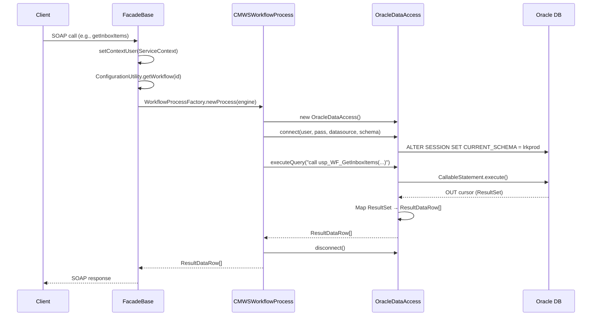

# 10 - Database Layer

## 1. Overview

CMWS uses a **100% stored procedure** database access pattern. There is zero inline SQL in the application — every database interaction goes through Oracle stored procedures via JDBC `CallableStatement`. The system was migrated from Sybase to Oracle in 2012.

| Property | Value |
|----------|-------|
| Database | Oracle |
| Access Pattern | Stored procedures only (no ORM, no inline SQL) |
| Client Library | Oracle JDBC (ojdbc6/ojdbc7) |
| Connection Pooling | WebSphere JNDI datasources |
| Data Access Class | `OracleDataAccess.java` |
| Total Stored Procedures | **243 unique** (called from Java code) |
| Schema Strategy | Per-workflow schema switching |
| Migrated From | Sybase (Oct 2012) |
| SQL Injection Protection | `MetadataHelper.checkForQuotedSQLInjection()` |

**Important:** The stored procedure source code is **NOT in this repository**. The Java code only knows procedure names and parameter shapes. The actual PL/SQL lives on the Oracle database server and is managed separately.

---

## 2. Connection Architecture

### JNDI Datasources — CMWSWeb (7)

Defined in `WebContent/WEB-INF/web.xml` and bound in `ibm-web-bnd.xmi`:

| # | JNDI Name | Purpose |
|---|-----------|---------|
| 1 | `jdbc/conn2lcms` | LCMS claims database |
| 2 | `jdbc/meta2dcms` | DCMS metadata database |
| 3 | `jdbc/conn2linx` | LINX integration database |
| 4 | `jdbc/wf_common_oracle_database1` | Workflow common DB (primary) |
| 5 | `jdbc/wf_common_oracle_database2` | Workflow common DB (secondary) |
| 6 | `jdbc/meta_common_oracle_database1` | Metadata common DB (primary) |
| 7 | `jdbc/meta_common_oracle_database2` | Metadata common DB (secondary) |

### JNDI Datasources — GIAL BatchControl (8)

GIAL has its own separate database connections for batch processing:

| # | JNDI Name | Batch Domain |
|---|-----------|-------------|
| 1 | `jdbc/lcms2Batch` | LCMS |
| 2 | `jdbc/gul2Batch` | GUL |
| 3 | `jdbc/osglia2Batch` | OSGLI Archive |
| 4 | `jdbc/osgli2Batch` | OSGLI |
| 5 | `jdbc/waiver2Batch` | Waiver |
| 6 | `jdbc/mu2Batch` | MU |
| 7 | `jdbc/cob2Batch` | COB |
| 8 | `jdbc/smcob2Batch` | SMCOB |

### Connection Lifecycle

```
1. JNDI lookup: InitialContext → DataSource
2. Get connection: ds.getConnection(userName, password)
3. Set schema: ALTER SESSION SET CURRENT_SCHEMA = {schemaName}
4. Execute stored procedures
5. Close connection (returns to pool)
```

### Per-Workflow Schema Switching

Each workflow has its own Oracle schema. The same stored procedures exist in every schema but operate on different workflow data. When processing a request, the code runs `ALTER SESSION SET CURRENT_SCHEMA = {schemaName}` to switch context.

**Workflow-to-Schema-to-Server Mapping** (confirmed by development team):

| Workflow Name | ID | Schema | DB Server (DEV) | DB Server (QA) | DB Server (UAT) | Proc Count |
|---------------|-----|--------|-----------------|----------------|-----------------|------------|
| Record Keeping Services (RKS) | 1 | `LRKPROD` | CMWSPD01/CMWSPD03 | CMWSPQ01/CMWSPQ03 | CMWSPU01/CMWSPU03 | 128 |
| COSC/MLBO Lockbox | 2 | `MLLCMPROD` | CMWSPD01/CMWSPD03 | CMWSPQ01/CMWSPQ03 | CMWSPU01/CMWSPU03 | 144 |
| OSGLI Administration | 3 | `OSGLIPROD` | CMWSPD02/CMWSPD04 | CMWSPQ02/CMWSPQ04 | CMWSPU02/CMWSPU04 | 278 |
| Contracts Archive | 4 | `CONTRACTSPROD` | CMWSPD01/CMWSPD03 | CMWSPQ01/CMWSPQ03 | CMWSPU01/CMWSPU03 | 46 |
| Underwriting Archive | 5 | `UWPROD` | CMWSPD01/CMWSPD03 | CMWSPQ01/CMWSPQ03 | CMWSPU01/CMWSPU03 | 49 |
| Proposal Unit Archive | 6 | `PROPOSALPROD` | CMWSPD01/CMWSPD03 | CMWSPQ01/CMWSPQ03 | CMWSPU01/CMWSPU03 | 47 |
| Walmart | 7 | `WALMARTPROD` | CMWSPD01/CMWSPD03 | CMWSPQ01/CMWSPQ03 | CMWSPU01/CMWSPU03 | 116 |
| Life Conversions | 8 | `LCNVPROD` | CMWSPD01/CMWSPD03 | CMWSPQ01/CMWSPQ03 | CMWSPU01/CMWSPU03 | 317 |
| Gul/Gvul Management | 9 | `GVULPROD` | CMWSPD01/CMWSPD03 | CMWSPQ01/CMWSPQ03 | CMWSPU01/CMWSPU03 | 135 |
| Enrollment Support Center | 10 | `ESCPROD` | CMWSPD01/CMWSPD03 | CMWSPQ01/CMWSPQ03 | CMWSPU01/CMWSPU03 | 116 |
| Client On-Boarding | 11 | `COBPROD` | CMWSPD01/CMWSPD03 | CMWSPQ01/CMWSPQ03 | CMWSPU01/CMWSPU03 | 140 |
| Small Market Client On-Boarding | 12 | `COB2PROD` | CMWSPD01/CMWSPD03 | CMWSPQ01/CMWSPQ03 | CMWSPU01/CMWSPU03 | 129 |
| Verizon | 13 | `VERIZONPROD` | CMWSPD01/CMWSPD03 | CMWSPQ01/CMWSPQ03 | CMWSPU01/CMWSPU03 | 94 |
| Enrollment Campaign Management | 14 | `EPRPROD` | CMWSPD01/CMWSPD03 | CMWSPQ01/CMWSPQ03 | CMWSPU01/CMWSPU03 | 146 |
| OSGLI Archive | 15 | `OSGLIARCHIVE` | CMWSPD02/CMWSPD04 | CMWSPQ02/CMWSPQ04 | CMWSPU02/CMWSPU04 | 274 |
| Medical Underwriting | 101 | `MUCMWSPROD` | CMWSPD02/CMWSPD04 | CMWSPQ02/CMWSPQ04 | CMWSPU02/CMWSPU04 | 81 |
| LCMS-GLCD | 102 | `LCMSGLCDPROD` | CMWSPD02/CMWSPD04 | CMWSPQ02/CMWSPQ04 | CMWSPU02/CMWSPU04 | 80 |
| LCMS-OSGLI | 104 | `LCMSOSGLIPROD` | CMWSPD02/CMWSPD04 | CMWSPQ02/CMWSPQ04 | CMWSPU02/CMWSPU04 | 65 |
| LCMS-PEB | 105 | `LCMSPEBPROD` | CMWSPD02/CMWSPD04 | CMWSPQ02/CMWSPQ04 | CMWSPU02/CMWSPU04 | 70 |
| LCMS-ILI | 107 | `LCMSILIPROD` | CMWSPD02/CMWSPD04 | CMWSPQ02/CMWSPQ04 | CMWSPU02/CMWSPU04 | 80 |
| DCMS | — | `DCMSCMWSPROD` | CMWSPD02/CMWSPD04 | CMWSPQ02/CMWSPQ04 | CMWSPU02/CMWSPU04 | 18 |

### Database Server Pattern

The workflows are split across **two database server pairs** per environment:

| Server Pair | Environment | Workflows |
|-------------|-------------|-----------|
| **CMWSPD01/CMWSPD03** | DEV | RKS, Lockbox, Contracts, UW, Proposals, Walmart, LCNV, GUL/GVUL, ESC, COB, SMCOB, Verizon, EPR (IDs 1-14) |
| **CMWSPD02/CMWSPD04** | DEV | OSGLI, OSGLI Archive, MU, LCMS-GLCD, LCMS-OSGLI, LCMS-PEB, LCMS-ILI, DCMS (IDs 3, 15, 101-107) |
| **CMWSPQ01/CMWSPQ03** | QA | Same split as DEV |
| **CMWSPQ02/CMWSPQ04** | QA | Same split as DEV |
| **CMWSPU01/CMWSPU03** | UAT | Same split as DEV |
| **CMWSPU02/CMWSPU04** | UAT | Same split as DEV |

**Naming convention:** `CMWSP{env}{pair}` where env = D(ev)/Q(A)/U(AT) and pair = 01/03 (primary group) or 02/04 (OSGLI/LCMS/MU group). Each pair has two servers (likely primary/failover or read/write split).

**Total: 864 unique procedures across 21 schemas** (331 called from Java, rest are database-only utilities or domain-specific variants).

**Credentials:** All connections use the `gicmwsv` user with environment-specific passwords.

---

## 3. Data Access Classes

### `OracleDataAccess` — Primary

**Location:** `com.pru.gi.workflow.data.OracleDataAccess`

This is the sole database access class for CMWSWeb. Every facade, process, and queue handler uses it.

**Methods:**

| Method | Purpose | Returns |
|--------|---------|---------|
| `connect(user, pass, dataSource, schema)` | JNDI lookup + schema switch | void |
| `disconnect()` | Close connection back to pool | void |
| `executeQuery(query)` | Call stored proc, return result set | `ResultDataRow[]` |
| `executeQuery(query, firstRowName)` | Same, but first row contains column names | `ResultDataRow[]` |
| `executeQuery(query, firstRowName, rowCount)` | Same, with max row limit | `ResultDataRow[]` |
| `executeCommand(command)` | Call stored proc, no return | void |
| `updateCommand(command)` | Call stored proc, return update count | int |
| `executeResult(procName, params)` | Call stored proc with parameterized inputs, return int result | int |

**How `executeQuery` works:**

1. Detects if query starts with `CALL` → uses `CallableStatement`; otherwise `Statement`
2. For callable statements: inspects `ParameterMetaData` to count OUT parameters
3. Registers all OUT params as `OracleTypes.CURSOR`
4. Executes the statement
5. Reads the OUT cursor ResultSet with `setFetchSize(2000)`
6. Maps each row to a `ResultDataRow` (column index → value)
7. If `firstRowName=true`, first ResultDataRow contains column names from `ResultSetMetaData`
8. On Oracle error code 532 → throws `WorkflowTimestampException` (optimistic locking)

**Typical call pattern in Java:**
```java
OracleDataAccess oraDAL = new OracleDataAccess();
oraDAL.connect(m_userName, m_password, m_dataSource, m_schemaName);
try {
    ResultDataRow[] results = oraDAL.executeQuery(
        "call usp_WF_GetAllQueues (" + workflowId + " ,? )", true);
    // process results...
} finally {
    oraDAL.disconnect();
}
```

### Other Data Access Classes

| Class | Purpose | Status |
|-------|---------|--------|
| `FilennetDataAccess` | EDM/Filenet document storage | Active (but NOT a database class — wraps EDM REST API) |
| `DB2DataAccess` | Legacy DB2 support | Likely unused |
| `MSSqlServerDataAccess` | SQL Server for QTS/reporting | Active for QTS integration |
| `CrystalReportsRASAccess` | Crystal Reports Analytics Service | Active for report generation |
| `ServiceHandler` | Routes to appropriate data access implementation | Active |
| `TivoliAccessManagerAccess` | TAM authentication | Minimal/deprecated |

### GIAL's `DBInterface`

**Location:** `com.pru.gial.data.DBInterface` and `com.pru.gi.gial.data.DBInterface`

Separate database access for GIAL's batch control operations. Uses parameterized `CallableStatement` (not string concatenation like CMWSWeb).

**Stored procedures called:**
- `usp_ValidateBatchDetails(?,?,?,?,?,?)` — validate a batch exists and is active
- `usp_CheckDocumentLoadStatus(?,?,?,?,?)` — check if a document is already loaded
- `usp_InsertDocumentLoadStatus(?,?,?,?,?,?)` — record document load status
- `usp_CreateICaptureBatch(?,?,?,?,?,?,?,?)` — create a new batch

---


## 4. Stored Procedure Catalog (Source-Verified)

**331 procedures called from Java code**, with descriptions and table references extracted from the actual PL/SQL source in Oracle. Organized by module prefix (31 modules).

> **Note:** 864 total procedures exist across 21 schemas. The 331 below are the ones actively called from Java. The remaining ~533 are database-only utilities, views, or domain-specific variants not referenced in the application code.

### ADMIN — `usp_ADMIN_*` (10 procedures)

| Procedure | Description | Key Tables |
|-----------|-------------|------------|
| `USP_ADMIN_ADDUSER` | PURPOSE: Creates a new WORKFLOW_USER entry.  The user is made active automatically | INSERT INTO admin_history,INSERT INTO WORKFLOW_USER,Update Admin |
| `USP_ADMIN_ADDUSERTOFBU` | PURPOSE: Adds a new entry to the FUNCTIONAL_UNIT_USER table. | FROM DUAL,FROM FUNCTIONAL_UNIT_USER,INSERT INTO admin_history,INSERT INTO FUNCTIONAL_UNIT_USER,INTO  |
| `USP_ADMIN_DELUSERFROMFBU` | PURPOSE: Removes an entry to the FUNCTIONAL_UNIT_USER table. | DELETE FROM FUNCTIONAL_UNIT_USER,FROM DUAL,FROM FUNCTIONAL_UNIT_USER,INSERT INTO admin_history,INTO  |
| `USP_ADMIN_GETFBUS` | PURPOSE: get a list Functional Business Units | FROM FUNCTIONAL_UNIT,FROM WORKFLOW_USER,INTO v_max_modifed_date,INTO v_max_modified_by |
| `USP_ADMIN_GETFBUUSERS` | PURPOSE: get a list Users for a given FBU | FROM FUNCTIONAL_UNIT_USER |
| `USP_ADMIN_GETUSERFBUS` | PURPOSE: get a list FBU's for a given User | FROM FUNCTIONAL_UNIT_USER |
| `USP_ADMIN_GETUSERID` | PURPOSE: To return ions_id of users whose name matches a partial name search on input first and last name | FROM WORKFLOW_USER |
| `USP_ADMIN_GETUSERPRIVILEGES` | PURPOSE: Returns all of the user's privileges. | FROM FBU_PRIVILEGE |
| `USP_ADMIN_GETUSERS` | PURPOSE: get a list WORKFLOW_USERs | FROM WORKFLOW_USER,INTO v_max_modifed_date |
| `USP_ADMIN_UPDATEUSER` | PURPOSE: Updates a WORKFLOW_USER entry. | FROM DUAL,FROM WORKFLOW_USER,INSERT INTO admin_history,INTO v_old_active_ind,INTO v_temp |

### ANC — `usp_ANC_*` (6 procedures)

| Procedure | Description | Key Tables |
|-----------|-------------|------------|
| `USP_ANC_ADDRESTRICTEDCASE` | PURPOSE: Makes a control number restricted. | INSERT INTO restricted_case |
| `USP_ANC_ADDUSERTOCASE` | PURPOSE: Makes a control number restricted. | INSERT INTO restricted_case_user,INSERT INTO restricted_case_user_history |
| `USP_ANC_DELRESTRICTEDCASE` | PURPOSE: Makes a control number not restricted. | FROM restricted_case,FROM restricted_case_user,INSERT INTO restricted_case_user_history,INTO v_ions_ |
| `USP_ANC_DELUSERFROMCASE` | PURPOSE: Makes a control number restricted. | DELETE FROM restricted_case_user,from restricted,FROM restricted_case_user,from the,INSERT INTO rest |
| `USP_ANC_GETRSTCDCASEUSERS` | PURPOSE: To get a list of control numbers for a user | FROM restricted_case_user |
| `USP_ANC_GETUSERRSTCDCASES` | PURPOSE: To get a list of control numbers for a user | FROM restricted_case_user |

### BILLING — `usp_BILLING_*` (3 procedures)

| Procedure | Description | Key Tables |
|-----------|-------------|------------|
| `USP_BILLING_FINDFOLDER` | PURPOSE: Finds Folder for the type | FROM DOCUMENT |
| `USP_BILLING_FINDTAB` | PURPOSE: Finds Folder for the type | FROM DOCUMENT |
| `USP_BILLING_GETFILEYEAR` | PURPOSE: Determines the file year for a document.  Use year from enqueue_date | FROM DOCUMENT,from enqueue_date |

### CASE — `usp_CASE_*` (4 procedures)

| Procedure | Description | Key Tables |
|-----------|-------------|------------|
| `USP_CASE_FINDFOLDER` | PURPOSE: Finds Folder for the SSN | DELETE FROM tt_results_,FROM DOCUMENT,from document_id,FROM tt_results_,INSERT INTO tt_results_ |
| `USP_CASE_FINDFOLDERBYCOMPLAINT` | PURPOSE: Finds Folder for the Complaint Number | FROM DOCUMENT |
| `USP_CASE_FINDOTHERDOCS` | PURPOSE: Related Document for the SSN and Control_Number | FROM DOCUMENT |
| `USP_CASE_UPDATECASEDEPOSIT` | (no description in source) | FROM DOCUMENT,FROM DUAL,INTO v_document_version_id,UPDATE pru_osgli_admin_folder |

### CASEDIARY — `usp_CASEDIARY_*` (3 procedures)

| Procedure | Description | Key Tables |
|-----------|-------------|------------|
| `USP_CASEDIARY_ADDENTRY` | PURPOSE: Adds a note to a case | INSERT INTO CASE_DIARY |
| `USP_CASEDIARY_GETENTRIES` | PURPOSE: Returns the notes associated with a case | FROM CASE_DIARY |
| `USP_CASEDIARY_UPDATEENTRY` | PURPOSE: Updates a note to a case | UPDATE CASE_DIARY |

### CASELIST — `usp_CASELIST_*` (21 procedures)

| Procedure | Description | Key Tables |
|-----------|-------------|------------|
| `USP_CASELIST_ADDCASE` | PURPOSE: Creates or Updates a case in the Lockbox_case_listing | FROM billing_case_listing,FROM DUAL,INSERT INTO billing_case_listing,INTO v_temp,UPDATE billing_case |
| `USP_CASELIST_ADDESCCASE` | PURPOSE: Creates or Updates a case in the case_listing | FROM case_listing,FROM DUAL,INSERT INTO case_listing,INTO v_temp,UPDATE case_listing |
| `USP_CASELIST_ADDGULGVULCASE` | PURPOSE: Creates or Updates a case in the gulgvul_case_listing | FROM DUAL,FROM gulgvul_case_listing,INSERT INTO gulgvul_case_listing,INTO v_temp,UPDATE gulgvul_case |
| `USP_CASELIST_ADDLCNVCASE` | PURPOSE: Creates or Updates a case in the lrk_case_listing | FROM DUAL,FROM lcnv_case_listing,from the,INSERT INTO lcnv_case_listing,INTO v_temp |
| `USP_CASELIST_ADDLRKCASE` | PURPOSE: Creates or Updates a case in the lrk_case_listing | FROM DUAL,FROM lrk_case_listing,from the,INSERT INTO lrk_case_listing,INTO v_temp |
| `USP_CASELIST_ADDNJEACASE` | PURPOSE: Creates or Updates a case in the njea_case_listing | FROM DUAL,FROM njea_billing_case_listing,FROM njea_billing_groups,FROM njea_case_listing,INSERT INTO |
| `USP_CASELIST_GETALLCASES` | PURPOSE: Returns information about all LCMS cases | FROM    case_listing |
| `USP_CASELIST_GETALLLCNVCASES` | PURPOSE: Returns information about all LCNV cases | FROM lcnv_case_listing |
| `USP_CASELIST_GETALLLRKCASES` | PURPOSE: Returns information about all LRK cases | FROM lrk_case_listing |
| `USP_CASELIST_GETCASEDETAILS` | PURPOSE: Checks both the lockbox and the njea case listing tables to return the case name | FROM billing_case_listing,FROM DUAL,FROM njea_billing_groups,FROM njea_case_listing,INTO v_bill_grou |
| `USP_CASELIST_GETCASEINFO` | PURPOSE: Returns information about an LCMS case | FROM    case_listing |
| `USP_CASELIST_GETLCMSCASEINFO` | PURPOSE: Returns information about an LCMS case | FROM case_listing |
| `USP_CASELIST_GETLCNVCASEINFO` | PURPOSE: Returns information about an LCNV case | FROM lcnv_case_listing |
| `USP_CASELIST_GETLRKCASEINFO` | PURPOSE: Returns information about an LRK case | FROM lrk_case_listing |
| `USP_CASELIST_GETNJEACASEINFO` | PURPOSE: Returns information about a NJEA case | FROM njea_billing_case_listing |
| `USP_CASELIST_GETNJEACASELIST` | PURPOSE: Returns information about a Lockbox case | FROM njea_case_listing |
| `USP_CASELIST_NJEASEARCH` | PURPOSE: Wildcard search by Casename | FROM njea_billing_case_listing |
| `USP_CASELIST_SAVECASE` | PURPOSE: Creates or Updates a case | FROM case_listing,FROM DUAL,INSERT INTO case_listing,INTO v_temp,UPDATE case_listing |
| `USP_CASELIST_SRCHBYCASENAME` | PURPOSE: Returns information about all LCNV cases based on Case Name | FROM lcnv_case_listing |
| `USP_CASELIST_SRCHBYCLIENTNAME` | PURPOSE: Wildcard search by clientName | FROM gulgvul_case_listing |
| `USP_CASELIST_SRCHBYCONTROLNUM` | PURPOSE: Returns information about all LCNV cases based on Control Number | FROM lcnv_case_listing |

### CASEPROC — `usp_CASEPROC_*` (2 procedures)

| Procedure | Description | Key Tables |
|-----------|-------------|------------|
| `USP_CASEPROC_GETCASEACTIVITIES` | PURPOSE: Returns all of the case process requirements and their associated dates | FROM DOCUMENT |
| `USP_CASEPROC_UPDATEACTIVITY` | PURPOSE: Creates or updates a case activity | FROM DOCUMENT,INSERT INTO CASE_PROCESS_TRACKING,UPDATE CASE_PROCESS_TRACKING,UPDATE DOCUMENT |

### CNTRLADMIN — `usp_CNTRLADMIN_*` (4 procedures)

| Procedure | Description | Key Tables |
|-----------|-------------|------------|
| `USP_CNTRLADMIN_ADDUSERRESTRCT` | PURPOSE: Adds a new entry to the RESTRICTD_CNTRL_USERS table. | FROM DUAL,FROM RESTRICTD_CNTRL_USERS,INSERT INTO CNTRLADMIN_HISTORY,INSERT INTO RESTRICTD_CNTRL_USER |
| `USP_CNTRLADMIN_DELUSERRESTRCT` | PURPOSE: Delete an entry from the RESTRICTD_CNTRL_USERS table. | FROM DUAL,FROM RESTRICTD_CNTRL_USERS,from the,INSERT INTO CNTRLADMIN_HISTORY,INTO v_temp |
| `USP_CNTRLADMIN_GETLASTMODIFIED` | PURPOSE: get a last modified User and date | FROM CNTRLADMIN_HISTORY,FROM WORKFLOW_USER |
| `USP_CNTRLADMIN_GETRESTRCTUSER` | PURPOSE: get a list of Restricted Users | FROM RESTRICTD_CNTRL_USERS |

### COB — `usp_COB_*` (63 procedures)

| Procedure | Description | Key Tables |
|-----------|-------------|------------|
| `USP_COB_ADDWORKTYPECHANGETYPE` | PURPOSE: Adds coverage to a work type | INSERT INTO cob_wt_change_type,UPDATE cob_work_type,update the |
| `USP_COB_ADDWORKTYPECOVERAGE` | PURPOSE: Adds coverage to a work type | from cob_coverage,from cob_coverage_category,FROM cob_wt_coverage,FROM DUAL,INSERT INTO cob_wt_cover |
| `USP_COB_ADDWORKTYPEDISTEMAIL` | PURPOSE: Adds email to a work type distribution list | FROM cob_work_type,FROM DUAL,INSERT INTO cob_wt_distribution_list,INTO v_work_type_id,UPDATE cob_wor |
| `USP_COB_ADDWORKTYPEDISTUSER` | PURPOSE: Adds CMWS user to a work type distribution list | FROM cob_work_type,FROM DUAL,INSERT INTO cob_wt_distribution_list,INTO v_work_type_id,UPDATE cob_wor |
| `USP_COB_ADDWORKTYPEFINDEVICE` | PURPOSE: Adds a financial device to a work type | from cob_financial_device,FROM cob_wt_financial_device,FROM DUAL,INSERT INTO cob_wt_financial_device |
| `USP_COB_ADDWORKTYPETHIRDPARTY` | PURPOSE: Adds third party to a work type | from cob_third_party_type,FROM DUAL,from STATE_CODE,INSERT INTO cob_wt_third_party,UPDATE cob_work_t |
| `USP_COB_ADDWTPERFGUARANTEE` | PURPOSE: Adds a performance guarantee to a work type | from cob_guarantee_type,FROM cob_wt_performance_guarantee,FROM DUAL,INSERT INTO cob_wt_performance_g |
| `USP_COB_CREATECHECKLISTITEM` | PURPOSE: Creates a checklist item under a checklist | FROM cob_checklist_item,INSERT INTO cob_checklist_item |
| `USP_COB_CREATETASK` | PURPOSE: Creates a new task under a milestone | FROM cob_task,INSERT INTO cob_task |
| `USP_COB_CREATEWORKTYPE` | (no description in source) | from CASE_TYPE,from cob_group_type,FROM DUAL,INSERT INTO cob_work_type |
| `USP_COB_DELWORKTYPECHANGETYPE` | PURPOSE: Removes a coverage from a work type | from a |
| `USP_COB_DELWORKTYPECOVERAGE` | PURPOSE: Removes a coverage from a work type | from a,from cob_coverage,from cob_coverage_category,UPDATE cob_work_type |
| `USP_COB_DELWORKTYPEDISTENTRY` | PURPOSE: Removes an email or CMWS user from distribution list | FROM cob_wt_distribution_list,from distribution,INTO v_work_type_id,UPDATE cob_work_type |
| `USP_COB_DELWORKTYPEFINDETAIL` | PURPOSE: Removes a Financial Details from a work type | from a,From Work,UPDATE cob_work_type |
| `USP_COB_DELWORKTYPEFINDEVICE` | PURPOSE: Removes a financial device from a work type | from a,from cob_financial_device,UPDATE cob_work_type |
| `USP_COB_DELWTPERFGUARANTEE` | PURPOSE: Removes a peformance guarantee from a work type | from a,from cob_guarantee_type,UPDATE cob_work_type |
| `USP_COB_FINDFOLDER` | PURPOSE: Returns an Active Folder ID based on the input parameters | FROM DOCUMENT,INTO v_rowcount |
| `USP_COB_GETCHANGETYPEBYCASE` | PURPOSE: Returns change types within case type | FROM CASE_TYPE |
| `USP_COB_GETCHECKLISTITEMSBYFBU` | PURPOSE: Returns list of checklist items by functional area | FROM cob_checklist,FROM WORKFLOW_USER |
| `USP_COB_GETCONTACTTYPEINFO` | PURPOSE: Returns required contact types by case type | FROM cob_contact_type |
| `USP_COB_GETCOVERAGESBYCAT` | PURPOSE: Returns coverages within category | FROM cob_coverage_category |
| `USP_COB_GETCOVERAGESLIST` | PURPOSE: Returns a list of all the coverages. | FROM cob_coverage_category |
| `USP_COB_GETDOCUMENTVERSIONS` | PURPOSE: Returns the final versions of a document and the labels | FROM DOCUMENT_VERSION |
| `USP_COB_GETLASTWORKTYPEBYCTLNM` | PURPOSE: Returns the most recent New Issue work tpe for a control number. | FROM cob_work_type |
| `USP_COB_GETMILESTONES` | PURPOSE: Returns list of milestones | FROM cob_milestone |
| `USP_COB_GETNEXTASSIGNTOUSER` | PURPOSE: Returns the next user a folder should be assigned to  | FROM WORKFLOW_HISTORY,FROM WORKFLOW_USER,INTO v_ions_id,INTO v_lastAssignedIonsID,INTO v_lastAssigne |
| `USP_COB_GETOPENINBOXITEMS` | PURPOSE: Returns all open tasks and checklist items assigned to | FROM cob_checklist,FROM cob_task,FROM cob_work_type |
| `USP_COB_GETOPENQUEUEITEMS` | PURPOSE: Returns all open tasks and checklist items for a virtual queue | FROM    cob_checklist,FROM cob_task,from queue,FROM QUEUE,INTO v_functional_unit_id |
| `USP_COB_GETTASK` | PURPOSE: Returns task details including the queue a task is associated with | FROM cob_task |
| `USP_COB_GETTASKSBYFBU` | PURPOSE: Returns list of tasks by functional area by milestone sequence | FROM cob_task,FROM WORKFLOW_USER |
| `USP_COB_GETUPCOMINGDUEITEMS` | PURPOSE: Returns all open milestones | FROM pru_cob_folder |
| `USP_COB_GETUSERFUNCTIONALAREAS` | PURPOSE: get a list Functional Areas's for a given User | FROM FUNCTIONAL_UNIT_USER,from FUU |
| `USP_COB_GETWORKTYPE` | PURPOSE: Returns data for work type | FROM cob_work_type |
| `USP_COB_GETWORKTYPE3RDPARTIES` | PURPOSE: Returns third parties for a work type | FROM cob_wt_third_party |
| `USP_COB_GETWORKTYPEBYDOC` | PURPOSE: Returns data for work type | FROM cob_work_type |
| `USP_COB_GETWORKTYPECHANGETYPE` | PURPOSE: Returns change types for  a work type | FROM cob_wt_change_type |
| `USP_COB_GETWORKTYPECHKLSTBYFBU` | PURPOSE: Returns all work type checklist items for an FBU | FROM cob_work_type |
| `USP_COB_GETWORKTYPECOMMISSIONS` | PURPOSE: Returns commissions for all coverages and third parties of a work type | FROM cob_wt_commission |
| `USP_COB_GETWORKTYPECONTACTS` | PURPOSE: Returns contacts for all coverages of a work type | FROM cob_work_type |
| `USP_COB_GETWORKTYPECONTACTSDOC` | PURPOSE: Returns contacts for a work type by document id | FROM cob_work_type,from distrubution |
| `USP_COB_GETWORKTYPECOVERAGES` | PURPOSE: Returns data for work type | FROM cob_wt_coverage |
| `USP_COB_GETWORKTYPECOVERAGSDOC` | PURPOSE: Returns distinct coverages for a work type | FROM cob_work_type |
| `USP_COB_GETWORKTYPEDISTEMAILS` | PURPOSE: Returns emails on Work Type distribution list | FROM cob_work_type |
| `USP_COB_GETWORKTYPEDISTUSERS` | PURPOSE: Returns cmws users on Work Type distribution list | FROM cob_work_type |
| `USP_COB_GETWORKTYPEFINDETAILS` | PURPOSE: Returns financial details for all coverages of a work type | FROM cob_wt_coverage |
| `USP_COB_GETWORKTYPEFINDEVICES` | PURPOSE: Returns financial devices for a work type | FROM cob_wt_financial_device |
| `USP_COB_GETWORKTYPEMILESTASKS` | PURPOSE: Returns all milestones and tasks for a work type | FROM cob_work_type |
| `USP_COB_GETWORKTYPENIGODOC` | PURPOSE: Returns all work type NIGO documents | FROM cob_work_type |
| `USP_COB_GETWTPERFGUARANTEES` | PURPOSE: Returns performance guarantees of a work type | FROM cob_wt_performance_guarantee |
| `USP_COB_SETWORKTYPECOMMISSION` | PURPOSE: Set commissions for a work type coverage and third party (inserts or updates). | FROM cob_wt_commission,FROM DUAL,INSERT INTO cob_wt_commission,INTO v_temp,UPDATE cob_work_type |
| `USP_COB_SETWORKTYPECONTACT` | PURPOSE: Set a contact for a work type (inserts or updates).  If removing | from cob_contact_type,FROM cob_wt_contact,FROM DUAL,INSERT INTO cob_wt_contact,INTO v_temp |
| `USP_COB_SETWORKTYPEFINDETAIL` | PURPOSE: Set financial details for a work type coverage (inserts or updates). | FROM cob_financial_detail,FROM DUAL,INSERT INTO cob_financial_detail,INTO v_temp,UPDATE cob_financia |
| `USP_COB_SETWORKTYPEFOLDER` | PURPOSE: Associates a work type data entry record with a work type folder. | FROM cob_checklist_item,FROM cob_milestone,FROM cob_nigo_document,FROM cob_task,FROM cob_work_type |
| `USP_COB_UPDATECHECKLISTITEM` | PURPOSE: Updates checklist item | FROM cob_checklist_item,Update Checklist,UPDATE cob_checklist_item |
| `USP_COB_UPDATETASK` | PURPOSE: Updates task | FROM cob_task,UPDATE cob_task,Update Task |
| `USP_COB_UPDATEWORKTYPE` | (no description in source) | from CASE_TYPE,from cob_group_type,update a,UPDATE cob_work_type,update column |
| `USP_COB_UPDATEWORKTYPE3RDPARTY` | PURPOSE: Updates third party information for a work type | from cob_third_party_type,FROM cob_wt_third_party,from STATE_CODE,INTO v_work_type_id,UPDATE cob_wor |
| `USP_COB_UPDATEWORKTYPECHECKLST` | PURPOSE: Updates work type checklist item | from cob_work_type,FROM cob_work_type,INTO cob_wt_checklist_item,INTO v_work_type_id,Update Checklis |
| `USP_COB_UPDATEWORKTYPEMILESTN` | PURPOSE: Updates work type milestone | FROM cob_work_type,INTO v_work_type_id,UPDATE  cob_wt_milestone,UPDATE cob_work_type,Update Mileston |
| `USP_COB_UPDATEWORKTYPENIGODOC` | PURPOSE: Updates work type checklist item | FROM    cob_work_type,FROM  cob_work_type,FROM cob_work_type,INTO cob_wt_nigo_document,INTO v_work_t |
| `USP_COB_UPDATEWORKTYPETASK` | PURPOSE: Updates work type task | FROM    cob_work_type,FROM cob_work_type,INTO cob_wt_task,INTO v_work_type_id,UPDATE cob_work_type |
| `USP_COB_UPDWORKTYPECHKLDYNAMIC` | PURPOSE: Updates work type checklist item - completed | FROM cob_work_type,INTO v_work_type_id,Update Checklist,UPDATE cob_work_type,UPDATE cob_wt_checklist |
| `USP_COB_UPDWORKTYPETASKDYNAMIC` | PURPOSE: Updates work type task - set owner | FROM  cob_work_type,FROM cob_work_type,INTO cob_wt_task,INTO v_work_type_id,UPDATE  cob_wt_task |

### CONTRACT — `usp_CONTRACT_*` (1 procedures)

| Procedure | Description | Key Tables |
|-----------|-------------|------------|
| `USP_CONTRACT_FINDFOLDERTAB` | PURPOSE: Finds document_id and timestamp of the folder or tab based on | FROM DOCUMENT |

### ELIG — `usp_ELIG_*` (9 procedures)

| Procedure | Description | Key Tables |
|-----------|-------------|------------|
| `USP_ELIG_COMPLETEELIGDOC` | PURPOSE: Clears the reserved indicator for this user | UPDATE eligibility_annotation |
| `USP_ELIG_CREATEANNOTATION` | PURPOSE: Creates a new eligibility annotation and returns the new annotation ID | FROM eligibility_annotation,INSERT INTO eligibility_annotation |
| `USP_ELIG_GETDOCANNOTATIONS` | PURPOSE: Returns information eligibility annotations for a document | FROM eligibility_annotation |
| `USP_ELIG_GETQUEUEITEMS` | PURPOSE: This will get the eligibility items that will appear in a queue or inbox | FROM DOCUMENT,FROM DOCUMENT_QUEUE,FROM eligibility_annotation |
| `USP_ELIG_GETTARGETDATE` | PURPOSE: Returns the target date and business date for the current date and time. | FROM WORKDAYS |
| `USP_ELIG_GETUSERQRCOUNTS` | PURPOSE: Counts the Number of Auto QR'ed items so far and the number selected for QR | FROM eligibility_annotation |
| `USP_ELIG_REMOVEANNOTATION` | PURPOSE: Deletes an eligibility_annotation item (OK if this fails) |  |
| `USP_ELIG_RESERVEELIGDOC` | PURPOSE: Reserves auto qr eligibility items that have not been set and are unreserved or unreserves all. | UPDATE eligibility_annotation |
| `USP_ELIG_SETDOCQRSTATUS` | PURPOSE: Updates the QR Status and QR Status Date | UPDATE eligibility_annotation |

### EPR — `usp_EPR_*` (55 procedures)

| Procedure | Description | Key Tables |
|-----------|-------------|------------|
| `USP_EPR_ADDTASKDIARYENTRYDOC` | PURPOSE: Adds a note to a task | FROM epr_work_type,INSERT INTO epr_wt_task_diary,INTO v_work_type_id |
| `USP_EPR_ADDWORKTYPEALLOCLIVES` | PURPOSE: Creates work type allocation lives state | INSERT INTO epr_wt_alloc_lives |
| `USP_EPR_ADDWORKTYPECORECOMP` | PURPOSE: Creates a core component to the work type and also adds the tasks related to | FROM DUAL,FROM epr_client_profile,FROM epr_core_component,FROM epr_core_component_task,FROM epr_cp_c |
| `USP_EPR_ADDWORKTYPEDISTUSER` | PURPOSE: Adds CMWS user to a work type distribution list | FROM DUAL,FROM epr_work_type,INSERT INTO epr_wt_distribution_list,INTO v_work_type_id,UPDATE epr_wor |
| `USP_EPR_CHECKFOLDERACTIVE` | PURPOSE: Returns details of when a folder was moved to the active queue | FROM WORKFLOW_HISTORY |
| `USP_EPR_CPDELETEDEPENDENCY` | PURPOSE: This will delete a depndency |  |
| `USP_EPR_CPDELWORKTYPECORECOMP` | PURPOSE: Delete a core component | FROM DUAL,FROM epr_cp_wt_core_component,from the,INTO v_temp,UPDATE epr_client_profile |
| `USP_EPR_CPSAVECLIENTCONTACTS` | PURPOSE: This will create a new client contact record | FROM DUAL,INSERT INTO epr_cp_wt_client_contacts,UPDATE epr_client_profile,UPDATE epr_cp_wt_client_co |
| `USP_EPR_CPSAVECLIENTPROFILE` | (no description in source) | FROM DUAL,FROM epr_client_profile,INSERT INTO epr_client_profile,INTO v_temp,UPDATE epr_client_profi |
| `USP_EPR_CPSAVECOVERAGES` | PURPOSE: This will create a new client profile coverage | FROM DUAL,FROM epr_cp_wt_coverage,INSERT INTO epr_cp_wt_coverage,INTO v_temp,UPDATE epr_client_profi |
| `USP_EPR_CPSAVEDEPENDENCY` | PURPOSE: This will create a new client profile coverage | INSERT INTO epr_cp_wt_dependency |
| `USP_EPR_CPSAVEENROLLRULES` | PURPOSE: This will create a new enrollment rule | FROM DUAL,FROM epr_cp_wt_enroll_rules,INSERT INTO epr_cp_wt_enroll_rules,INTO v_temp,UPDATE epr_clie |
| `USP_EPR_CPSAVEPRUCONTACTS` | PURPOSE: This will create a new pru contact record | FROM DUAL,FROM epr_cp_wt_pru_contact,INSERT INTO epr_cp_wt_pru_contact,INTO v_temp,UPDATE epr_cp_wt_ |
| `USP_EPR_CPSAVEWORKTYPECORECOMP` | PURPOSE: Creates a core component | FROM DUAL,FROM epr_cp_wt_core_component,INSERT INTO epr_cp_wt_core_component,INTO v_temp,UPDATE epr_ |
| `USP_EPR_CREATEWORKTYPE` | (no description in source) | from CASE_TYPE,FROM DUAL,INSERT INTO epr_work_type |
| `USP_EPR_DELWORKTYPEALLOCLIVES` | PURPOSE: deletes work type allocation lives state |  |
| `USP_EPR_DELWORKTYPECORECOMP` | PURPOSE: Delete a core component and its related tasks from the work type. | FROM DUAL,FROM epr_client_profile,FROM epr_core_component,FROM epr_cp_core_component_map,FROM epr_wt |
| `USP_EPR_DELWORKTYPEDISTENTRY` | PURPOSE: Removes an email or CMWS user from distribution list | from distribution,FROM epr_wt_distribution_list,INTO v_work_type_id,UPDATE epr_work_type |
| `USP_EPR_FINDFOLDER` | PURPOSE: Returns an Active Folder ID based on the input parameters | FROM DOCUMENT,INTO v_rowcount |
| `USP_EPR_GETCLIENTPROFILE` | PURPOSE: Returns data for client profile.If client profile is not found for the worktype then | FROM DUAL,FROM epr_client_profile,FROM epr_cp_campaign_type,FROM epr_cp_pru_record_keeping,FROM epr_ |
| `USP_EPR_GETCONTACTTYPEINFO` | PURPOSE: Returns required contact types by case type | FROM epr_contact_type |
| `USP_EPR_GETCORECATGORIES` | PURPOSE: Returns list of core categories | FROM epr_core_category |
| `USP_EPR_GETCORECOMPONENTS` | PURPOSE: Returns list of core components | FROM epr_core_component |
| `USP_EPR_GETCPCLIENTCONTACTS` | PURPOSE: Returns contacts for a client profile. | FROM epr_client_profile,FROM epr_cp_wt_client_contacts,FROM epr_work_type,INTO v_work_type_id |
| `USP_EPR_GETCPCORECATGORIES` | PURPOSE: Returns list of Client Profile core categories | FROM epr_cp_core_category |
| `USP_EPR_GETCPCORECOMPONENTS` | PURPOSE: Returns list of core components. | DELETE FROM tt_cc_temp,FROM DUAL,from EAS,FROM epr_client_profile,FROM epr_cp_core_component |
| `USP_EPR_GETCPCOVERAGES` | PURPOSE: Returns data for client profile coverages.If v_get_prior=""y" | FROM epr_client_profile,FROM epr_cp_coverage_line,FROM epr_work_type,INTO v_work_type_id |
| `USP_EPR_GETCPDEPENDENCY` | PURPOSE: Returns data for client profile coverages.If v_get_prior=""Y" | FROM epr_client_profile,FROM epr_cp_dependency,FROM epr_work_type,INTO v_work_type_id |
| `USP_EPR_GETCPENROLLRULES` | PURPOSE: Returns data for client profile.If v_get_prior=""Y" | FROM epr_client_profile,FROM epr_cp_wt_enroll_rules,FROM epr_work_type,INTO v_work_type_id |
| `USP_EPR_GETCPPRUCONTACTS` | PURPOSE: Returns pru contacts for a client profile. | DELETE FROM tt_contacts_temp,FROM epr_client_profile,FROM epr_cp_contact_type,FROM epr_work_type,FRO |
| `USP_EPR_GETDOCUMENTVERSIONS` | PURPOSE: Returns the final versions of a document and the labels | FROM DOCUMENT_VERSION |
| `USP_EPR_GETINFLIGHTDASHBOARD` | (no description in source) | DELETE FROM tt_tmp_core_components,DELETE FROM tt_tmp_core_counts,DELETE FROM tt_tmp_core_task_total |
| `USP_EPR_GETNEXTBUSINESSDAY` | PURPOSE: Returns the next business day | from which,FROM WORKDAYS |
| `USP_EPR_GETOPENINBOXITEMS` | PURPOSE: Returns all open tasks | FROM epr_core_component,FROM epr_task |
| `USP_EPR_GETOPENQUEUEITEMS` | PURPOSE: Returns all open tasks and checklist items for a virtual queue | FROM epr_core_component,FROM epr_task,from queue,FROM QUEUE,INTO v_functional_unit_id |
| `USP_EPR_GETPASTDUEITEMS` | PURPOSE: Returns all open tasks items with an owner | FROM pru_epr_folder |
| `USP_EPR_GETTASK` | PURPOSE: Returns task details including the queue a task is associated with | FROM epr_task |
| `USP_EPR_GETTASKDIARYENTRIESDOC` | PURPOSE: Returns the notes associated with a task | FROM epr_wt_task_diary |
| `USP_EPR_GETUPCOMINGDUEITEMS` | PURPOSE: Returns all open tasks items with an owner | FROM    pru_epr_folder,FROM WORKDAYS,INTO v_target_date |
| `USP_EPR_GETWORKTYPE` | PURPOSE: Returns data for work type | FROM epr_work_type |
| `USP_EPR_GETWORKTYPEALLOCLIVES` | PURPOSE: Gets work type allocation lives state | FROM epr_wt_alloc_lives |
| `USP_EPR_GETWORKTYPECOMPSTASKS` | PURPOSE: Returns all milestones and tasks for a work type | FROM epr_work_type,FROM epr_wt_task_diary |
| `USP_EPR_GETWORKTYPECONTACTS` | PURPOSE: Returns contacts for all coverages of a work type | FROM epr_work_type |
| `USP_EPR_GETWORKTYPECONTACTSDOC` | PURPOSE: Returns contacts for a work type by document id | FROM epr_work_type |
| `USP_EPR_GETWORKTYPEDISTEMAILS` | PURPOSE: Returns emails on Work Type distribution list | FROM epr_work_type |
| `USP_EPR_GETWORKTYPEDISTUSERS` | PURPOSE: Returns cmws users on Work Type distribution list | FROM epr_work_type |
| `USP_EPR_MAKETASKPASTDUE` | (no description in source) | UPDATE epr_wt_task |
| `USP_EPR_SETAUTOASSIGNIND` | (no description in source) | UPDATE epr_work_type |
| `USP_EPR_SETWORKTYPECONTACT` | PURPOSE: Set a contact for a work type (inserts or updates).  If removing | FROM DUAL,from epr_contact_type,FROM epr_cp_contact_type,FROM epr_wt_contact,INSERT INTO epr_wt_cont |
| `USP_EPR_SETWORKTYPEFOLDER` | PURPOSE: Associates a work type data entry record with a work type folder. | FROM DUAL,FROM epr_work_type,INTO v_temp,UPDATE epr_work_type |
| `USP_EPR_UPDATEWORKTYPE` | (no description in source) | from CASE_TYPE,FROM EPR_RECORD_TYPE,FROM epr_work_type,FROM EPR_WORK_TYPE,FROM WORKFLOW_USER |
| `USP_EPR_UPDATEWORKTYPECORECOMP` | PURPOSE: Updates work type milestone | FROM epr_work_type,INTO  v_work_type_id,INTO epr_wt_core_component,UPDATE epr_work_type,UPDATE epr_w |
| `USP_EPR_UPDATEWORKTYPETASK` | PURPOSE: Updates work type task | FROM EPR_TASK,FROM epr_work_type,FROM EPR_wt_TASK,INTO  v_work_type_id,INTO epr_wt_task |
| `USP_EPR_UPDWORKTYPETASKDYNAMIC` | PURPOSE: Updates work type task - set owner | FROM epr_work_type,INTO epr_wt_task,INTO v_work_type_id,UPDATE epr_work_type,UPDATE epr_wt_task |
| `USP_EPR_WORKTYPE_TASK_ASSIGN` | (no description in source) | DELETE FROM tt_email_reasssign_tasks,FROM  tt_email_reasssign_tasks,FROM EPR_CORE_COMPONENT,FROM EPR |

### FOLDER — `usp_FOLDER_*` (6 procedures)

| Procedure | Description | Key Tables |
|-----------|-------------|------------|
| `USP_FOLDER_ADDDOCUMENT` | PURPOSE: Creates a new version of a document. | FROM DOCUMENT,INSERT INTO DOCUMENT_RELATIONSHIP,INTO v_document_type_desc,update document,UPDATE DOC |
| `USP_FOLDER_GETBATCHDOCCOUNT` | PURPOSE: This procedure will get number of document remaining to be indexed in the shared services queues for a batch nu | FROM DOCUMENT_QUEUE |
| `USP_FOLDER_GETBATCHDOCUMENTS` | PURPOSE: This procedure will return all the documents belonging to the batch number along with the document type. | FROM DOCUMENT_QUEUE |
| `USP_FOLDER_GETPARENT` | PURPOSE: Finds documents parent if one exists | FROM DOCUMENT_RELATIONSHIP |
| `USP_FOLDER_GETPARENTS` | PURPOSE: Returns all of the parents a document/tab/folder belongs to | FROM DOCUMENT_RELATIONSHIP |
| `USP_FOLDER_REMOVEDOCUMENT` | PURPOSE: Removes a document from the parent document | FROM DOCUMENT,from the,INTO v_document_type_desc,update DOCUMENT,UPDATE DOCUMENT |

### GIDW — `usp_GIDW_*` (6 procedures)

| Procedure | Description | Key Tables |
|-----------|-------------|------------|
| `USP_GIDW_GETCORECOMPONENTS` | PURPOSE: Returns EAS Core Component  details for GIDW feed. | FROM DUAL,FROM epr_core_component,FROM epr_wt_core_component,FROM pru_epr_folder,FROM tt_cc_temp_ |
| `USP_GIDW_GETCOVERAGES` | PURPOSE: Returns details of client profiles modified in the last month | from being,FROM epr_client_profile,FROM epr_cp_coverage_line,FROM epr_cp_wt_coverage,INTO v_ceb |
| `USP_GIDW_GETCPCORECOMPONENTS` | PURPOSE: Returns list of core components for GIDW feed. | FROM epr_cp_wt_core_component,FROM pru_epr_folder |
| `USP_GIDW_GETCPDETAILS` | PURPOSE: Returns Client Profile details for GIDW feed. | FROM epr_browser_type,FROM epr_cp_engagement_levels,FROM epr_cp_enroll_type,FROM pru_epr_folder |
| `USP_GIDW_GETENROLLMENTS` | PURPOSE: Returns details of client profiles modified in the last month | DELETE FROM tt_cp_temp,FROM epr_client_profile,FROM epr_cp_campaign_type,FROM epr_cp_prior_carrier,F |
| `USP_GIDW_GETOTHERDETAILS` | PURPOSE: Returns Client Profile details for GIDW feed. | FROM epr_status,FROM epr_wt_contact,FROM pru_epr_folder |

### IPR — `usp_IPR_*` (10 procedures)

| Procedure | Description | Key Tables |
|-----------|-------------|------------|
| `USP_IPR_ADDAPHISTORY` | PURPOSE: Adds a new entry to the activity_process_history table | INSERT INTO activity_process_history |
| `USP_IPR_ADDMANUALPROCESSRATE` | PURPOSE: Creates  a manual activity type code  and   activity_processing_rate | FROM DUAL,FROM manual_activity_type,INSERT INTO manual_activity_process_rate,INSERT INTO manual_acti |
| `USP_IPR_ADDPROCESSRATE` | PURPOSE: Creates  a manual activity type code  and   activity_processing_rate | FROM activity_type,FROM DUAL,INSERT INTO activity_processing_rate,INSERT INTO activity_type,INTO v_t |
| `USP_IPR_GETALLPROCESSRATE` | (no description in source) | FROM activity_processing_rate,FROM activity_type,FROM WORKFLOW_USER |
| `USP_IPR_GETMANUALACTIVITY` | PURPOSE: Get  a manual activity for a user for given date | FROM activity_type,FROM manual_activities,FROM WORKFLOW_USER |
| `USP_IPR_GETUSERPROCESSRATE` | PURPOSE: | FROM activity_type,FROM CASE_PROCESS_TRACKING,FROM DOCUMENT,FROM manual_activities,FROM WORKFLOW_HIS |
| `USP_IPR_GETUSERWORKHOURS` | (no description in source) | FROM DUAL |
| `USP_IPR_UPDATEMANUALACTIVITY` | PURPOSE: Update a manual activity for a user for given date | FROM DUAL,FROM manual_activities,INSERT INTO manual_activities,INTO v_temp,Update a |
| `USP_IPR_UPDATEPROCESSRATE` | PURPOSE: Creates or Updates an activity type code  in the activity_processing_rate table | FROM activity_processing_rate,FROM DUAL,INSERT INTO activity_processing_rate,INTO v_temp,UPDATE acti |
| `USP_IPR_UPDATEWORKHOURS` | (no description in source) | FROM DUAL,FROM work_hours,INSERT INTO work_hours,INTO v_temp,update their |

### LCMS — `usp_LCMS_*` (10 procedures)

| Procedure | Description | Key Tables |
|-----------|-------------|------------|
| `USP_LCMS_CREATEBENE` | (no description in source) | FROM DOCUMENT,FROM pru_lcms_bene,INSERT INTO pru_lcms_bene,UPDATE DOCUMENT,update the |
| `USP_LCMS_GETBENEFICIARIES` | PURPOSE: get a  list of Beneficiaries for a document | FROM pru_lcms_bene |
| `USP_LCMS_GETCHANGEFORMCODE` | PURPOSE: find a form_code to change when moving document from GLCD to WAIVER or vice-versa. | FROM DUAL,FROM form_code,from GLCD,INTO v_temp |
| `USP_LCMS_GETCOVERAGES` | PURPOSE: get a list of Coverages for a document | FROM DOCUMENT,FROM pru_death_claim_coverage,FROM pru_waiver_claim_coverage,INTO v_form_code |
| `USP_LCMS_GETMOVETOQUEUE` | PURPOSE: get a move to queue id based on current queue id | FROM QUEUE |
| `USP_LCMS_GETQUEUECOVERAGES` | PURPOSE: get a  list of Coverages for a documents in a queue | FROM DOCUMENT |
| `USP_LCMS_RECORD_ERROR_LOG` | (no description in source) | INSERT INTO LCMS_ERROR_LOG |
| `USP_LCMS_UPDATEBENE` | (no description in source) | FROM DOCUMENT,FROM DUAL,FROM pru_lcms_bene,FROM PRU_LCMS_BENE,INSERT INTO pru_lcms_bene |
| `USP_LCMS_UPDATECOVERAGE` | PURPOSE: Updates or Creates a new coverage under a death claim document | FROM DOCUMENT,FROM DUAL,FROM pru_death_claim_coverage,FROM pru_waiver_claim_coverage,INSERT INTO pru |
| `USP_LCMS_UPDATEPAYEESEQNUM` | PURPOSE: Updates a Bene with payeeseqnum | FROM DOCUMENT,FROM pru_lcms_bene,INTO v_oldpayeeseq,Update Bene,UPDATE DOCUMENT |

### LPM — `usp_LPM_*` (3 procedures)

| Procedure | Description | Key Tables |
|-----------|-------------|------------|
| `USP_LPM_AGINGDAYSACCUM` | PURPOSE: | FROM DOCUMENT_QUEUE,FROM DUAL,INTO v_queue_type_cd |
| `USP_LPM_BUSINESSRECEIPTDATE` | PURPOSE: Returns business receipt date for the date passed. Or current date/time if no date is passed. | FROM WORKDAYS |
| `USP_LPM_TARGETDATE` | PURPOSE: Returns target date based on turnaround days. Calculation is based on business days. After 4:00 pm is considere | FROM DUAL,FROM WORKDAYS,INTO v_business_date |

### LTRS — `usp_LTRS_*` (11 procedures)

| Procedure | Description | Key Tables |
|-----------|-------------|------------|
| `USP_LTRS_GETALLBROCHUREKITS` | PURPOSE: Returns information about all LCNV Brochure Kits | DELETE FROM tt_temp,FROM case_brochure_kit,FROM tt_temp,INSERT INTO tt_temp,INTO v_lastId |
| `USP_LTRS_GETBROCHUREINFO` | PURPOSE: Returns information about an Brochure Info | FROM brochure_kit |
| `USP_LTRS_GETBROCHURETYPE` | PURPOSE: Returns all of the Brochure Type based on control_number and state | FROM case_brochure_kit,FROM DUAL,FROM lcnv_case_listing,INTO v_case_type,INTO v_temp |
| `USP_LTRS_GETCASEINFO` | PURPOSE: Returns information about an ESC case | FROM DOCUMENT |
| `USP_LTRS_GETLCNVCASEINFO` | PURPOSE: Returns information about an LCNV case | FROM DOCUMENT |
| `USP_LTRS_GETLETTERBOOKMARKS` | PURPOSE: Returns all of the Letter bookmarks | FROM BOOKMARK |
| `USP_LTRS_GETLETTERDOCTYPE` | PURPOSE: Returns all of the Letter Document Type for workflow | FROM LETTER |
| `USP_LTRS_GETLETTERLOCATIONS` | PURPOSE: Returns information about an Letter Options | FROM LettersOptions |
| `USP_LTRS_GETLETTERS` | PURPOSE: Returns all of the Letter Templates for workflow | FROM LETTER |
| `USP_LTRS_GETMETADATAFIELDS` | PURPOSE: Returns all of the Letter bookmarks to metadat fields for workflow | FROM METADATA_FIELD |
| `USP_LTRS_UPDATEBROCHURE` | PURPOSE: Update Brochure Kit Info | Update Brochure,UPDATE brochure_kit |

### META — `usp_META_*` (9 procedures)

| Procedure | Description | Key Tables |
|-----------|-------------|------------|
| `USP_META_CHANGEDOCTYPE` | PURPOSE: Changes a document type.  The document must remain in the same class. To change class and type | FROM DOCUMENT,FROM DOCUMENT_TYPE,INTO v_new_docclass,INTO v_old_docclass,UPDATE DOCUMENT |
| `USP_META_GETCOMMONMETADATA` | PURPOSE: Returns common metadata for up to 10 documents. | FROM DOCUMENT |
| `USP_META_GETDOCTYPESBYBUSINESS` | PURPOSE: Returns all of the crm or esc document types | FROM DOCUMENT_TYPE |
| `USP_META_GETDOCUMENTTYPESBYFBU` | PURPOSE: Returns all of the document types based on whether the user is in NJEA FBUs/LockboxFBUs or both | FROM DOCUMENT_TYPE |
| `USP_META_GETFORMCODES` | PURPOSE: Returns all of the form codes. | FROM form_code |
| `USP_META_GETLOOKUP` | PURPOSE: Returns lookup code and description using dynamic SQL.  The caller must have SELECT permission | FROM METADATA_LOOKUP,INTO v_table_name |
| `USP_META_GETMETADEFINITION` | PURPOSE: Returns metadata defintion for a document type | FROM METADATA_DEFINITION |
| `USP_META_GETMETAFIELDS` | PURPOSE: Returns the fields for a metadata definition | FROM METADATA_FIELD |
| `USP_META_GETMUSYSTEM` | PURPOSE: Returns all of the mu system data. | FROM mu_system |

### OSGLI — `usp_OSGLI_*` (1 procedures)

| Procedure | Description | Key Tables |
|-----------|-------------|------------|
| `USP_OSGLI_GETNEXTDOCTYPES` | PURPOSE: Returns all the document types a user will get based on a queue. | FROM FUNCTIONAL_UNIT_USER,FROM osgli_getnext_config |

### PROPOSAL — `usp_PROPOSAL_*` (2 procedures)

| Procedure | Description | Key Tables |
|-----------|-------------|------------|
| `USP_PROPOSAL_FINDFOLDER` | PURPOSE: Finds document_id and timestamp of the folder based on | from BatchControl,FROM pru_proposal_folder |
| `USP_PROPOSAL_FINDTAB` | PURPOSE: Finds document_id and timestamp of the tab based on | from BatchControl,FROM pru_proposal_tab |

### QR — `usp_QR_*` (23 procedures)

| Procedure | Description | Key Tables |
|-----------|-------------|------------|
| `USP_QR_ADDDOCUMENTITEM` | (no description in source) | FROM DOCUMENT,FROM DUAL,INSERT INTO qr_selected_docs,INTO v_doc_latest_version,INTO v_doc_type |
| `USP_QR_ADDITEM` | PURPOSE: Adds a new entry to the qr_sampling_rates_history table | INSERT INTO lpm_qr_items |
| `USP_QR_ADDRATEHISTORY` | PURPOSE: Adds a new entry to the qr_sampling_rates_history table | INSERT INTO qr_sampling_rates_history |
| `USP_QR_ADDUSERSAMPLING` | PURPOSE: This sp will Add a user QR sampling rate for an activity type | INSERT INTO qr_sampling_user_rates |
| `USP_QR_DELETEITEM` | (no description in source) |  |
| `USP_QR_DELETESAMPLING` | PROCEDURE USP_QR_DELETESAMPLING |  |
| `USP_QR_GETDOCUMENTSTATUS` | (no description in source) | FROM qr_selected_docs |
| `USP_QR_GETELIGQRSAMPLEINFO` | PURPOSE: Returns information eligibility QR sampling rates for Users in the Eligibility and the billing FBUs | FROM processor_qr_sample_rate,FROM WORKFLOW_USER |
| `USP_QR_GETFAILEDAGING` | PURPOSE: Return aging for failed/fio qr items | FROM DUAL,FROM qr_selected_docs,FROM WORKDAYS,FROM WORKFLOW_HISTORY,INTO v_cycle_start |
| `USP_QR_GETITEMS` | PURPOSE: Returns all the qr items from the auto QR table(lpm_qr_items) not yet passed (2) or bypassed (4) | FROM lpm_qr_items,from the |
| `USP_QR_GETITEMSTATUS` | PURPOSE: Returns QR item status | FROM lpm_qr_items |
| `USP_QR_GETPROCESSORID` | (no description in source) | FROM WORKFLOW_HISTORY |
| `USP_QR_GETREVALIDITEMS` | (no description in source) | FROM qr_selected_docs |
| `USP_QR_GETSAMPLINGRATE` | PROCEDURE USP_QR_GETSAMPLINGRATE | FROM DUAL,FROM qr_sampling_user_rates,INTO v_temp |
| `USP_QR_GETSAMPLINGSUMMARY` | PROCEDURE USP_QR_GETSAMPLINGSUMMARY | FROM FUNCTIONAL_UNIT_USER,FROM qr_sampling_user_rates,from the,FROM WORKFLOW_USER |
| `USP_QR_GETUSERQRSAMPLING` | PURPOSE: Returns QR sampling rates for a single user | FROM elig_activity_type,FROM processor_qr_sample_rate,FROM WORKFLOW_USER |
| `USP_QR_GETUSERRATESBYACTIVITY` | PURPOSE: Returns QR information for an activity code and user id | FROM qr_sampling_user_rates |
| `USP_QR_GETUSERSAMPLING` | PURPOSE: Returns QR information for a user | FROM activity_type,FROM qr_sampling_user_rates,FROM WORKFLOW_USER |
| `USP_QR_PROCESSTASKQR` | PURPOSE: Processes a task for QR | FROM DUAL,FROM epr_core_component,FROM epr_core_component_task,FROM epr_task,FROM epr_work_type |
| `USP_QR_RESERVEITEM` | PURPOSE: Reserves auto qr items | UPDATE lpm_qr_items |
| `USP_QR_UPDATEDOCUMENTSTATUS` | (no description in source) | FROM DOCUMENT,FROM qr_selected_docs,INTO v_doc_latest_version,INTO v_doc_type,INTO v_old_status_cd |
| `USP_QR_UPDATENUMBERPROCESSED` | PURPOSE: Updates the number processed for the activity type | FROM qr_sampling_user_rates,INTO v_number_of_items,UPDATE qr_sampling_user_rates |
| `USP_QR_UPDATEUSERSAMPLING` | PURPOSE: This sp will update the user QR sampling rate for a user per activity | UPDATE qr_sampling_user_rates,update the |

### QTS — `usp_QTS_*` (3 procedures)

| Procedure | Description | Key Tables |
|-----------|-------------|------------|
| `USP_QTS_ADDENTRY` | PURPOSE: Add a qts id to the document | FROM    DOCUMENT_QTS,from dual,INSERT INTO DOCUMENT_QTS,into v_new_document_qts_id |
| `USP_QTS_GETENTRIES` | PURPOSE: Returns the notes associated with a case | FROM DOCUMENT_QTS |
| `USP_QTS_UPDATEENTRY` | PURPOSE: Add a qts id to the document | from qts,UPDATE DOCUMENT_QTS |

### RADMIN — `usp_RADMIN_*` (17 procedures)

| Procedure | Description | Key Tables |
|-----------|-------------|------------|
| `USP_RADMIN_ADDHOLDORDER` | PURPOSE: Adds a new row to Record_Hold_Order table | FROM DUAL,INSERT INTO RECORD_HOLD_ORDER |
| `USP_RADMIN_ADDHOLDORDERDETAILS` | PURPOSE: Adds a hold order details (ssn and Scheme Numer ) to Record_Ho_Details table | FROM DUAL,from RECORD_HOLD_ORDER,FROM RECORD_HOLD_ORDER,INSERT INTO RECORD_HO_DETAILS,INTO v_temp |
| `USP_RADMIN_ADDSERIES` | PROCEDURE USP_RADMIN_ADDSERIES | INSERT INTO RECORD_SERIES |
| `USP_RADMIN_DELHOLDORDERDETAILS` | PURPOSE: Removes entry/ies from RECORD_HO_DETAILS corresponding to | from RECORD_HO_DETAILS |
| `USP_RADMIN_DELRECORDMAP` | PURPOSE: Removes an entry from the Record map tabl. | FROM DUAL,FROM RECORD_MAP,from the,INTO v_temp,UPDATE RECORD_SERIES |
| `USP_RADMIN_FINDBYSSN` | PURPOSE: Returns | FROM uv_gulgvul_combined_metadata,FROM WORKFLOW_HISTORY |
| `USP_RADMIN_GETHOLDORDER` | PURPOSE:Gets a list of Hold Orders specific to | FROM RECORD_HOLD_ORDER |
| `USP_RADMIN_GETHOLDORDERSSN` | PURPOSE:Gets a list of Hold Orders | FROM RECORD_HO_DETAILS |
| `USP_RADMIN_GETPRIORQUEUE` | PURPOSE:Returns the last queue which the document was in which was not a Records Management Queue. This is used | from document,from Miscellaneous,FROM WORKFLOW_HISTORY |
| `USP_RADMIN_GETRECORDSERIES` | PURPOSE:Gets a list of record series | FROM RECORD_SERIES |
| `USP_RADMIN_GETRECORDSMAP` | PURPOSE:Gets a list of document types mapped to a record series | FROM RECORD_SERIES,FROM WORKFLOW_USER |
| `USP_RADMIN_GETRSFORDOCTYPE` | PURPOSE: Gets the Record Series for a particular doc type | FROM RECORD_MAP |
| `USP_RADMIN_GETUNMAPPEDDOCTYPES` | PURPOSE:Gets a list of document types mapped to a record series | FROM DOCUMENT_TYPE,FROM RECORD_MAP |
| `USP_RADMIN_MAPDOCTYPETOSERIES` | PURPOSE: Adds a new entry to the Records Map table | FROM DUAL,FROM RECORD_MAP,INSERT INTO RECORD_MAP,INTO v_temp,UPDATE RECORD_SERIES |
| `USP_RADMIN_UPDATEHOLDORDER` | PURPOSE: Updates an existing row in Record_Hold_Order table | FROM DUAL,FROM RECORD_HOLD_ORDER,INTO v_temp,UPDATE RECORD_HOLD_ORDER |
| `USP_RADMIN_UPDATERD` | PURPOSE: Creates or Updates a entry in the Record Destruction table | FROM COMMON_METADATA,FROM DUAL,FROM RECORD_DESTRUCTION,FROM RECORD_HO_DETAILS,FROM RECORD_HOLD_ORDER |
| `USP_RADMIN_UPDATESERIES` | PROCEDURE USP_RADMIN_UPDATESERIES | FROM DUAL,FROM RECORD_SERIES,INTO v_temp,UPDATE RECORD_SERIES |

### SLA — `usp_SLA_*` (5 procedures)

| Procedure | Description | Key Tables |
|-----------|-------------|------------|
| `USP_SLA_DELETESLA` | PROCEDURE USP_SLA_DELETESLA |  |
| `USP_SLA_GETSLAINFO` | PROCEDURE USP_SLA_GETSLAINFO | FROM mu_sla |
| `USP_SLA_GETSLALIST` | PROCEDURE USP_SLA_GETSLALIST | FROM mu_sla |
| `USP_SLA_GETTARGETDATE` | PURPOSE: Returns target date based on sla | FROM DUAL,FROM mu_sla,FROM WORKDAYS,INTO v_sla_days,INTO v_target_date |
| `USP_SLA_SAVESLA` | PURPOSE: Creates or Updates a SLA | FROM DUAL,FROM mu_sla,INSERT INTO mu_sla,INTO v_temp,UPDATE mu_sla |

### SP — `usp_SP_*` (5 procedures)

| Procedure | Description | Key Tables |
|-----------|-------------|------------|
| `USP_SP_DELETEPRIORITYDETAILS` | PURPOSE: Deletes priority details |  |
| `USP_SP_GETPRIORITYDETAILS` | PURPOSE: Returns information about the priority rules | FROM DOCUMENT_TYPE,FROM set_priority,FROM set_priority_details,FROM WORKFLOW_USER |
| `USP_SP_GETPRIORITYLIST` | PURPOSE: Returns information about the priority rules | FROM set_priority,FROM WORKFLOW_USER |
| `USP_SP_SAVEPRIORITY` | PURPOSE: Returns information about the priority rules | FROM DUAL,FROM set_priority,INSERT INTO set_priority,INTO v_prior_getnext,UPDATE set_priority |
| `USP_SP_SAVEPRIORITYDETAILS` | PURPOSE: Saves priority details | INSERT INTO set_priority_details |

### STOR — `usp_STOR_*` (5 procedures)

| Procedure | Description | Key Tables |
|-----------|-------------|------------|
| `USP_STOR_CREATEDOCUMENT` | PURPOSE: This will create a new document null | FROM DOCUMENT,FROM DOCUMENT_TYPE,INSERT INTO COMMON_METADATA,INSERT INTO DOCUMENT,INSERT INTO DOCUME |
| `USP_STOR_GETDOCVERSIONS` | PURPOSE: Returns all of the document versions in increasing document_version_id order | FROM DOCUMENT_VERSION |
| `USP_STOR_GETLATESTVERSION` | PURPOSE: Gets the latest version of a document | FROM DOCUMENT_VERSION |
| `USP_STOR_GETREPOSITORIES` | PURPOSE: Returns all of the Repositories this workflow | FROM REPOSITORY |
| `USP_STOR_NEWDOCVERSION` | PURPOSE: Creates a new version of a document. | FROM COMMON_METADATA,FROM DOCUMENT,INSERT INTO COMMON_METADATA,INSERT INTO DOCUMENT_VERSION,INTO v_o |

### SU — `usp_SU_*` (3 procedures)

| Procedure | Description | Key Tables |
|-----------|-------------|------------|
| `USP_SU_DELETEREQUESTTYPE` | PURPOSE: Deletes a Haste Request Type | FROM DOCUMENT,UPDATE DOCUMENT |
| `USP_SU_GETREQUESTTYPES` | PURPOSE: Returns all request types selected for a document | FROM haste_request_tracking |
| `USP_SU_UPDATEREQUESTTYPE` | PURPOSE: Creates or updates a Haste Request Type | FROM DOCUMENT,INSERT INTO haste_request_tracking,UPDATE DOCUMENT,UPDATE haste_request_tracking |

### UNDERWRITING — `usp_UNDERWRITING_*` (2 procedures)

| Procedure | Description | Key Tables |
|-----------|-------------|------------|
| `USP_UNDERWRITING_FINDFOLDER` | PURPOSE: Finds document_id and timestamp of the folder based on | from BatchControl,FROM pru_underwriting_folder |
| `USP_UNDERWRITING_FINDTAB` | PURPOSE: Finds document_id and timestamp of the tab based on | from BatchControl,FROM pru_underwriting_tab |

### WF — `usp_WF_*` (22 procedures)

| Procedure | Description | Key Tables |
|-----------|-------------|------------|
| `USP_WF_ADDQUEUEITEM` | PURPOSE: This sp will enqueue an item into the workflow. | FROM DOCUMENT_QUEUE,FROM DUAL,FROM QUEUE,INSERT INTO DOCUMENT_QUEUE,into the |
| `USP_WF_GETALLQUEUES` | PURPOSE: Returns all of the queues in a particular workflow | FROM QUEUE |
| `USP_WF_GETAUTOASSIGNRULES` | (no description in source) | FROM auto_assign |
| `USP_WF_GETCOMPLETEDDATE` | (no description in source) | FROM WORKFLOW_HISTORY |
| `USP_WF_GETCURRENTCYCLEAGE` | PURPOSE: Return queue type age for a document | FROM DOCUMENT_QUEUE,FROM DUAL,INTO v_temp |
| `USP_WF_GETDEATHCLAIMPROCESSOR` | PURPOSE: Returns a caseworker from the Gul/Gvul Death Claim FBU to whom the next Daeth Claim folder should be assigned t | FROM DUAL,FROM FUNCTIONAL_UNIT_USER,from the,FROM WORKFLOW_HISTORY,INTO v_ions_id |
| `USP_WF_GETINBOXITEMS` | PURPOSE: Returns all of the items which appear in a user's inbox.  This includes items which | FROM DOCUMENT_QUEUE,from usp_WF_GetQueueWorkitems |
| `USP_WF_GETINBOXSUMMARY` | PURPOSE: Returns a count of the items in all of the users' inbox that the user in the | FROM DOCUMENT_QUEUE,FROM FUNCTIONAL_UNIT_USER,FROM WORKFLOW_USER |
| `USP_WF_GETLASTCHILD` | PURPOSE: Return the details of the last added child. Used for QR selection of letters when folder is moved to completed. | FROM DOCUMENT_RELATIONSHIP |
| `USP_WF_GETPROCESSAGE` | PURPOSE: Return process age of a doucment or folder based on enqueue date. | FROM DOCUMENT,FROM DOCUMENT_QUEUE,FROM DUAL,FROM WORKDAYS,INTO v_start_date |
| `USP_WF_GETQUEUEINFO` | PURPOSE: Returns current info related to a particular queue | FROM QUEUE |
| `USP_WF_GETQUEUEITEM` | PURPOSE: Returns basic info for an item in workflow | FROM DOCUMENT_QUEUE |
| `USP_WF_GETQUEUES` | PURPOSE: Returns all of the queues for which a user has a certain permission | from connecting,FROM FUNCTIONAL_UNIT_USER |
| `USP_WF_GETQUEUEWORKITEMS` | PURPOSE: Returns all of the items which appear in a queue. | FROM DOCUMENT_QUEUE |
| `USP_WF_GETQUEUEWORKITEMSCOUNT` | PURPOSE: Returns a count of all of the items which appear in a queue. | FROM DOCUMENT_QUEUE |
| `USP_WF_GETRMQUEUEWORKITEMS` | PURPOSE: Returns all of the items which appear in a Records Management queue. | DELETE FROM tt_RM_ITEMS_TEMP,FROM DOCUMENT,FROM DUAL,FROM RECORD_DESTRUCTION,FROM tt_RM_ITEMS_TEMP |
| `USP_WF_GETTARGETDATE` | PURPOSE: Returns the target date for a document | FROM COMMON_METADATA,FROM DOCUMENT,FROM DUAL,FROM target_date,FROM WORKDAYS |
| `USP_WF_GETWFHISTORY` | PURPOSE: Returns the workflow history for a document | FROM WORKFLOW_HISTORY |
| `USP_WF_GETWIPAGE` | PURPOSE: Return WIP age of a doucment or folder based on enqueue date. | FROM DOCUMENT_QUEUE,FROM DUAL,INTO v_temp |
| `USP_WF_ISWORKDAY` | PURPOSE: Returns 1 if it is a working day | FROM WORKDAYS |
| `USP_WF_REMOVEQUEUEITEM` | PURPOSE: This sp will remove an item from the workflow. | from DOCUMENT,FROM DOCUMENT,FROM DOCUMENT_QUEUE,FROM DUAL,from the |
| `USP_WF_UPDATEQUEUEITEM` | PURPOSE: This sp will modify an item into the workflow. | FROM DOCUMENT_QUEUE,FROM DUAL,FROM QUEUE,from SELECT,into the |

### WFREPORTS — `usp_WFREPORTS_*` (7 procedures)

| Procedure | Description | Key Tables |
|-----------|-------------|------------|
| `USP_WFREPORTS_ADDRPTHISTORY` | PURPOSE: Adds a new entry to the REPORT_HISTORY table | INSERT INTO REPORT_HISTORY |
| `USP_WFREPORTS_GETCOLLECTIONS` | PURPOSE: Returns all of the report collections the user has access to | FROM FBU_RPT_COLLECTION_ACCESS,FROM REPORT_COLLECTION |
| `USP_WFREPORTS_GETGROUPS` | PURPOSE: Returns all of the groups in a collection that a user has access to | FROM FBU_REPORT_GROUP_ACCESS,FROM QUEUE_PERMISSION,FROM REPORT_GROUP |
| `USP_WFREPORTS_GETPARAMETERS` | PURPOSE: Returns all of the parameters for a report | FROM REPORT_PARAMETER |
| `USP_WFREPORTS_GETREPORTINFO` | PURPOSE: Returns info about a report (not including parameters) | FROM WORKFLOW_REPORT |
| `USP_WFREPORTS_GETREPORTS` | PURPOSE: Returns all of the reports in a group that a user has access to | FROM FBU_REPORT_ACCESS,FROM REPORT_GROUP_REPORT |
| `USP_WFREPORTS_GETREPORTSBYCOL` | PURPOSE: Returns all of the reports in a collection that a user has access to | FROM FBU_REPORT_ACCESS,FROM REPORT_GROUP |

---

## 5. Execution Patterns

### Facade → Process → OracleDataAccess → Stored Proc



### Optimistic Locking

The system uses **timestamp-based optimistic locking**. When updating a queue item, the timestamp from the original read is passed to `usp_WF_UpdateQueueItem`. If the stored proc detects the row was modified since that timestamp, Oracle raises error code **532**, which `OracleDataAccess` catches and throws as `WorkflowTimestampException`.

### Error Handling

- Oracle `RAISE_ERROR` → caught as `SQLException`
- Error code 532 → `WorkflowTimestampException` (concurrent modification)
- All other errors → `WorkflowException` (generic)
- Connection errors → `WorkflowException(CONNECTION_CLOSED_ERROR)`

---

## 6. SQL Injection Protection

Parameters are passed via **string concatenation** (not parameterized queries) for most stored procedure calls:

```java
// Typical pattern — string concatenation
dal.executeQuery("call usp_COB_GetWorkTypeByDoc (" + item.getDocumentId() + " ,? )", true);
```

The `executeResult()` method uses proper parameterized queries with `?` placeholders, but it's used less frequently.

**Protection mechanism:** `MetadataHelper.checkForQuotedSQLInjection()` is called on user-provided string values before concatenation. This provides basic protection but is not equivalent to parameterized queries.

**Risk note for contractors:** When adding new stored procedure calls, prefer the `executeResult()` pattern with parameterized inputs. The string concatenation pattern exists for legacy reasons.

---

## 7. Database Tables (143 unique, inferred from stored procedure source)

### Core Workflow Tables
`DOCUMENT`, `DOCUMENT_VERSION`, `DOCUMENT_QUEUE`, `DOCUMENT_RELATIONSHIP`, `DOCUMENT_TYPE`, `QUEUE`, `QUEUE_PERMISSION`, `WORKFLOW_HISTORY`, `WORKFLOW_USER`, `WORKFLOW_REPORT`, `WORKDAYS`, `TARGET_DATE`, `AUTO_ASSIGN`, `COMMON_METADATA`, `FORM_CODE`, `REPOSITORY`

### Admin & Security Tables
`FUNCTIONAL_UNIT`, `FUNCTIONAL_UNIT_USER`, `FBU_PRIVILEGE`, `FBU_REPORT_ACCESS`, `FBU_REPORT_GROUP_ACCESS`, `FBU_RPT_COLLECTION_ACCESS`, `ADMIN_HISTORY`, `RESTRICTED_CASE`, `RESTRICTED_CASE_USER`, `RESTRICTED_CASE_USER_HISTORY`, `RESTRICTD_CNTRL_USERS`, `CNTRLADMIN_HISTORY`

### COB Tables (15)
`COB_WORK_TYPE`, `COB_MILESTONE`, `COB_TASK`, `COB_CHECKLIST`, `COB_CHECKLIST_ITEM`, `COB_CONTACT_TYPE`, `COB_COVERAGE_CATEGORY`, `COB_FINANCIAL_DETAIL`, `COB_NIGO_DOCUMENT`, `COB_WT_CHANGE_TYPE`, `COB_WT_CHECKLIST_ITEM`, `COB_WT_COMMISSION`, `COB_WT_CONTACT`, `COB_WT_COVERAGE`, `COB_WT_DISTRIBUTION_LIST`, `COB_WT_FINANCIAL_DEVICE`, `COB_WT_NIGO_DOCUMENT`, `COB_WT_PERFORMANCE_GUARANTEE`, `COB_WT_TASK`, `COB_WT_THIRD_PARTY`, `PRU_COB_FOLDER`

### EPR Tables (25+)
`EPR_WORK_TYPE`, `EPR_TASK`, `EPR_STATUS`, `EPR_CLIENT_PROFILE`, `EPR_CONTACT_TYPE`, `EPR_CORE_CATEGORY`, `EPR_CORE_COMPONENT`, `EPR_CORE_COMPONENT_TASK`, `EPR_WT_ALLOC_LIVES`, `EPR_WT_CONTACT`, `EPR_WT_CORE_COMPONENT`, `EPR_WT_DISTRIBUTION_LIST`, `EPR_WT_TASK`, `EPR_WT_TASK_DIARY`, `EPR_CP_*` (15 client profile sub-tables for contacts, coverages, dependencies, enrollment rules, etc.)

### Case Management Tables
`CASE_LISTING`, `CASE_DIARY`, `CASE_TYPE`, `CASE_PROCESS_TRACKING`, `LRK_CASE_LISTING`, `LCNV_CASE_LISTING`, `GULGVUL_CASE_LISTING`, `BILLING_CASE_LISTING`, `NJEA_CASE_LISTING`, `NJEA_BILLING_CASE_LISTING`, `NJEA_BILLING_GROUPS`

### LCMS Tables
`PRU_LCMS_BENE`, `PRU_DEATH_CLAIM_COVERAGE`, `PRU_WAIVER_CLAIM_COVERAGE`, `LCMS_ERROR_LOG`

### OSGLI Tables
`PRU_OSGLI_ADMIN_FOLDER`, `OSGLI_GETNEXT_CONFIG`

### Quality Review Tables
`QR_SELECTED_DOCS`, `QR_SAMPLING_RATES_HISTORY`, `QR_SAMPLING_USER_RATES`, `PROCESSOR_QR_SAMPLE_RATE`, `LPM_QR_ITEMS`

### IPR Tables
`ACTIVITY_TYPE`, `ACTIVITY_PROCESS_HISTORY`, `ACTIVITY_PROCESSING_RATE`, `WORK_HOURS`, `MANUAL_ACTIVITIES`, `MANUAL_ACTIVITY_TYPE`, `MANUAL_ACTIVITY_PROCESS_RATE`

### Records Management Tables
`RECORD_SERIES`, `RECORD_MAP`, `RECORD_DESTRUCTION`, `RECORD_HOLD_ORDER`, `RECORD_HO_DETAILS`

### Reporting Tables
`REPORT_COLLECTION`, `REPORT_GROUP`, `REPORT_GROUP_REPORT`, `REPORT_HISTORY`, `REPORT_PARAMETER`

### Letters Tables
`LETTER`, `LETTERSOPTIONS`, `BOOKMARK`, `BROCHURE_KIT`, `CASE_BROCHURE_KIT`

### Metadata Tables
`METADATA_DEFINITION`, `METADATA_FIELD`, `METADATA_LOOKUP`

### Other
`DOCUMENT_QTS`, `ELIGIBILITY_ANNOTATION`, `ELIG_ACTIVITY_TYPE`, `HASTE_REQUEST_TRACKING`, `MU_SLA`, `MU_SYSTEM`, `SET_PRIORITY`, `SET_PRIORITY_DETAILS`, `PRU_UNDERWRITING_FOLDER`, `PRU_UNDERWRITING_TAB`, `PRU_PROPOSAL_FOLDER`, `PRU_PROPOSAL_TAB`, `PRU_EPR_FOLDER`

### Temp/Working Tables
`TT_RESULTS_`, `TT_TEMP`, `TT_RM_ITEMS_TEMP`, `TT_CC_TEMP`, `TT_CONTACTS_TEMP`, `TT_CP_TEMP`, `TT_EMAIL_REASSSIGN_TASKS`, `TT_TMP_CORE_*` (component/task aggregation temps)

---

## 8. Key Observations for Contractors

1. **No schema files in this repo** — database changes are managed separately by DBAs
2. **Stored proc source is NOT here** — you only see the call signatures in Java
3. **To add a new database operation:** create the stored proc in Oracle first, then call it via `OracleDataAccess.executeQuery()` or `executeCommand()`
4. **Schema switching is automatic** — `ServiceEngine` config determines which schema to use based on workflow ID
5. **Connection management is manual** — always `connect()` in try block, `disconnect()` in finally
6. **No transaction management in Java** — transactions are handled by the stored procedures themselves
7. **fetchSize=2000** — hardcoded for performance; large result sets may need tuning
